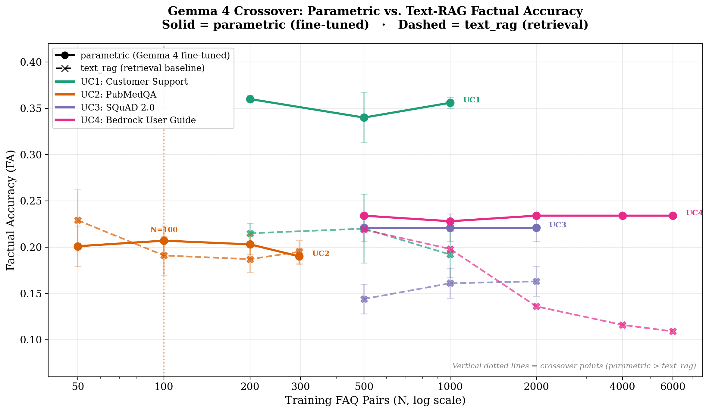
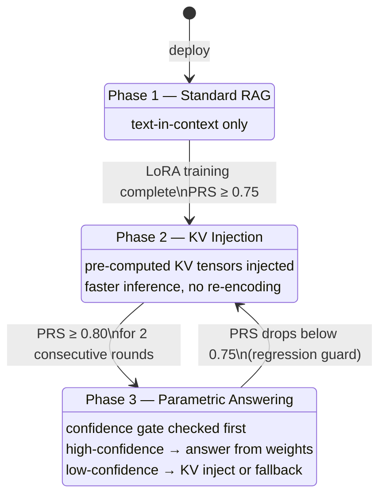
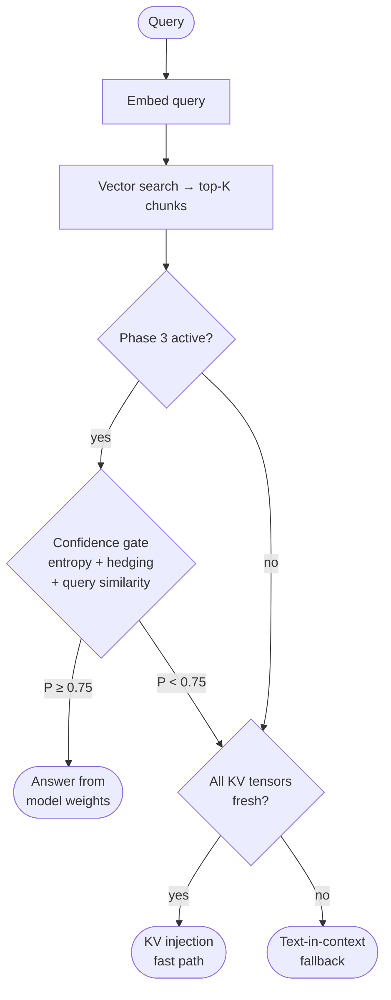

# KVForge

**KVForge** is a progressive system that transitions deployed question-answering systems from Retrieval-Augmented Generation (RAG) to **fully parametric answering** — where a fine-tuned small language model answers directly from its weights with no retrieval at all.

The key result: a **2B-parameter Gemma 4** model, LoRA-fine-tuned on cloud-generated QA pairs, **matches or exceeds text-in-context RAG on factual accuracy across three of four enterprise corpora**, eliminating per-query retrieval costs.

> **Research Paper:** [KVForge: Autonomous Phase-Adaptive Question Answering with Progressive Parametric Absorption](docs/KVForge_Research_Paper.pdf)

---

## Why KVForge

Standard RAG pays a fixed cost on every query — retrieved documents must be re-encoded through the full transformer stack — and, more fundamentally, *never eliminates the retrieval dependency*. Even knowledge the model has seen hundreds of times is fetched from the vector store on every query.

KVForge's central insight is that this dependency can be progressively removed. A three-phase progression transfers corpus knowledge into model weights over time:

| Phase | Mode | Retrieval? | Re-encoding? |
|-------|------|:----------:|:------------:|
| **1** | Text-in-context RAG | Always | Always |
| **2** | KV-cache injection | Always | Never |
| **3** | Parametric answering | Never | Never |

Phase transitions are gated by the **Parametric Readiness Score (PRS)** — a composite of accuracy, calibration, and self-consistency — so the system only advances when the model has *proven* it can answer from memory.

---

## Results: Gemma 4 Crossover Across Four Datasets

KVForge was evaluated on four heterogeneous corpora using **Google Gemma-4-E2B-it** (2B parameters, 4-bit quantized), LoRA-fine-tuned on cloud-LLM-generated QA pairs. Factual Accuracy (FA) is a composite of token-F1 and LLM-judge correctness.

| Dataset | Corpus | Parametric FA | Text-RAG FA | Gain |
|---------|--------|:-------------:|:-----------:|:----:|
| UC1 Customer Support | Bitext (2,000 chunks) | **0.36** | 0.21 | **+71%** |
| UC2 PubMedQA | Biomedical QA (2,918 chunks) | **0.23** | 0.14 | **+64%**\* |
| UC3 SQuAD 2.0 | Reading comprehension | **0.22** | 0.16 | **+38%** |
| UC4 Bedrock | Technical docs (2,520 chunks) | **0.23** | 0.16 | **+44%** |

\* PubMedQA required extended training (4,707 FAQ pairs, r=4, 15 epochs) to cross over; at sparse coverage parametric reverts below RAG. See the [consolidated crossover figure](docs/figures/gemma4_crossover_consolidated.png).



**What this means for enterprises:** a 2B-parameter model, fine-tuned on cloud-generated QA pairs at a one-time cost of ~$50 per corpus, can match or exceed retrieval quality while eliminating per-query retrieval — all on a single commodity GPU.

---

## Core Idea

1. **Index** — chunk documents, embed them, and (optionally) pre-compute KV tensors
2. **Generate** — a cloud LLM produces diverse QA pairs from indexed chunks ("sleep-time" compute)
3. **Train** — LoRA-fine-tune the model on those QA pairs, baking corpus knowledge into weights
4. **Gate** — a confidence gate routes high-confidence queries to parametric answering, low-confidence queries back to retrieval

The result is a *progressive absorption loop*: as the model learns the corpus, more queries are answered from weights, and per-query retrieval costs decline toward zero.

---

## KVForge Studio

KVForge Studio is a browser-based UI for managing the full 6-step pipeline across one or more use-cases. It replaces manual script invocations with a point-and-click interface, real-time log streaming, and GPU health checks.

**Start the portal:**

```bash
python kvforge_portal.py --port 8080
# Open http://localhost:8080
```

**6-step pipeline (per use-case):**

| Step | Name | Description |
|------|------|-------------|
| 1 | Index | Chunk, embed, and upsert documents into the vector store |
| 2 | LLM Config | Configure the local model, quantization, and vLLM endpoint |
| 3 | Sleep-time FAQ Gen | Pre-compute Q&A pairs from indexed chunks using a cloud LLM |
| 4 | Training | LoRA fine-tuning on the generated QA pairs |
| 5 | KV Recompute | Refresh KV tensors with the updated LoRA adapter |
| 6 | PRS Eval | Evaluate Parametric Readiness Score and advance phase if threshold is met |

Per-UC configuration (model, GPU assignment, FAQ count) lives in `uc_config.json` alongside each use-case directory. Job logs stream to the browser via SSE. GPU steps include a free-GPU check before they run.

---

## Three-Phase Architecture



### Query-Time Decision Flow



---

## Pluggable Architecture

KVForge is designed so every component can be swapped:

```
┌─────────────────────────────────────────────────────────────┐
│                      kvforge CLI                        │
│              init / index / search / train / eval           │
└────────────────────────┬────────────────────────────────────┘
                         │
        ┌────────────────┼────────────────┐
        ▼                ▼                ▼
┌──────────────┐ ┌──────────────┐ ┌──────────────────────┐
│ DocumentLoader│ │   Embedder   │ │     VectorStore      │
│ Protocol     │ │ Protocol     │ │ Protocol             │
├──────────────┤ ├──────────────┤ ├──────────────────────┤
│ PDFLoader    │ │ FastEmbed    │ │ QdrantStore          │
│ MarkdownLoader│ │ SentenceTrans│ │ ChromaStore          │
│ JSONLLoader  │ │ OpenAI       │ │ (Pinecone, Weaviate…)│
│ HTMLLoader   │ └──────────────┘ └──────────────────────┘
│ DirectoryLoad│
└──────────────┘
```

All three protocols are Python `runtime_checkable` `Protocol` classes — add a new backend by implementing the interface without modifying any existing code.

---

## Project Structure

```
kvforge/
├── kvforge.py          # Main CLI: init / index / search
├── ask.py                  # Query CLI: ask a question
│
├── core/                   # Library modules (no GPU needed)
│   ├── config.py           # DatasourceConfig Pydantic model
│   ├── kv_utils.py         # KV tensor ops
│   ├── model_loader.py     # Thread-safe LLM singleton
│   ├── version.py          # Phase state (version.json)
│   ├── confidence_gate.py  # Phase 3 entropy/hedging gate
│   ├── replay_buffer.py    # SQLite weighted training sampler
│   └── access_tracker.py   # Tier classification (hot/warm/cold/frozen)
│
├── pipeline/               # Orchestration scripts
│   ├── kv_indexer.py       # Chunk + embed + KV computation
│   ├── kv_inference.py     # Phase 1/2/3 query inference
│   ├── kv_background.py    # Background KV healing daemon
│   ├── lora_trainer.py     # LoRA fine-tuning
│   ├── prs_evaluator.py    # PRS evaluation
│   ├── sleep_faq_generator.py   # Offline FAQ pre-computation via cloud LLM
│   ├── monitoring_dashboard.py  # FastAPI monitoring server
│   └── index_and_train.py  # Full pipeline orchestrator
│
├── studio/                 # KVForge Studio web UI
│   └── kvforge_portal.py   # FastAPI portal server (port 8080)
│
├── embeddings/             # Pluggable embedder backends
├── ingestion/              # Pluggable document loaders
├── vectorstore/            # Pluggable vector store backends
├── tools/                  # Utility scripts
├── scripts/                # Shell wrappers for all pipeline tools
├── examples/               # End-to-end use-case examples
│   ├── usecase1_customer_support/   # UC1: Bitext customer support
│   ├── usecase2_pubmedqa/           # UC2: PubMedQA biomedical
│   ├── usecase3_squad/              # UC3: SQuAD 2.0
│   └── usecase4_bedrock_userguide/  # UC4: Amazon Bedrock User Guide
├── tests/                  # KVForge test suite
└── docs/                   # Documentation
    ├── faq/                # FAQ topic pages
    ├── guides/             # Quickstart, architecture, troubleshooting
    └── api/                # API reference
```

---

## Getting Started

### Prerequisites

- Python 3.10+
- Docker (for Qdrant)
- GPU optional for indexing/search; **required** for KV computation and LoRA training

### 1. Clone and install

```bash
git clone https://github.com/hemantcgi/kvforge.git
cd kvforge
python -m venv venv
source venv/bin/activate

# CPU-only (indexing, search, tests)
pip install qdrant-client fastembed pypdf fastapi uvicorn httpx \
            pydantic pytest beautifulsoup4

# GPU (KV compute + LoRA training — on your GPU server)
pip install torch transformers peft bitsandbytes accelerate datasets
```

### 2. Start Qdrant

```bash
docker run -d -p 6333:6333 -p 6334:6334 \
  -v ~/qdrant_storage:/qdrant/storage \
  qdrant/qdrant
```

### 3. Scaffold a new datasource

`kvforge.py init` creates a validated config file and the checkpoint directory:

```bash
# PDF corpus, default FastEmbed embedder, Qdrant vector store
python kvforge.py init --name my-corpus

# Markdown corpus, custom embedding model, explicit Gemma 4
python kvforge.py init \
  --name docs-corpus \
  --loader markdown \
  --embed-model BAAI/bge-base-en-v1.5 \
  --vector-dim 768 \
  --llm-model google/gemma-4-E2B-it
```

This creates `datasource_my-corpus.json` and `lora_checkpoints/my-corpus/`.

### 4. Index your documents

```bash
# Index a single PDF
python kvforge.py index \
  --config datasource_my-corpus.json \
  --source ./my_document.pdf

# Index a directory of markdown files
python kvforge.py index \
  --config datasource_docs-corpus.json \
  --source ./docs/
```

### 5. Search

```bash
python kvforge.py search \
  --config datasource_my-corpus.json \
  "What is the recommended approach for X?"
```

### 6. Generate FAQs for training

KVForge offers two ways to generate FAQs. The **sleep-time generator** pre-computes Q&A pairs offline using a cloud LLM (Gemini, Claude, or OpenAI) and typically produces much higher-quality training signal than the heuristic generator:

```bash
# Sleep-time FAQ generator (recommended — uses cloud LLM)
python -m pipeline.sleep_faq_generator \
  --config datasource_my-corpus.json \
  --output my-corpus_faqs.json \
  --count 50
  --n-per-chunk 5
```

The sleep-time generator is configured via the `llm` block in `uc_config.json`:

```json
{
  "llm": {
    "sleep_faq_provider": "gemini",
    "sleep_faq_model": "gemini-2.5-flash",
    "sleep_faq_count": 50
  }
}
```

Generated FAQs are saved to `faqs.json` per use-case and automatically pre-seed `known_good_queries` in `version.json`, which improves the Phase 3 confidence gate from day one.

### 7. Run the full training pipeline (GPU required)

```bash
python pipeline/index_and_train.py my_document.pdf \
  --config datasource_my-corpus.json \
  --faqs my-corpus_faqs.json
```

This runs in sequence:
1. Chunk + embed + upsert to vector store
2. Compute KV tensors (one LLM forward pass per chunk)
3. LoRA fine-tuning on the generated QA pairs
4. Recompute KV tensors with updated LoRA weights
5. PRS evaluation (accuracy + calibration + self-consistency)
6. Activate Phase 2 if `prs_threshold` is met

### 8. Query with KV injection

```python
import json
import pipeline.kv_background as kv_background
import pipeline.kv_inference as kv_inference

with open("datasource_my-corpus.json") as f:
    cfg = json.load(f)

kv_background.start(cfg)   # start background heal workers (call once)
answer = kv_inference.answer_with_retrieval("Your question here", cfg)
print(answer)
```

### 9. Monitor

```bash
python -m pipeline.monitoring_dashboard --config datasource_my-corpus.json --port 8081
# Open http://localhost:8081
```

The dashboard shows:

| Panel | Description |
|-------|-------------|
| Phase / LoRA version | Current pipeline phase and adapter version |
| Tier distribution | Hot / warm / cold / frozen counts |
| Top 10 chunks | Most-accessed chunks — click any preview to see full text |
| PRS history | Per-round scores with progress bars |
| FAQ Coverage Heatmap | Which chunks each FAQ maps to (cosine similarity) |
| A/B query panel | Compare KVForge against Gemini, Claude, or OpenAI in one request |

---

## Datasource Config Reference

`kvforge.py init` creates a config with sensible defaults. All fields:

```json
{
  "collection":        "my-corpus",
  "qdrant_host":       "localhost",
  "qdrant_port":       6333,
  "vector_store":      "qdrant",
  "loader":            "pdf",
  "embed_model":       "BAAI/bge-small-en-v1.5",
  "embedder_backend":  "fastembed",
  "vector_dim":        384,
  "llm_model":         "google/gemma-4-E2B-it",
  "chunk_size":        600,
  "chunk_overlap":     60,
  "prs_threshold":     0.75,
  "prs_weights":       { "accuracy": 0.5, "calibration": 0.3, "consistency": 0.2 },
  "faq_question_key":  "question",
  "faq_answer_key":    "answer",
  "gate_threshold":    0.75,
  "lora_rank":         16,
  "lora_alpha":        32,
  "lora_target_modules": ["q_proj", "k_proj", "v_proj"],
  "checkpoint_dir":    "lora_checkpoints/my-corpus/",
  "version_file":      "my-corpus_version.json",
  "replay_db":         "my-corpus_replay.db"
}
```

Supported values:
| Field | Options |
|-------|---------|
| `vector_store` | `qdrant`, `chroma` |
| `loader` | `pdf`, `markdown`, `jsonl`, `html`, `directory` |
| `embedder_backend` | `fastembed`, `sentence_transformers`, `openai` |

---

## Module Reference

| File | Responsibility |
|------|----------------|
| `kvforge.py` | CLI: `init` / `index` / `search` |
| `kv_utils.py` | KV tensor ops: mean_pool, serialize, deserialize, stack |
| `model_loader.py` | Singleton LLM + LoRA loader; KV shape auto-discovery |
| `confidence_gate.py` | Phase 3: entropy + hedging + query-similarity gate |
| `access_tracker.py` | Thread-safe hit counter; tier classification |
| `version.py` | Atomic `version.json` I/O; phase transitions |
| `replay_buffer.py` | SQLite-backed weighted chunk sampler |
| `config.py` | Pydantic `DatasourceConfig` — validated config model |
| `pipeline/kv_indexer.py` | Extended indexer: chunk + embed + KV compute + upsert |
| `pipeline/kv_inference.py` | Query-time: KV inject or text fallback + stale-chunk healing |
| `pipeline/kv_background.py` | Daemon threads: KV recompute queue + access tracker flush |
| `pipeline/lora_trainer.py` | LoRA fine-tuning with replay buffer |
| `pipeline/prs_evaluator.py` | Parametric Readiness Score: accuracy + calibration + consistency |
| `pipeline/monitoring_dashboard.py` | FastAPI monitoring dashboard: tier stats, top-10 chunks, PRS history, FAQ coverage heatmap, A/B query comparison |
| `pipeline/index_and_train.py` | Orchestrator: index → train → KV refresh → PRS → phase advance |
| `pipeline/sleep_faq_generator.py` | Offline FAQ pre-computation from indexed chunks via cloud LLM (Gemini / Claude / OpenAI) |
| `studio/pipeline_runner.py` | SSE subprocess runner — spawns pipeline steps, streams logs to browser |
| `studio/kvforge_portal.py` | KVForge Studio: browser UI for the 6-step pipeline with SSE log streaming |
| `ingestion/` | DocumentLoader protocol + PDF/Markdown/JSONL/HTML/Directory backends |
| `embeddings/` | Embedder protocol + FastEmbed/SentenceTransformers/OpenAI backends |
| `vectorstore/` | VectorStore protocol + QdrantStore/ChromaStore backends |
| `tools/generate_faqs.py` | Heuristic FAQ generator (no API key required) |

---

## Parametric Readiness Score (PRS)

PRS measures how well the fine-tuned model has internalized the corpus. It gates phase transitions and is computed after each training round:

$$\text{PRS} = 0.5 \times \text{accuracy} + 0.3 \times \text{calibration} + 0.2 \times \text{consistency}$$

| Component | How measured |
|-----------|-------------|
| **Accuracy** | Does the parametric answer match the ground-truth answer? |
| **Calibration** | Does stated confidence (0–100%) correlate with actual accuracy? |
| **Consistency** | Do independent samples of the same question agree? |

Weights are fully configurable via `prs_weights` in the datasource config.

---

## Confidence Gate (Phase 3)

When Phase 3 is active, each query is scored on three signals before deciding whether to retrieve:

| Signal | Default weight | Meaning |
|--------|:--------------:|---------|
| Token entropy | 0.4 | Low entropy → model is confident |
| Hedging score | 0.3 | Absence of "I think", "maybe", etc. → confident |
| Query similarity | 0.3 | Cosine similarity to known-good queries |

If `P(no_retrieval) >= gate_threshold` (default `0.75`), the model answers directly from weights. Otherwise it falls back to KV injection or text-in-context retrieval.

---

## Running Tests

76 tests, all pass without a GPU:

```bash
python -m pytest tests/ -v --override-ini="addopts="
```

---

## EC2 Deployment

Tested on AWS g5.xlarge (4× NVIDIA A10G, 24 GB VRAM each).

**4-UC layout on a single g5.xlarge:**

| Use-case | GPU | vLLM port | Monitoring port |
|----------|-----|-----------|-----------------|
| UC1 — Customer Support | GPU 0 | 8091 | 8081 |
| UC2 — PubMedQA | GPU 1 | 8092 | 8082 |
| UC3 — SQuAD | GPU 2 | 8093 | 8083 |
| UC4 — Bedrock User Guide | GPU 3 | 8090 | 8084 |
| KVForge Studio | — | — | **8080** |

---

## References

[1] Lewis, P., et al. **"Retrieval-Augmented Generation for Knowledge-Intensive NLP Tasks."** NeurIPS 2020. [arXiv:2005.11401](https://arxiv.org/abs/2005.11401)

[2] Vaswani, A., et al. **"Attention Is All You Need."** NeurIPS 2017. [arXiv:1706.03762](https://arxiv.org/abs/1706.03762)

[3] Hu, E. J., et al. **"LoRA: Low-Rank Adaptation of Large Language Models."** ICLR 2022. [arXiv:2106.09685](https://arxiv.org/abs/2106.09685)

[4] Guo, C., et al. **"On Calibration of Modern Neural Networks."** ICML 2017. [arXiv:1706.04599](https://arxiv.org/abs/1706.04599)

[5] Wang, X., et al. **"Self-Consistency Improves Chain of Thought Reasoning in Language Models."** ICLR 2023. [arXiv:2203.11171](https://arxiv.org/abs/2203.11171)

[6] Kadavath, S., et al. **"Language Models (Mostly) Know What They Know."** 2022. [arXiv:2207.05221](https://arxiv.org/abs/2207.05221)

[7] Kuhn, L., et al. **"Semantic Uncertainty."** ICLR 2023. [arXiv:2302.09664](https://arxiv.org/abs/2302.09664)

---

## License

MIT
