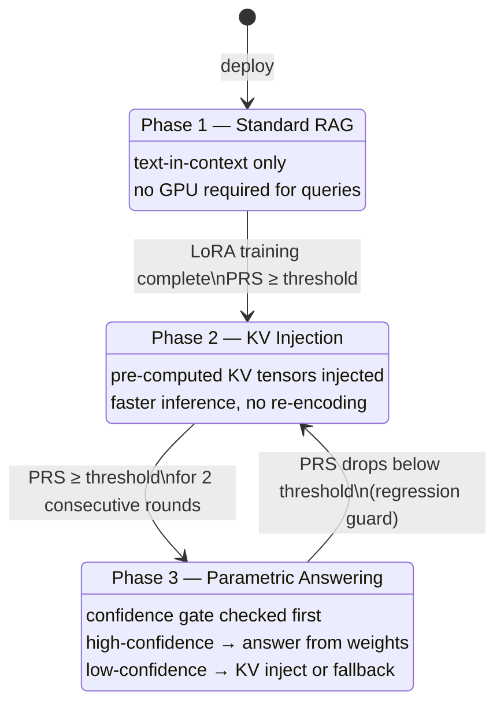
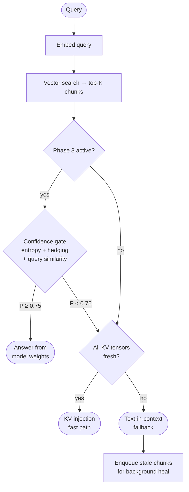
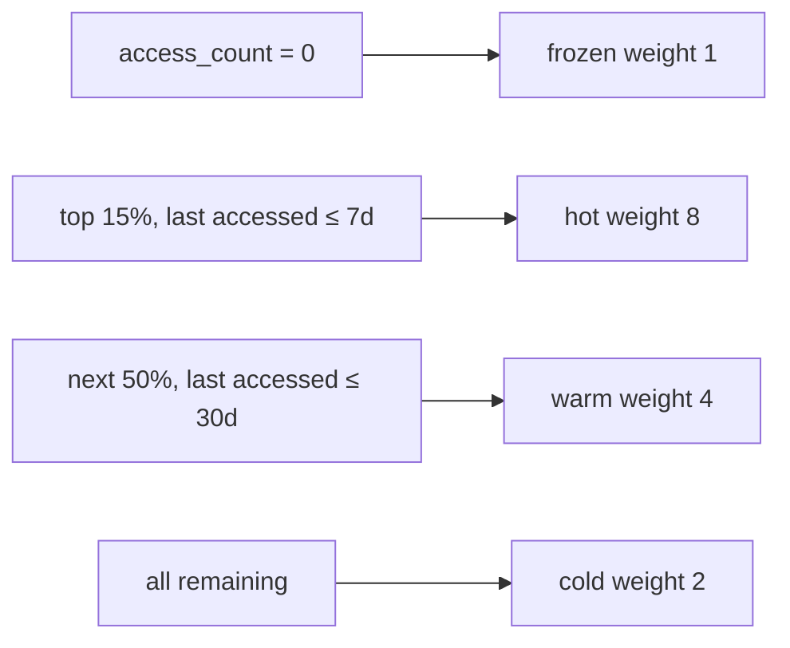

# SmartQdrant

**SmartQdrant** is a progressive RAG (Retrieval-Augmented Generation) system that pre-computes and stores LLM KV-cache tensors directly in a vector database. Instead of re-encoding retrieved documents at query time, SmartQdrant injects pre-computed key-value tensors into the LLM's attention layers — making inference faster as the system learns which knowledge it can answer from its own weights.

It works with **any dataset, any embedding model, any small language model, and any vector database.**

---

## Core Idea

Standard RAG re-encodes retrieved chunks on every query. SmartQdrant amortizes that cost:

1. **Index** — chunk your documents, embed them, and compute KV tensors (one LLM forward pass per chunk)
2. **Store** — save KV tensors alongside vectors in the database as base64-encoded payloads
3. **Serve** — at query time, retrieve top-K chunks and inject their pre-computed KV tensors as `past_key_values` — the LLM skips re-encoding and generates directly

Over time, LoRA fine-tuning on your corpus bakes knowledge into the model weights. A confidence gate then decides per-query whether retrieval is even needed.

---

## Three-Phase Architecture



### Query-Time Decision Flow



---

## Pluggable Architecture

SmartQdrant is designed so every component can be swapped:

```
┌─────────────────────────────────────────────────────────────┐
│                      smartqdrant CLI                        │
│              init / index / search / train / eval           │
└────────────────────────┬────────────────────────────────────┘
                         │
        ┌────────────────┼────────────────┐
        ▼                ▼                ▼
┌──────────────┐ ┌──────────────┐ ┌──────────────────────┐
│ DocumentLoader│ │   Embedder   │ │     VectorStore      │
│ Protocol     │ │ Protocol     │ │ Protocol             │
├──────────────┤ ├──────────────┤ ├──────────────────────┤
│ PDFLoader    │ │ FastEmbed    │ │ QdrantStore          │
│ MarkdownLoader│ │ SentenceTrans│ │ ChromaStore          │
│ JSONLLoader  │ │ OpenAI       │ │ (Pinecone, Weaviate…)│
│ HTMLLoader   │ └──────────────┘ └──────────────────────┘
│ DirectoryLoad│
└──────────────┘
```

All three protocols are Python `runtime_checkable` `Protocol` classes — add a new backend by implementing the interface without modifying any existing code.

---

## Project Structure

```
smartqdrant/
├── smartqdrant.py          # Main CLI: init / index / search
├── ask.py                  # Query CLI: ask a question
│
├── core/                   # Library modules (no GPU needed)
│   ├── config.py           # DatasourceConfig Pydantic model
│   ├── kv_utils.py         # KV tensor ops
│   ├── model_loader.py     # Thread-safe LLM singleton
│   ├── version.py          # Phase state (version.json)
│   ├── confidence_gate.py  # Phase 3 entropy/hedging gate
│   ├── replay_buffer.py    # SQLite weighted training sampler
│   └── access_tracker.py   # Tier classification (hot/warm/cold/frozen)
│
├── pipeline/               # Orchestration scripts
│   ├── kv_indexer.py       # Chunk + embed + KV computation
│   ├── kv_inference.py     # Phase 1/2/3 query inference
│   ├── kv_background.py    # Background KV healing daemon
│   ├── lora_trainer.py     # LoRA fine-tuning
│   ├── prs_evaluator.py    # PRS evaluation
│   ├── monitoring_dashboard.py  # FastAPI monitoring server
│   └── index_and_train.py  # Full pipeline orchestrator
│
├── embeddings/             # Pluggable embedder backends
├── ingestion/              # Pluggable document loaders
├── vectorstore/            # Pluggable vector store backends
├── tools/                  # Utility scripts
├── scripts/                # Shell wrappers for all pipeline tools
├── examples/               # End-to-end use-case examples
│   ├── usecase1_customer_support/   # Qdrant + Bitext dataset
│   ├── usecase2_pubmedqa/           # ChromaDB + PubMedQA dataset
│   ├── usecase3_squad/              # FAISS + SQuAD v2 dataset
│   └── usecase4_bedrock_userguide/  # Qdrant + Amazon Bedrock User Guide
├── tests/                  # SmartQdrant test suite
│   └── qdrant_internal/    # Upstream Qdrant tests (not SmartQdrant)
└── docs/                   # Documentation
    ├── faq/                # FAQ topic pages
    ├── guides/             # Quickstart, architecture, troubleshooting
    └── api/                # API reference
```

## Scripts

Shell wrappers for every pipeline tool are in `scripts/`. See [`scripts/README.md`](scripts/README.md) for the full catalog.

**Most common commands:**

```bash
# Index documents
./scripts/index.sh datasource_my-corpus.json ./my-docs/

# Ask a question
./scripts/ask.sh datasource_my-corpus.json "What is the return policy?"

# Full Phase 1→2→3 pipeline (GPU required)
./scripts/run_pipeline.sh datasource_my-corpus.json ./my-docs/ my-corpus_faqs.json
```

## Documentation

| Resource | Description |
|----------|-------------|
| [`docs/guides/quickstart.md`](docs/guides/quickstart.md) | Get started in 5 minutes |
| [`docs/guides/architecture.md`](docs/guides/architecture.md) | 3-phase pipeline deep-dive |
| [`docs/guides/adding-backends.md`](docs/guides/adding-backends.md) | Add a new vector store, embedder, or loader |
| [`docs/guides/troubleshooting.md`](docs/guides/troubleshooting.md) | Common errors and fixes |
| [`docs/api/index.md`](docs/api/index.md) | API reference index |
| [`docs/api/config.md`](docs/api/config.md) | All `DatasourceConfig` fields |
| [`FAQ.md`](FAQ.md) | How-to answers by topic |

## Getting Started

### Prerequisites

- Python 3.10+
- Docker (for Qdrant)
- GPU optional for indexing/search; **required** for KV computation and LoRA training

### 1. Clone and install

```bash
git clone https://github.com/hemantcgi/smartqdrant.git
cd smartqdrant
python -m venv venv
source venv/bin/activate

# CPU-only (indexing, search, tests)
pip install qdrant-client fastembed pypdf fastapi uvicorn httpx \
            pydantic pytest beautifulsoup4

# GPU (KV compute + LoRA training — on your GPU server)
pip install torch transformers peft bitsandbytes accelerate datasets
```

### 2. Start Qdrant

```bash
docker run -d -p 6333:6333 -p 6334:6334 \
  -v ~/qdrant_storage:/qdrant/storage \
  qdrant/qdrant
```

### 3. Scaffold a new datasource

`smartqdrant.py init` creates a validated config file and the checkpoint directory:

```bash
# PDF corpus, default FastEmbed embedder, Qdrant vector store
python smartqdrant.py init --name my-corpus

# Markdown corpus, custom embedding model
python smartqdrant.py init \
  --name docs-corpus \
  --loader markdown \
  --embed-model BAAI/bge-base-en-v1.5 \
  --vector-dim 768 \
  --llm-model meta-llama/Llama-3.2-3B-Instruct
```

This creates `datasource_my-corpus.json` and `lora_checkpoints/my-corpus/`.

### 4. Index your documents

```bash
# Index a single PDF
python smartqdrant.py index \
  --config datasource_my-corpus.json \
  --source ./my_document.pdf

# Index a directory of markdown files
python smartqdrant.py index \
  --config datasource_docs-corpus.json \
  --source ./docs/
```

### 5. Search

```bash
python smartqdrant.py search \
  --config datasource_my-corpus.json \
  "What is the recommended approach for X?"
```

### 6. Generate FAQs for training

```bash
python tools/generate_faqs.py \
  --config datasource_my-corpus.json \
  --output my-corpus_faqs.json \
  --n 50
```

### 7. Run the full training pipeline (GPU required)

```bash
python pipeline/index_and_train.py my_document.pdf \
  --config datasource_my-corpus.json \
  --faqs my-corpus_faqs.json
```

This runs in sequence:
1. Chunk + embed + upsert to vector store
2. Compute KV tensors (one LLM forward pass per chunk)
3. LoRA fine-tuning with tier-weighted replay buffer
4. Recompute KV tensors with updated LoRA weights
5. PRS evaluation (accuracy + calibration + self-consistency)
6. Activate Phase 2 if `prs_threshold` is met

### 8. Query with KV injection

```python
import json
import pipeline.kv_background as kv_background
import pipeline.kv_inference as kv_inference

with open("datasource_my-corpus.json") as f:
    cfg = json.load(f)

kv_background.start(cfg)   # start background heal workers (call once)
answer = kv_inference.answer_with_retrieval("Your question here", cfg)
print(answer)
```

### 9. Monitor

```bash
python pipeline/monitoring_dashboard.py --config datasource_my-corpus.json
# Open http://localhost:8080
```

The dashboard shows:
- Current phase and LoRA version
- Tier distribution (hot / warm / cold / frozen)
- Top 10 most-accessed chunks
- PRS history across training rounds

---

## Datasource Config Reference

`smartqdrant.py init` creates a config with sensible defaults. All fields:

```json
{
  "collection":        "my-corpus",
  "qdrant_host":       "localhost",
  "qdrant_port":       6333,
  "vector_store":      "qdrant",
  "loader":            "pdf",
  "embed_model":       "BAAI/bge-small-en-v1.5",
  "embedder_backend":  "fastembed",
  "vector_dim":        384,
  "llm_model":         "meta-llama/Llama-3.2-3B-Instruct",
  "chunk_size":        600,
  "chunk_overlap":     60,
  "prs_threshold":     0.75,
  "prs_weights":       { "accuracy": 0.5, "calibration": 0.3, "consistency": 0.2 },
  "faq_question_key":  "question",
  "faq_answer_key":    "answer",
  "gate_threshold":    0.75,
  "lora_rank":         16,
  "lora_alpha":        32,
  "lora_target_modules": ["q_proj", "k_proj", "v_proj"],
  "checkpoint_dir":    "lora_checkpoints/my-corpus/",
  "version_file":      "my-corpus_version.json",
  "replay_db":         "my-corpus_replay.db"
}
```

Supported values:
| Field | Options |
|-------|---------|
| `vector_store` | `qdrant`, `chroma` |
| `loader` | `pdf`, `markdown`, `jsonl`, `html`, `directory` |
| `embedder_backend` | `fastembed`, `sentence_transformers`, `openai` |

---

## Module Reference

| File | Responsibility |
|------|----------------|
| `smartqdrant.py` | CLI: `init` / `index` / `search` |
| `kv_utils.py` | KV tensor ops: mean_pool, serialize, deserialize, stack |
| `model_loader.py` | Singleton LLM + LoRA loader; KV shape auto-discovery |
| `confidence_gate.py` | Phase 3: entropy + hedging + query-similarity gate |
| `access_tracker.py` | Thread-safe hit counter; tier classification |
| `version.py` | Atomic `version.json` I/O; phase transitions |
| `replay_buffer.py` | SQLite-backed tier-weighted chunk sampler |
| `config.py` | Pydantic `DatasourceConfig` — validated config model |
| `pipeline/kv_indexer.py` | Extended indexer: chunk + embed + KV compute + upsert |
| `pipeline/kv_inference.py` | Query-time: KV inject or text fallback + stale-chunk healing |
| `pipeline/kv_background.py` | Daemon threads: KV recompute queue + access tracker flush |
| `pipeline/lora_trainer.py` | LoRA fine-tuning with tier-weighted replay buffer |
| `pipeline/prs_evaluator.py` | Parametric Readiness Score: accuracy + calibration + consistency |
| `pipeline/monitoring_dashboard.py` | FastAPI live dashboard at `:8080` |
| `pipeline/index_and_train.py` | Orchestrator: index → train → KV refresh → PRS → phase advance |
| `ingestion/` | DocumentLoader protocol + PDF/Markdown/JSONL/HTML/Directory backends |
| `embeddings/` | Embedder protocol + FastEmbed/SentenceTransformers/OpenAI backends |
| `vectorstore/` | VectorStore protocol + QdrantStore/ChromaStore backends |
| `tools/generate_faqs.py` | Auto-generate FAQs from an indexed corpus |

---

## Tier System

Chunks are classified by access frequency and recency. Tiers control LoRA training sample weight — hot chunks appear more often, preventing catastrophic forgetting of frequently-used knowledge.



| Tier | Condition | Replay weight |
|------|-----------|:-------------:|
| hot | Top 15% by access count, last accessed < 7 days | 8 |
| warm | Next 50%, last accessed < 30 days | 4 |
| cold | Remaining accessed chunks | 2 |
| frozen | Never accessed | 1 |

---

## Parametric Readiness Score (PRS)

PRS measures how well the fine-tuned model has internalized the corpus. It gates phase transitions and is computed after each training round:

$$\text{PRS} = 0.5 \times \text{accuracy} + 0.3 \times \text{calibration} + 0.2 \times \text{consistency}$$

| Component | How measured |
|-----------|-------------|
| **Accuracy** | Does the model's answer contain the ground-truth answer string? |
| **Calibration** | Does stated confidence (0–100%) correlate with actual accuracy? |
| **Consistency** | Do two independent samples of the same question agree? |

Weights are fully configurable via `prs_weights` in the datasource config.

Inspired by calibration evaluation methodology from Guo et al. (2017) [4] and self-consistency prompting from Wang et al. (2022) [5].

---

## Confidence Gate (Phase 3)

When Phase 3 is active, each query is scored on three signals before deciding whether to retrieve:

| Signal | Default weight | Meaning |
|--------|:--------------:|---------|
| Token entropy | 0.4 | Low entropy → model is confident |
| Hedging score | 0.3 | Absence of "I think", "maybe", etc. → confident |
| Query similarity | 0.3 | Cosine similarity to known-good queries |

If `P(no_retrieval) >= gate_threshold` (default `0.75`), the model answers directly from weights. Otherwise it falls back to KV injection or text-in-context retrieval.

Entropy-based confidence gating is related to approaches in Kadavath et al. (2022) [6] and Kuhn et al. (2023) [7].

---

## KV Tensor Storage Schema

When indexing, SmartQdrant writes these fields to each point's payload:

| Field | Type | Description |
|-------|------|-------------|
| `kv_cache` | string (base64) | Mean-pooled KV tensor, shape `[L, 2, H, D]` float16 |
| `kv_version` | int | LoRA version used to compute the cache |
| `access_count` | int | Total query hit count |
| `last_accessed_ts` | int | Unix timestamp of last retrieval |
| `avg_retrieval_rank` | float | Mean rank position when retrieved |
| `parametric_hit_count` | int | Times answered from weights (Phase 3) |
| `tier` | string | `hot` / `warm` / `cold` / `frozen` |

KV tensor shape `[num_layers, 2, num_kv_heads, head_dim]` is auto-discovered from the HuggingFace model config — no manual configuration needed.

---

## Running Tests

76 tests, all pass without a GPU:

```bash
python -m pytest tests/ -v --override-ini="addopts="
```

Individual test files:

| Test file | What it covers |
|-----------|----------------|
| `test_embeddings.py` | Embedder protocol, FastEmbed, dim validation |
| `test_ingestion.py` | All loader backends + registry wiring |
| `test_vectorstore.py` | VectorStore protocol, QdrantStore, registry |
| `test_model_loader.py` | KV shape auto-discovery, LoRA target detection |
| `test_prs_evaluator.py` | PRS weights, FAQ schema flexibility |
| `test_config.py` | Pydantic config validation |
| `test_generate_faqs.py` | FAQ Q/A parsing |
| `test_smartqdrant.py` | CLI init / index / search |
| `test_kv_*.py` | KV tensor ops, inference modes, stale-chunk handling |
| `test_confidence_gate.py` | Entropy + hedging signal logic |
| `test_access_tracker.py` | Tier classification, thread-safe counters |
| `test_dashboard.py` | FastAPI health/stats endpoints |
| `test_integration_smoke.py` | End-to-end pipeline logic without GPU |

---

## EC2 Deployment

Tested on AWS g5.xlarge (NVIDIA A10G, 24 GB VRAM).

```bash
# Pull latest code
ssh -i your-key.pem ubuntu@<ec2-ip>
cd ~/qdrant
git pull origin main
source venv/bin/activate

# Run tests to verify deployment
python -m pytest tests/ -v --override-ini="addopts="

# Run the full pipeline
python pipeline/index_and_train.py my_document.pdf \
  --config datasource_my-corpus.json \
  --faqs my-corpus_faqs.json

# Start dashboard in background
nohup python pipeline/monitoring_dashboard.py \
  --config datasource_my-corpus.json &
```

**Benchmark on Amazon Bedrock User Guide (2,520 chunks, Llama 3.2 3B):**

| Step | Time |
|------|------|
| Embed + upsert | ~45s |
| KV tensor computation | ~498s |
| LoRA training (3 epochs) | ~474 steps |
| PRS evaluation | ~90s |
| **Final PRS** | **0.8512** → Phase 2 activated |

---

## Per-Datasource Isolation

Each datasource is fully independent:

| Config key | Purpose |
|------------|---------|
| `version_file` | Phase, PRS history, known-good queries |
| `replay_db` | SQLite replay buffer |
| `checkpoint_dir` | LoRA adapter checkpoints |

Multiple document collections can share one Qdrant instance.

---

## References

[1] Vaswani, A. et al. **"Attention Is All You Need."** NeurIPS 2017.
[`arXiv:1706.03762`](https://arxiv.org/abs/1706.03762)
— Foundation of the transformer KV-cache mechanism exploited by SmartQdrant.

[2] Lewis, P. et al. **"Retrieval-Augmented Generation for Knowledge-Intensive NLP Tasks."** NeurIPS 2020.
[`arXiv:2005.11401`](https://arxiv.org/abs/2005.11401)
— Original RAG paper; SmartQdrant extends this with KV injection and parametric answering.

[3] Hu, E. et al. **"LoRA: Low-Rank Adaptation of Large Language Models."** ICLR 2022.
[`arXiv:2106.09685`](https://arxiv.org/abs/2106.09685)
— LoRA fine-tuning used to bake corpus knowledge into model weights.

[4] Guo, C. et al. **"On Calibration of Modern Neural Networks."** ICML 2017.
[`arXiv:1706.04599`](https://arxiv.org/abs/1706.04599)
— Calibration component of PRS scoring.

[5] Wang, X. et al. **"Self-Consistency Improves Chain of Thought Reasoning in Language Models."** ICLR 2023.
[`arXiv:2203.11171`](https://arxiv.org/abs/2203.11171)
— Self-consistency component of PRS scoring.

[6] Kadavath, S. et al. **"Language Models (Mostly) Know What They Know."** 2022.
[`arXiv:2207.05221`](https://arxiv.org/abs/2207.05221)
— Informs the confidence gate design for Phase 3.

[7] Kuhn, L. et al. **"Semantic Uncertainty: Linguistic Invariances for Uncertainty Estimation in Natural Language Generation."** ICLR 2023.
[`arXiv:2302.09664`](https://arxiv.org/abs/2302.09664)
— Entropy-based uncertainty estimation used in the confidence gate.

[8] Gim, I. et al. **"PromptCache: Modular Attention Reuse for Low-Latency Inference."** MLSys 2024.
[`arXiv:2311.04934`](https://arxiv.org/abs/2311.04934)
— Closest prior work to SmartQdrant's KV-tensor storage and reuse approach.

[9] **Qdrant vector database.** [`qdrant.tech`](https://qdrant.tech)
— Vector store used for embedding search and KV payload storage.

---

## License

MIT
