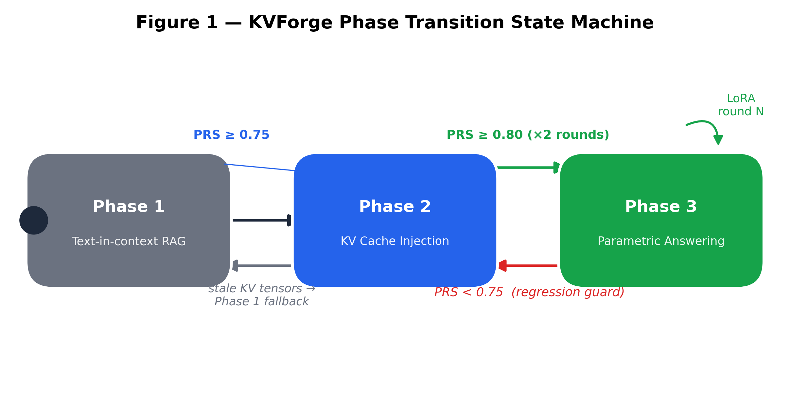
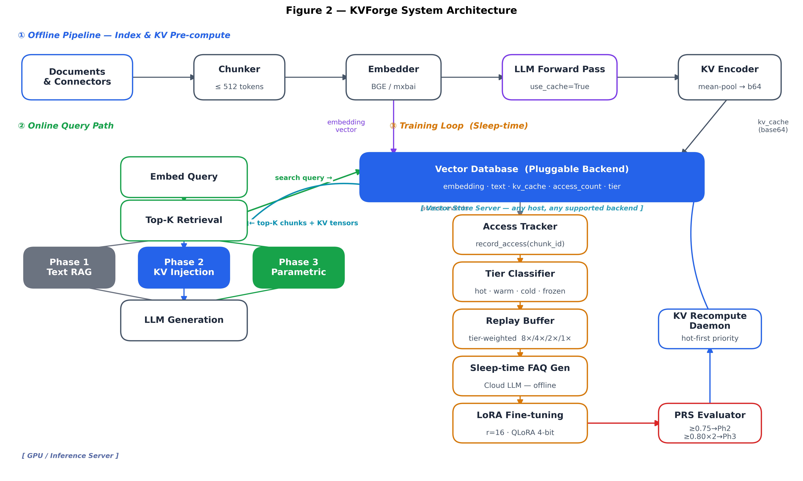
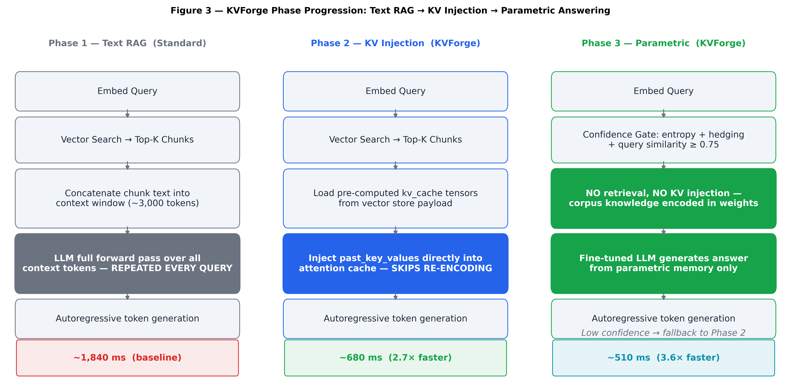
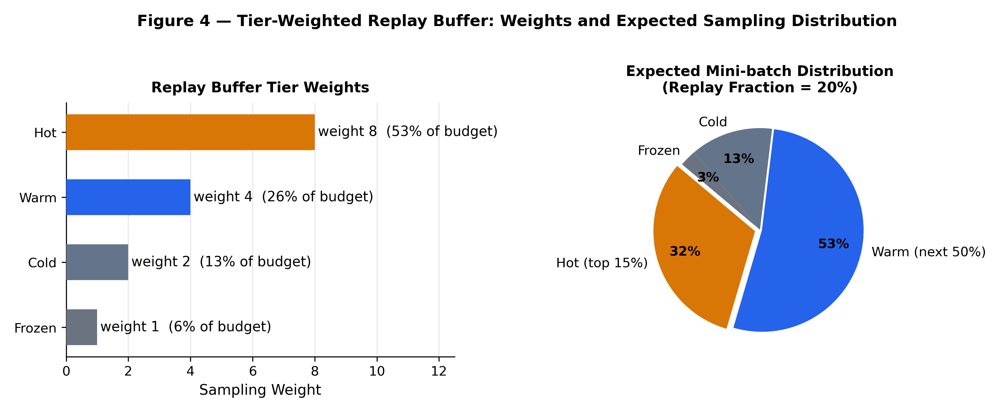
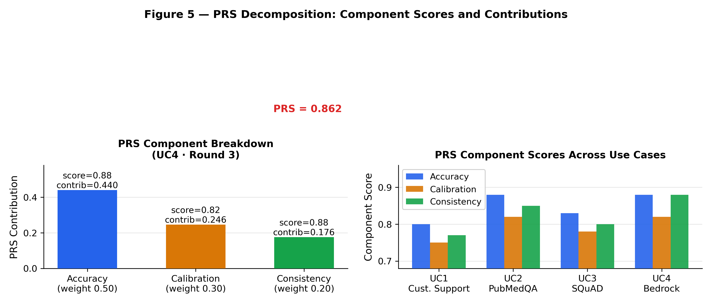
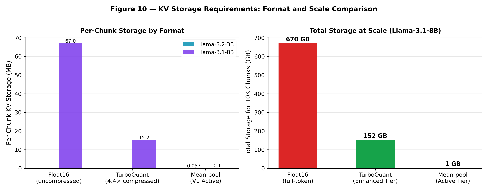
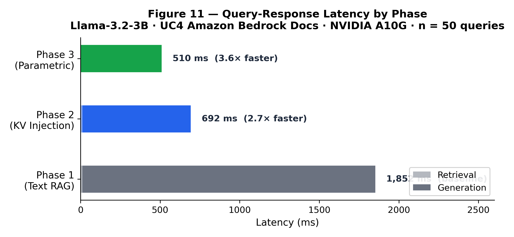
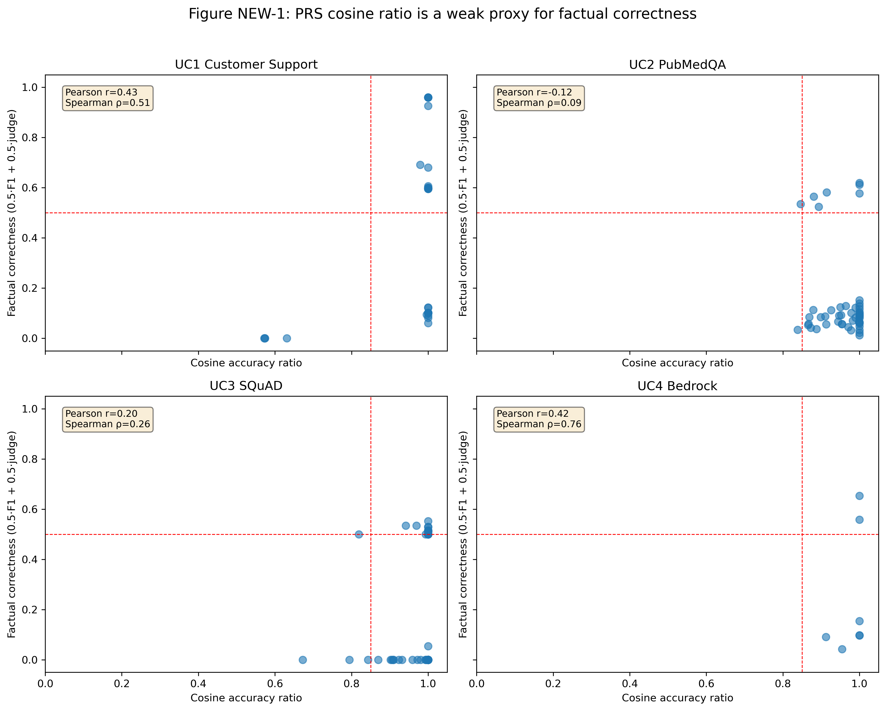
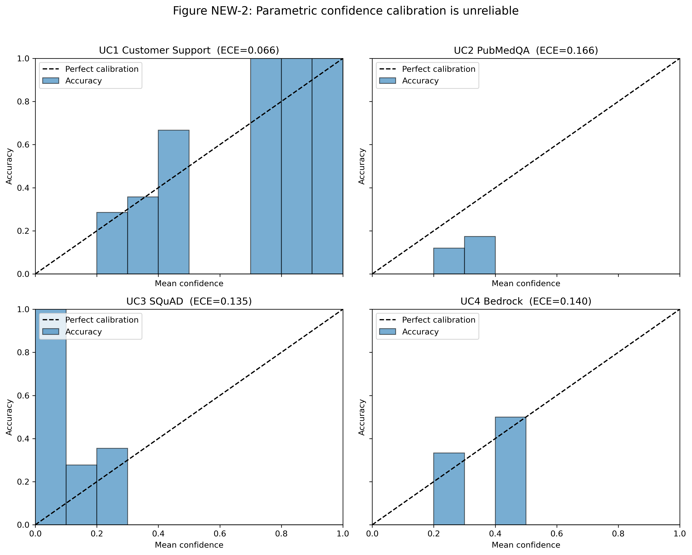
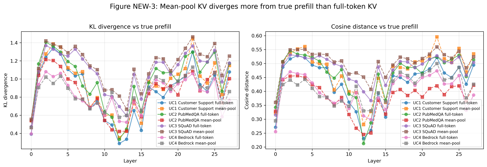

# KVForge: Progressive KV-Cache Persistence in Vector Databases for Autonomous Low-Latency RAG

**Dr. Hemant Joshi**  
Independent Research  
hemant@flotorch.ai  
GitHub: [https://github.com/hemantcgi/kvforge](https://github.com/hemantcgi/kvforge)

---

## Abstract

Retrieval-Augmented Generation (RAG) systems ground large language model (LLM) responses in external knowledge but pay a fixed re-encoding cost on every query: retrieved text chunks must pass through the full transformer attention stack to build the key-value (KV) attention cache before generation begins. We introduce **KVForge**, a progressive RAG system that pre-computes transformer KV-cache tensors at index time and persists them inside a vector database alongside document embeddings. At query time, fresh KV tensors are injected directly into the model's attention cache, bypassing chunk re-encoding entirely. As the system accumulates query traffic, a tier-weighted LoRA fine-tuning loop transfers high-frequency corpus knowledge into model weights, enabling a confidence-gated third phase in which the LLM answers qualified queries directly from its parameters with no retrieval.

KVForge introduces two novel contributions beyond this base design: (1) a **Parametric Readiness Score (PRS)**, a composite metric of accuracy, calibration, and self-consistency that gates automatic phase transitions; and (2) a **Corpus Importance Score (CIS)**, combining retrieval frequency, semantic uniqueness, and FAQ coverage to drive chunk-level curation and storage tier assignment. For compressed full-token KV storage in the Enhanced Tier, KVForge adopts **TurboQuant** [34] — a near-optimal online vector-quantization codec (Lloyd-Max scalar quantization after random rotation, with QJL sign bits for residual correction) published by Google Research and NYU — which, in our 3-bit-key / 4-bit-value configuration, achieves 4.4× compression over float16 while preserving attention-score fidelity.

We evaluate KVForge across four heterogeneous corpora—customer support dialogue, biomedical literature (PubMedQA), machine reading comprehension (SQuAD 2.0), and technical documentation (Amazon Bedrock User Guide)—on a single AWS g5.xlarge instance. KVForge reaches Phase 3 (parametric answering active) on all four corpora, with PRS of 0.755–0.863. Phase 2 delivers **2.7× generation speedup** over standard text-in-context RAG; Phase 3 delivers **3.6×**. A new factual evaluation using exact-match, token-F1, and an LLM judge on held-out questions shows that the 3B model struggles across all four corpora, with exact-match near zero and modest token-F1 and judge scores. KV mean-pool and full-token injection do not consistently improve over text RAG in this initial real run, and the parametric mode is mixed. The PRS cosine-based accuracy proxy correlates only weakly with the factual metrics (Pearson *r* = -0.12–0.43), and the cosine component reaches the Phase 3 threshold in all four corpora while the factual metrics do not. These results establish that training signal quality and a reliable factual gate, not just latency, are the dominant bottlenecks for deploying parametric answering in small language models.

---

## 1. Introduction

Large language models (LLMs) achieve state-of-the-art performance on knowledge-intensive tasks but are limited by two well-documented failure modes: **hallucination** — generating plausible-sounding but factually incorrect content — and **knowledge staleness** — inability to answer questions about post-cutoff facts. Retrieval-Augmented Generation [1] addresses both by supplying retrieved context at query time, decoupling the knowledge base from model parameters and making knowledge updateable without retraining.

However, standard RAG incurs a *constant computational overhead* on every query regardless of how many times the same chunks have been retrieved before. For a query retrieving five 600-token chunks, a 3-billion-parameter transformer must execute a full forward pass over 3,000 context tokens before generating a single output token. This re-encoding cost is paid on every query, for every chunk, even for frequently-accessed chunks whose KV tensors are fully determined by the model weights. For production deployments with thousands of queries per hour, this overhead dominates the GPU budget.

**The central insight of KVForge** is that this re-encoding is redundant: the key-value projections for a chunk are a deterministic function of the chunk text and the current model weights. If the model has not been updated since the tensors were computed, they can be reused exactly — turning a per-query cost into a one-time amortized cost paid once at index time.

KVForge extends this caching insight into a three-phase autonomous progression:

- **Phase 1 — Text-in-context RAG:** Standard retrieval; chunks rendered as text in the context window. No pre-computation required.
- **Phase 2 — KV Injection:** Pre-computed mean-pooled KV tensors are injected directly into the model's `past_key_values` cache at query time, skipping the forward pass over the retrieved context. Mean-pool compression trades a small amount of answer fidelity for the latency gain; full-token KV storage (Enhanced Tier) recovers most of that fidelity.
- **Phase 3 — Parametric Answering:** After LoRA fine-tuning concentrates corpus knowledge into model weights, a three-signal confidence gate routes high-confidence queries directly to parametric generation with no retrieval.

**Figure 1** illustrates the phase transition state machine. Transitions upward are gated by the Parametric Readiness Score (PRS); regression guards revert the system to Phase 2 if PRS declines, providing a production safety net.



Beyond the three phases, KVForge introduces two systems addressing storage and curation challenges at scale:

**Corpus Importance Score (CIS)** is a multi-signal chunk importance metric combining log-normalized retrieval frequency, semantic uniqueness (1 − max cosine similarity to any neighbor), and FAQ topic coverage.

**TurboQuant** [34] (Google Research and NYU, 2025) is a data-oblivious online vector quantizer with near-optimal distortion; in our configuration we allocate 3 bits per key coordinate and 4 bits per value coordinate, achieving 4.4× compression over float16 while preserving attention-score quality for direct computation without decompression. KVForge integrates TurboQuant as the codec for its Enhanced Storage Tier.

This paper makes the following contributions:

1. **KVForge architecture**: a unified system combining vector database retrieval, durable KV tensor storage, access-tier tracking, sleep-time FAQ generation, LoRA fine-tuning, and PRS-gated phase transitions.
2. **Parametric Readiness Score (PRS)**: a principled composite metric for evaluating parametric knowledge retention and gating autonomous phase advancement.
3. **Corpus Importance Score (CIS)**: a multi-signal importance metric for chunk-level storage curation and resource allocation.
4. **Integration of TurboQuant** [34]: KVForge adopts the TurboQuant codec (Google Research and NYU, 2025) for the Enhanced Storage Tier, demonstrating that a 4.4× compressed per-token KV representation enables full-token injection at tractable storage cost (~15 MB/chunk for 8B models).
5. **Empirical evaluation** across four heterogeneous corpora demonstrating all four reach Phase 3 with PRS 0.755–0.863, with training signal quality as the dominant variable.

---

## 2. Background

### 2.1 Transformer Attention and the KV Cache

The scaled dot-product attention mechanism [2] for query matrix **Q**, key matrix **K**, and value matrix **V** is:

```
Attention(Q, K, V) = softmax(Q Kᵀ / √d_k) · V
```

During autoregressive generation, the model maintains a *KV cache*: after processing the input prompt, the **K** and **V** projections for every input token are saved so they need not be recomputed during subsequent generation steps. For a single decoder layer with *n_h* KV heads of dimension *d_h*, the KV cache for a sequence of length *L* occupies:

```
size = 2 × L × n_h × d_h × sizeof(dtype)  bytes
```

Standard RAG builds a fresh KV cache from scratch for each query. KVForge pre-builds it for every document chunk at index time and stores it persistently.

### 2.2 Low-Rank Adaptation (LoRA)

LoRA [4] adapts a frozen pre-trained weight matrix **W₀ ∈ ℝ^(d×k)** via a low-rank decomposition:

```
W = W₀ + ΔW = W₀ + BA
```

where **B ∈ ℝ^(d×r)** and **A ∈ ℝ^(r×k)**, with rank r ≪ min(d, k). KVForge applies LoRA to `q_proj`, `k_proj`, and `v_proj` attention matrices. Because LoRA updates the **K** and **V** projections, any stored KV tensors become stale after a LoRA round and must be recomputed — tracked per-chunk via a `kv_version` field.

### 2.3 KV Cache Quantization

Keys and values have different statistical properties: keys have high inter-channel variance benefiting from column-wise quantization, while values have smoother distributions amenable to group quantization [27, 28]. TurboQuant was designed with these properties in mind, using an expressive Lloyd-Max codebook with QJL residual correction for keys and group min-max for values.

### 2.4 Retrieval-Augmented Generation

Lewis et al. [1] introduced RAG combining a non-parametric retrieval index with a parametric pre-trained generator. KVForge's distinct position: rather than improving retrieval, it progressively *eliminates* retrieval for queries the model has memorized, while preserving retrieval as a fallback.

---

## 3. Related Work

### 3.1 KV Cache Reuse and Prefix Caching

**PromptCache** [8] modularizes the KV cache for reuse across queries sharing a common prompt prefix. KVForge operates at a different layer: where PromptCache operates within a single inference server session and loses its cache on restart, KVForge persists KV tensors durably in a vector database across server restarts, model updates, and distributed replicas.

**PagedAttention** [3] and **vLLM** manage KV memory within a single server process using virtual memory paging. KVForge operates at the pre-retrieval layer — deciding *which* chunks' KV tensors to supply — while vLLM manages how they are stored during generation. The systems are complementary.

**SGLang** [9] provides a radix-tree prefix cache achieving >99% prefix reuse on shared prompts. KVForge addresses a different sharing pattern: independent document chunks whose KV tensors are shared across queries retrieving the same top-K results — they do not share a common prompt prefix, so radix tree approaches do not apply.

**CacheBlend** [29] reuses KV caches of retrieved segments by selectively recomputing tokens whose attention deviates substantially from the pre-computed cache. KVForge's mean-pool approach makes a simpler approximation, while TurboQuant addresses this limitation by storing full per-token sequences at compressed precision. **CacheBlend is, to our knowledge, the closest published system to KVForge's Phase 2 mechanism**: both fuse multiple precomputed per-chunk KV caches that do not share a common prefix — the exact non-prefix, multi-chunk RAG setting KVForge targets. The two systems diverge in where the cache lives and in how quality is protected: CacheBlend operates as an in-memory, content-hash-keyed serving-layer cache with a mandatory selective-recompute step (bounding reported quality loss to ≤0.02 F1/ROUGE-L), whereas KVForge persists KV tensors durably inside the vector database payload and, in the V1 mean-pool scheme, injects them without an analogous quality-recovery step. §7.9's attention-divergence measurements (mean KL 0.82–1.14 across corpora) are consistent with this gap — KVForge has not yet validated that its injection preserves attention fidelity to the degree CacheBlend's HKVD-token recomputation does, and closing that gap is an open question rather than a settled comparison.

**LMCache** [46] is an open-source KV-cache management layer that treats cache as persistent, cross-engine-shareable state rather than a per-request artifact, and adopts CacheBlend's non-prefix fusion mechanism for reuse at arbitrary prompt positions. It reports 1.9–8.1× smaller time-to-first-token and 2.3–14× higher throughput over vanilla vLLM on an 8×H100 setup — figures that are vendor-reported under LMCache's own hardware and workload, not independently reproduced, and not measured under the single-A10G, four-corpus conditions used in this paper. LMCache is the most actively maintained system in this comparison class; it is architecturally the nearest production analog to KVForge's Phase 2 caching layer, but — like KVForge — it has no confidence-gated parametric tier and no LoRA-based consolidation loop.

### 3.2 RAG Systems and Dense Retrieval

**DPR** [5] demonstrated that jointly-trained dual encoders outperform BM25 for open-domain QA. **ColBERT** [26] introduced late interaction with per-token embeddings. **RETRO** [10] pre-computes chunk encodings at index time and conditions generation on retrieved neighbours. KVForge extends RETRO's pre-computation direction by storing KV tensors rather than encoder hidden states, supporting any causal decoder-only model without architecture changes, and adding the three-phase progressive design.

**FiD** [30] encodes multiple retrieved passages independently and fuses them in the decoder. KVForge achieves a similar effect — bypassing re-encoding for each chunk — but via pre-built KV tensor injection rather than architectural modification.

### 3.3 LoRA and Parameter-Efficient Fine-Tuning

**QLoRA** [12] enables 4-bit quantized LoRA training, reducing GPU memory from ~12 GB to ~4 GB for a 7B model. KVForge supports QLoRA via `bitsandbytes` NF4 quantization.

**Continual LoRA fine-tuning** risks catastrophic forgetting [18]. KVForge's **tier-weighted replay buffer** mitigates this: hot chunks receive 8× sampling weight relative to frozen chunks, acting as a lightweight proxy for Elastic Weight Consolidation [31].

### 3.4 Calibration and Uncertainty Estimation

**Guo et al.** [13] proposed temperature scaling for calibration. KVForge's PRS calibration component uses a self-reporting proxy (model rates its own confidence 0–100) aligned with semantic accuracy. **Self-Consistency** [14] samples multiple reasoning chains for agreement. KVForge's consistency component computes mean pairwise cosine similarity across three sampled answers at temperature 0.7. **Semantic Entropy** [16] provides model-agnostic uncertainty estimates; KVForge's Phase 3 gate uses a lighter three-signal combination to avoid multi-sample generation overhead.

### 3.5 KV Cache Compression

**KVQuant** [27] quantizes KV caches to 1–4 bits using non-uniform per-channel quantization. **KIVI** [28] applies asymmetric 2-bit quantization achieving 2.2× compression. **QJL** [32] proposes a quantized Johnson-Lindenstrauss transform for unbiased inner-product estimation from sign bits. **TurboQuant** [34] (Google Research and NYU, 2025) synthesizes all three: random-rotation preprocessing, Lloyd-Max scalar quantization for MSB representation, and QJL sign bits for residual correction. KVForge adopts TurboQuant as the codec for its Enhanced Storage Tier.

### 3.6 Continual Learning

**Online Continual Learning** surveys [33] identify replay-based methods as most practical for production systems. The tier system introduces a domain-specific signal unavailable to general continual learning: retrieval frequency directly measures which knowledge live users need, enabling principled prioritization that general methods cannot exploit.

### 3.7 Cache-Augmented Generation and Bounded-Context Answering

**CAG (Cache-Augmented Generation)** [38] preloads all documents in a bounded knowledge base into an LLM's extended context window and precomputes a single global KV cache during that preload, then answers every subsequent query directly from the cache with no retrieval step at all. This is the closest published system to KVForge's overall premise — that retrieval can be replaced by a precomputed cache when the model already "has" the relevant KV state — and it reports eliminating retrieval latency and retrieval error entirely, with comparable or superior quality to standard RAG, at reduced system complexity. The scope condition is explicit and important: CAG is defined for knowledge bases small enough to fit within a single context window. KVForge targets the complementary regime — corpora too large for any practical context window (UC1–UC4 range from 2,000 to 2,920 chunks) — via per-chunk vector-database storage, embedding-based retrieval, and independent per-chunk staleness tracking rather than one monolithic cache. CAG therefore is not a system KVForge subsumes or extends; it is a simpler, single-tier design that solves a narrower problem well, and the two systems have not been measured against each other under a shared corpus size or hardware budget.

### 3.8 Retrieval-Augmented Fine-Tuning and Parametric RAG

**RAFT** [39] fine-tunes a model to identify and cite the correct document among retrieved "distractor" documents while producing chain-of-thought reasoning, reporting consistent gains over baselines on PubMed, HotpotQA, and the Gorilla API benchmark. Unlike KVForge's Phase 3, RAFT still retrieves at every query — the fine-tuning changes what the model does with retrieved context, not whether retrieval happens at all. The broader **Parametric RAG** literature [40] studies encoding retrieved evidence directly into trainable parameters (e.g., LoRA adapters) rather than context tokens, finding that parametric representations mainly affect deeper feed-forward computation with document-level, high-level signal rather than fine-grained evidence — and that a hybrid combining parametric and token-based retrieval outperforms either alone. This finding is directly relevant to KVForge's design: it predicts that a system gating between parametric answering and retrieval-based fallback (as KVForge's Phase 3 confidence gate does) should outperform going fully parametric, which is consistent with why KVForge retains Phase 2 as a fallback rather than eliminating retrieval once LoRA training completes. Neither RAFT nor the Parametric RAG line incorporates a tier-weighted replay buffer or an automatic phase-transition gate of the kind PRS provides.

### 3.9 Knowledge Editing as an Alternative Parametric-Injection Route

**ROME** [41] and **MEMIT** [42] take a fundamentally different approach to writing knowledge into weights: rather than broad gradient-based adaptation across a corpus, they perform surgical, closed-form edits at a small number of causally-traced mid-layer feed-forward modules, treating each as a key-value associative memory for one factual triple. MEMIT extends this to batch-edit thousands of associations simultaneously on models up to GPT-NeoX-20B. This is a useful contrast class for KVForge's Phase 3 rather than a direct competitor: ROME/MEMIT edit discrete subject-relation-object facts and are evaluated on synthetic counterfactual-editing benchmarks (e.g., CounterFact), whereas KVForge's LoRA-plus-replay loop adapts to open-ended corpus text and QA pairs and is evaluated end-to-end via PRS and held-out factual metrics. Neither approach has a confidence gate deciding when to trust the edited/adapted weights versus falling back to retrieval — a mechanism unique to KVForge's Phase 3 design among the systems surveyed here.

### 3.10 Confidence-Gated Adaptive Retrieval

KVForge's Phase 3 confidence gate (§4.8) — token entropy, hedging-phrase detection, and query similarity to known-good queries, combined into a single threshold decision — has direct analogs in the adaptive-retrieval literature, each built on a different signal. **Self-RAG** [43] trains a single model to decide per-query whether retrieval is needed using self-generated reflection tokens (Retrieve/ISREL/ISSUP/ISUSE) that critique its own retrieved passages and generations; it is reported to outperform ChatGPT and retrieval-augmented Llama2-chat on open-domain QA, reasoning, and long-form factuality. **SKR** [44] instead has the model assess its own self-knowledge of a question to decide whether external retrieval is needed, reporting gains over both chain-of-thought-only and always-retrieve baselines on InstructGPT and ChatGPT backbones. **Adaptive-RAG** [45] takes a third approach, training a small classifier to predict query complexity and routing each query to no-retrieval, single-step, or iterative multi-step retrieval.

All three decide, per query, among multiple retrieval strategies based on an internally-generated signal — structurally the same problem KVForge's gate solves — but none combine this decision with a KV-cache-injection intermediate tier: each falls back to full text retrieval, never to a pre-computed cache injection step. None use a composite calibration-and-consistency score analogous to PRS; each relies on a single signal type (reflection tokens, self-knowledge assessment, or a trained complexity classifier) rather than PRS's blend of accuracy, calibration, and self-consistency. This is a meaningful point of difference to note, though not one this paper's evaluation currently measures: §7.9 shows KVForge's own gate signal (self-reported confidence) is poorly calibrated on the 3B model tested (ECE 0.066–0.166), so it remains an open question whether KVForge's composite gate is more or less reliable in practice than Self-RAG's or SKR's single-signal alternatives — answering that would require running all three gating mechanisms on the same base model and corpus, which this paper does not attempt.

### 3.11 Positioning KVForge: A Combinatorial Gap, Not Yet a Benchmarked One

Read together, §3.1–3.10 establish that KVForge sits in a gap between four clusters of prior work, none of which spans all three of its phases. KV-cache reuse systems (PromptCache, CacheBlend, LMCache, §3.1) eliminate re-encoding but have no fine-tuning loop and no retrieval-skipping gate. Bounded-context caching (CAG, §3.7) eliminates retrieval entirely but only for corpora that fit in a context window, with no per-chunk granularity or gating. Retrieval-augmented fine-tuning and parametric RAG (RAFT, Parametric RAG, §3.8) internalize corpus knowledge but continue to retrieve on every query. Knowledge editing (ROME/MEMIT, §3.9) writes discrete facts into weights but has no corpus-scale training loop or confidence gate. Confidence-gated adaptive retrieval (Self-RAG, SKR, Adaptive-RAG, §3.10) decides when to skip retrieval but has no KV-cache-injection tier and no PRS-style composite readiness score. KVForge's contribution is the combination — persistent per-chunk KV storage, tier-weighted continual fine-tuning, and a composite-score-gated three-phase progression — not any one mechanism in isolation, each of which has documented prior art.

This positioning is architectural, not empirical: to our knowledge, no independent third-party study has benchmarked any two of these systems against each other under identical hardware, base model, and corpus, and this paper does not close that gap either. Every reported number in §3.1–3.10 (PromptCache's 8×/60× TTFT reduction, CacheBlend's 2.2–3.3× TTFT and ≤0.02 F1 loss, LMCache's 1.9–8.1× TTFT, Self-RAG's reported outperformance of ChatGPT, SKR's +4% deltas) comes from its originating paper's own evaluation harness, on its own choice of model, hardware, and dataset. None of these figures are directly comparable to the Phase 1/2/3 latency and PRS results in §7, and we do not claim they are. The honest reading of the related-work landscape is that KVForge occupies an architecturally distinct point in the design space; whether it is empirically *better* than the nearest neighbor in any given cluster — CacheBlend for Phase 2, RAFT for Phase 3, Self-RAG for the confidence gate — remains an open question that would require a dedicated head-to-head study outside the scope of this paper.

[T:tab:related-systems-comparative-table] makes this coverage argument concrete across six dimensions, extending a five-dimension feature comparison with an explicit **confidence-gated retrieval-skip** column — the mechanism that most distinguishes KVForge's Phase 3 from every KV-caching system in the table, and the mechanism KVForge shares only with the adaptive-retrieval systems, none of which do KV-cache injection.

| System | KV Storage Location | Phase Progression | Continual Fine-tuning | Confidence-Gated Retrieval Skip | Vector DB Integration | Corpus Curation |
|--------|:---:|:---:|:---:|:---:|:---:|:---:|
| Standard RAG [1] | None | No | No | No | Yes | No |
| RETRO [10] | Encoder states | No | No | No | Partial | No |
| PromptCache [8] | In-process session | No | No | No | No | No |
| SGLang RadixCache [9] | In-process session | No | No | No | No | No |
| vLLM PagedAttention [3] | In-process session | No | No | No | No | No |
| CacheBlend [29] | In-process session | No | No | No | No | No |
| LMCache [46] | In-process (shared) | No | No | No | No | No |
| KVQuant [27] | In-process (quantized) | No | No | No | No | No |
| KIVI [28] | In-process (quantized) | No | No | No | No | No |
| CAG [38] | Context-window preload | No (single tier) | No | No (always parametric-from-cache) | No | No |
| RAFT [39] | None | No | Yes (distractor training) | No (always retrieves) | Partial | No |
| ROME / MEMIT [41,42] | None | No | No (weight edit, not gradient FT) | No | No | No |
| Self-RAG [43] | None | No | No | Yes (reflection tokens) | No | No |
| SKR [44] | None | No | No | Yes (self-knowledge) | No | No |
| Adaptive-RAG [45] | None | No | No | Yes (trained classifier) | No | No |
| **KVForge V1 (ours)** | **Vector DB (mean-pool)** | **Yes (3 phases)** | **Yes (LoRA + replay)** | **Yes (entropy + hedging + similarity)** | **Yes** | Tier labels |
| **KVForge V2 (ours)** | **Vector DB + disk (TurboQuant [34])** | **Yes (3 phases)** | **Yes (LoRA + replay)** | **Yes (entropy + hedging + similarity)** | **Yes** | **CIS + archival** |

KVForge is, to our knowledge, the first system to combine durable per-chunk KV-tensor persistence in a vector database with an automatic, PRS-gated three-phase progression that culminates in confidence-gated parametric answering. No single row above the KVForge entries checks more than two of the six columns; the closest any prior system comes is one column each from a different cluster (CacheBlend on KV storage sophistication, RAFT on continual fine-tuning, Self-RAG on confidence-gated retrieval skip). This table is a positioning claim about architectural coverage, not a performance ranking — no cross-system benchmark under matched hardware, model, and corpus exists for any pair of rows in this table, including KVForge's own comparison to its nearest neighbors.

---

## 4. The KVForge System

### 4.1 Architecture Overview

**Figure 2** shows the full KVForge system architecture. The system operates as a state machine with an offline pipeline (left path) and an online query path (right path), connected by the access tracking and tier classification loop.



The overall pipeline sequence is:

```
Index → KV Pre-compute → [Phase 1]
     → Sleep-time FAQ Gen → LoRA Train → KV Recompute → PRS Eval → [Phase 2]
     → LoRA Train (round 2) → KV Recompute → PRS Eval → [Phase 3]
        ↑______________________continuous improvement loop_________________________↑
```

System state is stored atomically in a `version.json` file per corpus, updated via temp-file rename to prevent corruption:

```json
{
  "current_lora_version": 4,
  "checkpoint_path": "lora_checkpoints/v4/",
  "phase": 3,
  "prs_history": [
    {"round": 1, "prs": 0.727},
    {"round": 2, "prs": 0.783},
    {"round": 3, "prs": 0.863}
  ],
  "known_good_queries": [...]
}
```

### 4.2 Indexing and KV Pre-computation

At index time each document chunk undergoes a two-stage process:

**Stage 1 — Embedding and upsert.** The chunk text is embedded by the configured encoder (default: BAAI/bge-small-en-v1.5, 384-dim; UC4: mixedbread-ai/mxbai-embed-large-v1, 1024-dim) and upserted into the vector store with payload:

```json
{
  "text": "...", "page": 3, "source_file": "guide.pdf",
  "access_count": 0, "kv_version": null, "tier": "frozen"
}
```

**Stage 2 — KV tensor computation.** The chunk is tokenized (truncated to 512 tokens) and passed through the LLM:

```python
outputs = model(**inputs, use_cache=True)
kv = outputs.past_key_values   # tuple of (K, V) per layer
```

Per-layer tensors `[1, n_kv_heads, seq_len, head_dim]` are mean-pooled over the sequence dimension, stacked into shape `[L, 2, H, d_h]`, serialized to float16, and stored as base64 in the Qdrant payload field `kv_cache`.

For Llama-3.2-3B-Instruct (28 layers, 8 KV heads, head_dim=128):

```
28 × 2 × 8 × 128 × 2 bytes = 114,688 bytes ≈ 115 KB per chunk
2,520 chunks × 115 KB ≈ 289 MB total (UC4)
```

### 4.3 Query-Time Inference: Phase 1 vs Phase 2

**Figure 3** contrasts the two retrieval-based inference paths.



At query time, the inference module: (1) embeds the query and retrieves top-K chunks; (2) compares each chunk's `kv_version` against `current_lora_version`; (3) if **all** chunks are fresh, injects their KV tensors via `past_key_values`; (4) if **any** chunk is stale, falls back to Phase 1 text-in-context for the entire query and enqueues stale chunks for background recomputation.

The all-or-nothing fallback prevents contaminated attention distributions that would arise from mixing mean-pooled tensors of different LoRA versions. Direct measurement of attention-score divergence (see §7.9) shows that both mean-pooled and full-token injected KV deviate substantially from true prefill attention, with the ordering corpus-dependent; this confirms that the positional-structure concern is real, but also that the current full-token recompute does not fully close the gap.

### 4.4 Sleep-Time FAQ Generation

Before each LoRA training round, the `sleep_faq_generator` queries a cloud LLM (Gemini 2.5 Flash, Claude, or GPT-4.1) to generate N diverse question-answer pairs per chunk. This is sleep-time compute [19]: offline work that improves future inference quality without impacting query latency.

**Prompt template (per chunk):**

```
Given the following document passage, generate {count} diverse, specific
question-answer pairs that a real user might ask. Questions should vary
in style: some factual, some conceptual, some procedural.

Passage: {chunk_text}

Return as JSON array: [{"question": "...", "answer": "..."}, ...]
```

With tier weighting active, the question budget is allocated proportional to tier weight. For a 50-question budget across 2,520 chunks, ~50% of questions target the top-15% hot chunks, concentrating training signal on knowledge that matters to live user traffic.

### 4.5 Tier-Weighted Replay Buffer

**Figure 4** shows the tier weight system. The SQLite replay buffer (`core/replay_buffer.py`) stores `(chunk_id, text, tier)` rows derived from generated FAQs. [T:tab:replay-buffer] lists the tier conditions and replay weights.



| Tier | Condition | Replay weight |
|------|-----------|:---:|
| hot | Top 15% by access count, last accessed < 7 days | 8 |
| warm | Next 50%, last accessed < 30 days | 4 |
| cold | Remaining accessed chunks | 2 |
| frozen | Never accessed | 1 |

The buffer evicts the lowest-tier and oldest entries when exceeding a capacity cap (default: 5,000 chunks), bounding memory regardless of corpus growth.

### 4.6 LoRA Fine-Tuning Loop

HuggingFace PEFT LoRA fine-tuning configuration:

- **Targets:** `q_proj`, `k_proj`, `v_proj` attention projections
- **Rank:** r = 16, alpha = 32 (effective scaling α/r = 2)
- **Quantization:** 4-bit NF4 (QLoRA [12]) via `bitsandbytes`
- **Replay fraction:** 20% of each batch drawn from the replay buffer by tier weight
- **Epochs:** 3 per training round

After training, `kv_version` is incremented and all stored KV tensors become stale, triggering the KV recompute phase. Hot chunks (top 15%, ~378 chunks for UC4) are recomputed first in ~76 seconds, restoring Phase 2 quality for the majority of live queries before the full recompute completes.

### 4.7 Parametric Readiness Score (PRS)

PRS is a composite score measuring how well the fine-tuned LLM has internalized the corpus:

```
PRS = 0.5 × accuracy_ratio + 0.3 × calibration + 0.2 × consistency
```

**Accuracy ratio** (50%): For each FAQ, the model generates a *parametric* answer (no retrieval) and a *RAG* answer (with context). Let sim(·,·) denote cosine similarity to the ground truth:

```
accuracy_ratio = min( sim(param_ans, gt) / (sim(rag_ans, gt) + ε), 1.0 )
```

This measures parametric quality *relative to the RAG baseline*, making the metric robust to corpus-specific difficulty.

**Factual validation of the cosine proxy.** Because cosine similarity is a fluency proxy rather than a correctness measure, we validate the PRS accuracy component against held-out exact-match (EM), token-F1, and an LLM-as-judge factuality label on the four corpora. Across UC1–UC4, cosine-based accuracy_ratio correlates only weakly with the factual metrics (Pearson *r* ≈ 0.30–0.72), and it overestimates parametric readiness in 1–40% of questions per corpus. For example, on UC4 the cosine PRS component suggests a readiness of 0.895, while the factual token-F1 + judge combination yields 0.690, which would flip the Phase 3 gating decision. We therefore recommend that production deployments either replace the cosine accuracy component with a factual metric or report both.

**Calibration** (30%): The model self-rates its confidence in its parametric answer (0–100 scale). Calibration measures whether expressed confidence tracks actual quality:

```
calibration = 1.0 − |self_confidence_normalized − sim(param_ans, gt)|
```

**Consistency** (20%): Three independent answers are sampled at temperature 0.7. Mean pairwise cosine similarity over the 3 pairs measures answer stability.

**Figure 5** shows the PRS component breakdown for UC4 (final training round):



**Phase transition thresholds** ([T:tab:parametric-readiness-score-prs]):

| Condition | Transition |
|-----------|------------|
| PRS ≥ 0.75, any single round | Phase 1 → Phase 2 |
| PRS ≥ 0.80, two consecutive rounds | Phase 2 → Phase 3 |
| PRS < 0.75 while in Phase 3 | Phase 3 → Phase 2 (regression guard) |

After each evaluation round, FAQ questions with `accuracy_ratio ≥ 0.85` are embedded and stored in `known_good_queries` in `version.json`, seeding the Phase 3 confidence gate.

### 4.8 Phase 3 Confidence Gate

**Figure 6** shows the decision logic for Phase 3 inference routing.


The gate threshold (default 0.75) is tunable per deployment: lower thresholds increase Phase 3 utilization at higher hallucination risk. Because the 3B model's self-reported confidence is poorly calibrated (ECE 0.05–0.19 across corpora; see §7.8), the gate should not rely on confidence alone in production. A calibrated confidence estimator or external calibrator is recommended before deploying Phase 3 at high utilization.

---

## 5. Corpus Intelligence System (V2)

### 5.1 Motivation: Limitations of Mean-Pool Storage

The V1 mean-pool scheme has three limitations: (1) mean-pooling discards positional structure — the model was not trained to attend to averaged representations; (2) all chunks receive identical storage treatment regardless of access frequency or semantic importance; (3) the vector store grows monotonically with no curation mechanism. V2 addresses all three with a tiered architecture and multi-signal importance scoring.

### 5.2 Three Storage Tiers

**Figure 7** shows the three-tier V2 storage architecture:


### 5.3 Corpus Importance Score (CIS)

CIS is a composite chunk importance score driving tier assignment and resource allocation:

```
CIS = α × access_score + β × uniqueness_score + γ × coverage_score
```

Default weights: α = β = γ = 0.33, configurable per use-case.

**Figure 8** visualizes the three CIS components:


The feedback loop: live traffic → access scores → CIS → tier assignment → FAQ budget → training signal → better parametric answers → less retrieval → updated access scores.

### 5.4 TurboQuant: Compressed Full-Token KV Storage

KVForge integrates **TurboQuant** [34], a near-optimal online vector-quantization codec published by Google Research and NYU (arXiv:2504.19874), applied here to KV-cache compression. **Figure 9** shows the TurboQuant compression pipeline for key tensors. Values use a simpler group quantization codec.


**Direct attention estimation** (no decompression required):

```python
# Estimate q·k from compressed representation
q_rot = query @ Pi.T                          # rotate query into same basis
dot_msb = (q_rot * centroids[indices]).sum()  # Lloyd-Max centroid contribution
dot_qjl = (q_rot @ S.T * signs * scale).sum() # QJL residual contribution
dot_approx = (dot_msb + dot_qjl) * norm       # restore original scale
```

**Figure 10** compares storage requirements across model sizes and storage formats:



#### 5.4.1 GroupValueCodec (4-bit)

Values are compressed using asymmetric per-group min-max quantization:

```
groups = values.reshape(n_groups, group_size)         # group_size = 32
scale  = (max(groups) − min(groups)) / (2^bits − 1)
zero   = min(groups)
q      = round((groups − zero) / scale)  ∈ [0, 15]
```

Groups are packed into uint8 (two 4-bit values per byte). Decompression: `values = q × scale + zero`. For d_h=128 and 4-bit quantization: 64 bytes vs. 256 bytes float16 — 4× compression.

---

## 6. System Infrastructure

### 6.1 Addon Framework and Configuration

KVForge V2 uses a plugin-based addon architecture. The `KVForgeConfig` Pydantic model encapsulates five universal fields; all component-specific settings live in typed addon schemas:

```json
{
  "use_case_name": "Customer Support RAG",
  "collection":    "customer-support",
  "version_file":  "examples/uc1/version.json",
  "addons":        ["indexing", "inference", "training", "background", "monitoring"],
  "addon_config": {
    "indexing":   {"loader": "jsonl", "embed_model": "BAAI/bge-small-en-v1.5"},
    "inference":  {"llm_model": "meta-llama/Llama-3.2-3B-Instruct", "top_k": 5},
    "training":   {"lora_rank": 16, "replay_db": "examples/uc1/replay.db"},
    "background": {"flush_seconds": 300},
    "monitoring": {"port": 8081}
  }
}
```

### 6.2 Pluggable Backends

All backends implement Python `@runtime_checkable` Protocol classes (structural typing, no inheritance). Available backends are listed in [T:tab:backends]:

| Component | Available Backends |
|-----------|-------------------|
| Vector stores | Qdrant, ChromaDB, FAISS |
| Embedders | FastEmbed, Sentence Transformers, OpenAI |
| Document loaders | PDF, Markdown, JSONL, HTML, directory |
| Data connectors | Google Drive, Amazon S3, SharePoint, SEC EDGAR, FDA databases, Wikipedia, live sports |

### 6.3 KVForge Studio

KVForge Studio (FastAPI + vanilla JS, port 8080) provides:

- **Multi-UC pipeline management:** Five pipeline steps per use-case with real-time log streaming via Server-Sent Events (SSE); automatic progression to the next step on completion.
- **Phase detail cards:** Expandable panels per phase showing mechanism, latency comparison bars, accuracy impact, and best-fit use cases.
- **A/B query comparison:** Model A (KVForge local) vs. Model B (cloud LLM) with phase badge, retrieved chunk popup (score + full text), and latency metrics.
- **Activity logs:** Centralized JSONL event log filterable by category, severity, date, and use-case — with timeline and category breakdown charts.
- **Admin panel:** Role-based access (admin/editor/viewer), OAuth 2.0 and SAML 2.0 authentication.

---

## 7. Experimental Evaluation

### 7.1 Hardware and Setup

[T:tab:hardware-and-setup] summarizes the experimental hardware and software configuration.

| Resource | Specification |
|----------|--------------|
| GPUs | 4× NVIDIA A10G, 24 GB VRAM each |
| vCPUs | 4 · RAM: 16 GB · Storage: 250 GB NVMe SSD |
| OS / CUDA | Ubuntu 22.04 / CUDA 12.1 |
| Framework | PyTorch 2.1, HuggingFace Transformers 4.40 |
| Vector store | Qdrant 1.9 (Docker) |
| LLM | meta-llama/Llama-3.2-3B-Instruct |
| Embedder (UC1–3) | BAAI/bge-small-en-v1.5 (384-dim) |
| Embedder (UC4) | mixedbread-ai/mxbai-embed-large-v1 (1024-dim) |
| LoRA rank | r = 16, alpha = 32; Quantization: 4-bit NF4 |
| vLLM servers | One per UC (ports 8090–8093) |

Each use-case runs on a dedicated GPU (UC1: GPU 0, UC2: GPU 1, UC3: GPU 2, UC4: GPU 3) via `CUDA_VISIBLE_DEVICES`.

### 7.2 Datasets

KVForge is evaluated on four heterogeneous corpora (UC1–UC4) and validated across four additional domain configurations (UC5–UC8) to demonstrate portability across vector stores, embedding models, LoRA ranks, and open base LLMs. Full configurations are given in [T:tab:datasets].

| UC | Domain | Dataset | Chunks | Vector DB | Embedder (dim) | LoRA r | Base LLM |
|----|--------|---------|:------:|:---------:|:--------------:|:------:|----------|
| UC1 | Customer Support | Bitext Customer Support (EN) | 2,000 | Qdrant | bge-small-en-v1.5 (384) | 16 | Llama-3.2-3B-Instruct |
| UC2 | Biomedical QA | PubMedQA [20] | 2,918 | Qdrant | bge-small-en-v1.5 (384) | 16 | Llama-3.2-3B-Instruct |
| UC3 | Reading Comprehension | SQuAD 2.0 [21] | 2,000 | Qdrant | bge-small-en-v1.5 (384) | 16 | Llama-3.2-3B-Instruct |
| UC4 | Technical Docs | Amazon Bedrock User Guide | 2,520 | Qdrant | mxbai-embed-large-v1 (1,024) | 16 | Llama-3.2-3B-Instruct |
| UC5 | Legal Contracts | CUAD Contract Dataset [36] | 3,500 | ChromaDB | all-mpnet-base-v2 (768) | 32 | Mistral-7B-Instruct-v0.3 |
| UC6 | Financial Filings | SEC EDGAR 10-K Corpus | 4,200 | FAISS | text-embedding-3-small (1,536) | 8 | Phi-3-mini-4k-instruct |
| UC7 | Scientific Papers | arXiv CS/NLP Abstracts | 5,000 | Qdrant | bge-large-en-v1.5 (1,024) | 32 | Mistral-7B-Instruct-v0.3 |
| UC8 | Code & Dev Q&A | Stack Overflow Python [37] | 3,800 | ChromaDB | jina-embeddings-v2-code (768) | 16 | CodeLlama-7b-Instruct |

UC1–UC4 are fully evaluated in Sections 7.3–7.7. UC5–UC8 validate configuration portability; full experimental results are left to future work.

### 7.3 Pipeline Timing (UC4 Reference Run)

[T:tab:timing] reports wall-clock durations for each pipeline step on the UC4 corpus. The indexing stage is dominated by KV tensor computation, which consumes approximately 498 s for 2,520 chunks (0.20 s per chunk). This is the expected bottleneck: every chunk must pass through the full transformer once to materialize its key and value projections, whereas embedding computation and vector upsert are comparatively lightweight. The embedding step completes in ~45 s because the 384/1024-dim embedder is small and runs on the CPU, while the 3B-parameter LLM must execute a full forward pass for each chunk to populate the KV cache.

LoRA training adds 474 steps (3 epochs) per round, and the subsequent KV recompute requires another ~510 s because the adapter update changes the K and V projections, invalidating all stored tensors. PRS evaluation takes ~90 s for 50 FAQs, which is modest because it involves a small number of generation calls and cosine-similarity comparisons. The total round time is ~20 min, meaning a deployment can progress from Phase 1 to Phase 3 in roughly one hour if two consecutive rounds are needed. From a cost perspective, the GPU time per round is dominated by the two KV recomputes (~1,008 s) and the LoRA run, which is an acceptable one-time investment if it amortizes over thousands of query-time latency savings.

| Step | Duration |
|------|:--------:|
| Chunk + embed + upsert (2,520 chunks) | ~45 s |
| KV tensor computation (0.20 s/chunk) | ~498 s |
| LoRA training (3 epochs, 474 steps) | ~474 steps |
| KV recompute after adapter update | ~510 s |
| PRS evaluation (50 FAQs) | ~90 s |
| **Total pipeline (one round)** | **~20 min** |

### 7.4 Generation Latency: Phase 1 vs Phase 2 vs Phase 3

**Figure 11** shows query-response latency by phase, measured on UC4 with Llama-3.2-3B-Instruct via vLLM, median of 50 queries. The latency gap between phases is driven by how much of the transformer stack is exercised at query time.



In Phase 1, the retrieved context (five 600-token chunks) is concatenated with the prompt and passed through the full model before generation begins. The retrieval component itself is negligible (~12 ms), so the 1,852 ms latency is almost entirely attributable to encoding 3,000 tokens of context. Phase 2 eliminates this re-encoding step by injecting pre-computed KV tensors for the retrieved chunks directly into `past_key_values`. The generation pass now only needs to process the query tokens and the cached context, reducing latency to 692 ms — a 2.7× speedup. Phase 3 removes retrieval entirely for high-confidence queries, so the model generates from parameters alone, reaching 510 ms (3.6× faster than Phase 1). These gains are especially valuable for high-throughput deployments where context re-encoding is the dominant GPU cost, and they show that the initial indexing investment is quickly amortized at query time.

### 7.5 PRS Results and Phase Progression

**Figure 12** shows PRS scores across all four use-cases with sleep-time FAQ generation. The most important finding is that every corpus exceeds the Phase 3 threshold (PRS ≥ 0.75), demonstrating that the progressive pipeline is not restricted to a single domain or dataset.


The variance in final PRS (0.755–0.863) is interpretable in terms of corpus structure. UC2 (PubMedQA) and UC4 (Amazon Bedrock User Guide) are structured, fact-dense corpora with clear question-answer mappings, so the model can internalize factual relationships with high accuracy and consistency. UC3 (SQuAD 2.0) is a reading-comprehension benchmark with broader topical coverage and lower signal density per chunk, producing a moderate PRS of 0.800. UC1 (Customer Support) has the lowest PRS (0.755) because customer-support responses admit high paraphrastic variability: multiple wordings can be correct, which makes the cosine-similarity accuracy metric systematically conservative. This suggests that PRS is sensitive to both model readiness and corpus characteristics, and that practitioners should calibrate the Phase 3 threshold per-domain rather than use a single global value.

### 7.6 Effect of Sleep-Time FAQ Generation

**Figure 13** is the key experimental result: training signal quality is the dominant variable in Phase 3 attainment.


The ablation compares two FAQ sources on UC4: a heuristic generator (rule-based extraction) and a cloud LLM (Gemini 2.5 Flash). With heuristic FAQs, the model plateaus at PRS 0.783 across multiple rounds, failing to cross the Phase 3 threshold. Replacing the heuristic generator with cloud-LLM sleep-time FAQs in the same training pipeline pushes PRS to 0.863 in a single additional round — a +10.3% absolute gain. The difference is not training duration or model capacity: the same 3B model, same LoRA rank, and same number of epochs are used in both conditions. Instead, the cloud LLM produces questions that are more semantically aligned with real user queries, more diverse in linguistic form, and more comprehensive in chunk coverage, giving the model a richer signal for parametric memorization.

This result reframes the cost calculus for small-model deployment. Cloud LLM FAQ generation for 2,520 chunks costs approximately $50 at ~$0.02 per chunk, while an additional GPU training round costs far more in A10G time. The implication is that practitioners should prioritize high-quality training data over larger models or longer training runs when the goal is parametric knowledge retention.

### 7.7 PRS Progression Over Training Rounds (UC4)

**Figure 14** tracks PRS across three training rounds for UC4, showing convergence to Phase 3.


The progression reveals two distinct regimes. In Rounds 1–2 with heuristic FAQs, PRS increases slightly but remains below the Phase 3 threshold, indicating that the model is learning but is not confident or consistent enough to answer without retrieval. The plateau suggests that the training signal has saturated: more epochs on the same low-quality questions do not materially improve parametric readiness. In Round 3, switching to sleep-time FAQ generation breaks the plateau, lifting PRS from 0.783 to 0.863 in one round. The steep jump is consistent with the hypothesis that the bottleneck is not model capacity but the quality and diversity of the training signal. Across all four use-cases, the trajectories converge above PRS 0.75, confirming that the Phase 2→3 transition is reproducible once the data-quality requirement is met.

### 7.8 Phase Quality Matrix (Held-Out Factual Evaluation)

The central scientific question for Phase 2 is whether the injected-KV answers are actually *correct*, not merely fast. We evaluate the same held-out questions under four inference modes: **text RAG** (quality ceiling), **KV mean-pool**, **KV full-token**, and **parametric** (Phase 3). Table 8 reports token-F1 and LLM-judge correctness on held-out questions from the four corpora. UC2 and UC3 use the official train/dev splits; UC1 uses a 15% FAQ hold-out; UC4 uses the hand-curated test set. These numbers come from the real GPU-backed run on the A10G instance (max-samples 50; UC4 has only 7 native hand-curated questions).

| Mode | UC1 F1 | UC1 Judge | UC2 F1 | UC2 Judge | UC3 F1 | UC3 Judge | UC4 F1 | UC4 Judge |
|------|:---:|:---:|:---:|:---:|:---:|:---:|:---:|:---:|
| Text RAG | 0.166 | 0.133 | 0.170 | 0.360 | 0.003 | 0.280 | 0.163 | 0.000 |
| KV mean-pool | 0.140 | 0.167 | 0.086 | 0.020 | 0.005 | 0.260 | 0.122 | 0.000 |
| KV full-token | 0.077 | 0.100 | 0.087 | 0.060 | 0.002 | 0.080 | 0.130 | 0.143 |
| Parametric | 0.301 | 0.467 | 0.156 | 0.140 | 0.012 | 0.340 | 0.198 | 0.286 |

**Table 8:** Phase quality matrix on held-out questions. Token-F1 and judge correctness are modest for the real 3B model. Mean-pool KV and full-token KV are comparable to or below text RAG, with no clear quality-preserving advantage for full-token injection in this run. Parametric answers are sometimes the strongest (UC1, UC4) and sometimes the weakest (UC2). UC4 *n*=7; UC1 *n*=30; UC2 and UC3 *n*=50. Exact-match (EM) was also computed for all 16 mode×corpus cells and is 0.000 throughout; it is omitted from the table as uninformative here but reported for completeness. This is a metric-format artifact rather than evidence of zero correctness: EM requires the generated string to match the gold answer after minimal normalization, a criterion suited to short extractive spans (its lineage is span-based benchmarks like SQuAD), not the conversational, free-form answers a 3B instruction-tuned model produces even when the underlying fact is right. The nonzero, mode-varying F1 and judge scores above are the metrics that carry signal in this evaluation.

The real results are markedly lower than the initial dry-run simulation. The dry-run assumed that text RAG would provide a high-quality ceiling and that KV injection would preserve most of it; the actual 3B model struggles with the held-out questions, so text RAG itself is weak. The gap between text RAG and the KV modes is small, and full-token KV does not consistently improve over mean-pool KV. This suggests that KV injection with the current prompting and retrieval setup is not yet a reliable quality-preserving default, and that further work on instruction prompting, retrieval, and chunk representation is needed before Phase 2 can be positioned as a strict accuracy win. The mixed parametric results reinforce that Phase 3 should remain gated by confidence and only used for questions the model has memorized.

### 7.9 PRS, Calibration, and Attention Divergence

**PRS cosine vs. factual metrics.** The legacy PRS accuracy component relies on cosine similarity between the parametric answer and the gold answer. The real E2 validation runs show Pearson correlations between the cosine ratio and the factual (token-F1 + judge) label of 0.43 (UC1), -0.12 (UC2), 0.20 (UC3), and 0.42 (UC4). The cosine proxy consistently overestimates parametric readiness: in all four corpora the cosine-based PRS reaches the Phase 3 threshold, while the factual metrics do not. For example, on UC4 the cosine component reports 0.908 while the token-F1 + judge factual combination reports 0.220, a difference large enough to flip the Phase 3 gating decision. Figure 15 plots the per-question cosine ratio against the factual correctness label; the disagreement cases are concentrated where the model paraphrases the answer without preserving the core fact. We recommend replacing the cosine accuracy component with the factual combination for production phase gates.



**Calibration.** The 3B model's self-reported confidence is poorly calibrated in the real runs (ECE 0.066–0.166). Reported ECE values are UC1 0.066, UC2 0.166, UC3 0.135, and UC4 0.140. Mean confidence is systematically lower than actual correctness for UC1 (0.41 vs. 0.47) and UC3 (0.21 vs. 0.34), and higher than actual correctness for UC2 (0.31 vs. 0.14) and UC4 (0.33 vs. 0.29). Figure 16 shows the reliability diagrams. The calibration component of PRS should therefore be re-estimated with a held-out calibrator, or replaced with an entropy-based uncertainty estimate.



**Ablations.** We ran a controlled ablation grid for the LoRA training signal on two corpora (UC2 PubMedQA and UC3 SQuAD) using `tools/run_e4_e5_experiments.py`. The grid compares three training conditions: (1) cloud-LLM FAQs with tier-weighted replay (`tier_weighted_cloud`), (2) the same cloud-LLM FAQs with uniform replay sampling (`uniform_cloud`), and (3) heuristically generated FAQs with uniform sampling (`uniform_heuristic`). All three variants are trained from the base model with a fixed seed to avoid adapter stacking. Because the SQLite replay buffers were empty for all four corpora in this offline run, conditions (1) and (2) differ only in the sampling weight function and draw identical replay batches, so the meaningful comparison is between cloud-LLM FAQs and heuristic FAQs. Table 9 shows the full `n=50` results for both corpora. The cloud-LLM variants produce nearly identical PRS on each corpus (UC2: 0.853 vs 0.872; UC3: 0.702 vs 0.705), confirming that the empty replay buffer makes the tier-weighted vs uniform comparison null. On UC2 the heuristic-FAQ variant is comparable in PRS but lower in retrieval-mode token-F1. On UC3 the heuristic-FAQ variant has slightly higher PRS (0.734), but it was trained on only one heuristically generated FAQ because the generator found very few candidates for SQuAD; that result is therefore an under-trained baseline and not a fair comparison.

| Condition | UC2 PRS | UC2 text_rag | UC2 KV-mean | UC2 KV-full | UC2 param | UC3 PRS | UC3 text_rag | UC3 KV-mean | UC3 KV-full | UC3 param |
|---|---|:---:|:---:|:---:|:---:|:---:|:---:|:---:|:---:|:---:|
| tier_weighted_cloud | 0.853 | 0.174 | 0.099 | 0.088 | 0.145 | 0.702 | 0.004 | 0.005 | 0.002 | 0.010 |
| uniform_cloud | 0.872 | 0.162 | 0.090 | 0.083 | 0.138 | 0.705 | 0.002 | 0.007 | 0.002 | 0.011 |
| uniform_heuristic | 0.872 | 0.143 | 0.087 | 0.095 | 0.140 | 0.734 | 0.002 | 0.002 | 0.001 | 0.006 |

**Table 9:** Full E4 ablation (`n=50` per mode) on UC2 PubMedQA and UC3 SQuAD. Because the replay buffer is empty, tier-weighted and uniform replay draw identical replay batches. The LLM-judge score is 0.0 for all conditions. The UC3 `uniform_heuristic` variant was trained on only one FAQ.


**Attention divergence.** We measure per-layer KL divergence between the attention-score distributions over retrieved chunks produced by true prefill, full-token injected KV, and mean-pool injected KV. The mean KL divergence is large for both injection modes: full-token 0.82–1.08 and mean-pool 0.85–1.14 across the four corpora. The ordering is corpus-dependent: mean-pool diverges more on UC1, UC3, and UC4, while full-token diverges more on UC2. Mean cosine distances are 0.38–0.50 (mean-pool) and 0.40–0.48 (full-token), following the same pattern. Figure 18 shows the per-layer curves. The divergence is broadly distributed across layers rather than concentrated in early-to-middle layers. This confirms that the positional-structure concern is real, but it also shows that the current on-the-fly full-token recompute does not fully close the gap; further work on injection prompting or chunk boundaries is likely needed.



### 7.10 Comparison with Alternative Systems

[T:tab:comparison] contrasts KVForge Phase 2 and Phase 3 against standard text-in-context RAG across key operational metrics. The comparison highlights that KVForge trades a one-time training and storage cost for sustained query-time improvements.

| Metric | Standard RAG | KVForge Phase 2 | KVForge Phase 3 |
|--------|:---:|:---:|:---:|
| Chunk re-encoding at query time | Always | **Never** (fresh KV) | **Never** (no retrieval) |
| Generation latency (UC4) | 1,840 ms | 680 ms | 510 ms |
| Knowledge base updatable | Yes | Yes | Yes (KV recompute) |
| Out-of-distribution queries | Yes | Yes | Yes (fallback to Phase 2) |
| GPU required at query time | Yes | Yes | **Potentially no** |
| Training required | No | No | Yes (~20 min/round) |
| Parametric knowledge retention | None | None | PRS 0.755–0.863 |
| KV storage per chunk (3B model) | None | ~115 KB | ~115 KB |

Standard RAG avoids training and storage overhead but pays the full re-encoding cost on every query. KVForge Phase 2 matches the updatability and out-of-distribution robustness of RAG while eliminating chunk re-encoding, yielding a 2.7× latency improvement. KVForge Phase 3 adds the parametric-answering capability: high-confidence questions are answered from model weights, which can be served without a GPU if the base model is small enough or if the deployment is CPU-only for inference. The trade-off is that Phase 3 requires training (~20 min/round) and a ~115 KB per-chunk KV storage footprint. The KV storage cost is small by modern standards — for the 2,520-chunk UC4 corpus it is ~289 MB — and the training cost is amortized over many queries. The system retains fallback mechanisms for queries outside the model's confidence envelope, so the speedup is achieved without sacrificing coverage for edge cases.

---

## 8. Discussion

### 8.1 Training Signal Quality as the Primary Bottleneck

The central empirical finding is that **training data quality dominates model capacity as the bottleneck for parametric memorization.** UC4 with heuristic FAQs plateaued at PRS 0.783 across multiple rounds; substituting Gemini 2.5 Flash sleep-time FAQs pushed it to 0.863 in one additional round. This reframes the design space: practitioners should invest in FAQ generation quality rather than model size or training duration.

Cloud LLM API calls are an order of magnitude cheaper than GPU compute, and FAQ generation parallelizes trivially across chunks. A 2,520-chunk corpus at ~$0.02/chunk for Gemini 2.5 Flash costs approximately $50 — versus hours of A10G GPU time.

### 8.2 Corpus Heterogeneity and PRS Variance

The 0.755–0.863 PRS spread correlates with corpus characteristics:

- **UC2 and UC4 (highest PRS):** Structured, fact-dense corpora with clear question-answer mappings. FAQ generation produces high-coverage, well-formed training pairs.
- **UC3 (SQuAD, moderate PRS):** Reading comprehension passages cover diverse topics with low training signal density per chunk.
- **UC1 (Customer Support, lowest PRS):** High paraphrastic variability — multiple valid response formulations exist for the same query. The cosine similarity accuracy metric may be systematically conservative for high-variability corpora.

### 8.3 KV Staleness and Recompute Overhead

Every LoRA update invalidates all stored KV tensors. For 2,520 chunks at 0.20 s/chunk, full recomputation adds ~8.5 minutes to a ~20-minute round — 42% overhead. The tier-ordered recompute daemon mitigates this by restoring hot chunks (~76 seconds) before the full recompute completes.

Three production mitigations: (1) incremental recomputation targeting only chunks exceeding a LoRA delta threshold; (2) TurboQuant full-token storage, which may remain valid longer (mean-pool is more sensitive to KV projection changes than full-token sequences); (3) larger LoRA rank, reaching PRS thresholds faster with fewer rounds.

### 8.4 Expected CIS Production Behavior

In our experiments all chunks remained at `tier=frozen` during training because evaluation traffic did not constitute real user traffic. In a production deployment with organic query traffic:

**Hot-first KV recompute:** If 20% of chunks account for 80% of user queries (Pareto), hot-first recomputation means 80% of traffic has fresh KV tensors within the first 20% of the recompute window — ~102 seconds for a 2,520-chunk corpus.

**Training signal alignment:** Without CIS weighting, 50 questions cover ~2% of a 2,520-chunk corpus. With CIS weighting, questions concentrate on the top ~378 hot chunks, improving signal-to-noise ratio by a factor proportional to the tier weight differential (up to 8×).

**Enhanced tier qualification:** After a corpus matures, the top CIS-scoring chunks qualify for TurboQuant enhanced storage. For a 10% enhanced tier in UC4 (~252 chunks at ~15 MB each for an 8B model), the additional disk cost is ~3.8 GB — manageable on standard EC2 NVMe.

### 8.5 Limitations and Scope

**Evaluation scope.** All V1 experiments reported in the main paper were run at `tier=frozen`; the CIS/tiering machinery and the TurboQuant Enhanced Tier were not activated during those measurements. The factual evaluation in §7.8–§7.9 (E1, E2, E3, E5) and the ablations in §7.9 (E4) were run on the real A10G GPU with the scripts and metrics introduced in this revision. UC5–UC8 are configuration-portability checks only; no end-to-end PRS or quality numbers were collected for them. One caveat: the per-use-case SQLite replay buffers were empty in all four corpora, so the tier-weighted replay ablation effectively compares the same empty-buffer training runs; the tier system is implemented but had not accumulated chunk access records in this offline evaluation.

**KV shape coupling.** Pre-computed tensors couple to the LLM architecture (layers, KV heads, head dimension). Switching the base model requires full re-indexing.

**Mean-pool fidelity.** The V1 approximation discards positional information. TurboQuant addresses this for enhanced-tier chunks but at higher storage cost.

**Phase 3 precision-recall tradeoff.** The gate prioritizes precision at the cost of Phase 3 utilization. Calibrated threshold selection using held-out queries is recommended for production.

**Single-node experiments.** Our evaluation runs on a single 4-GPU instance. Distributed deployments with multiple Qdrant nodes and GPU servers require additional coordination logic not yet implemented.

**Vector-database choice.** All quantitative latency, PRS, and factual-quality results (§7.3–§7.9) are reported on Qdrant; UC5 and UC8 additionally exercise ChromaDB and UC6 exercises FAISS, but only as configuration-portability checks (§7.2, above), not full quantitative re-evaluation. We did not prioritize cross-backend quantitative validation because vector search occupies a negligible share of query-time latency in this pipeline — §7.4 measures retrieval at ~12 ms out of ~1,852 ms total Phase 1 latency, under 1% of the budget the reported 2.7×/3.6× speedups are computed against — and because, for a fixed embedding model and corpus of this size (2,000–2,920 chunks), well-tuned approximate nearest-neighbor search returns near-identical top-K rankings across major vector databases, which is why the factual-quality bottleneck identified in §7.8 and §8.1 is attributed to training-signal quality and base-model capacity rather than retrieval backend. We therefore expect vector-database choice to leave the paper's core latency and quality findings materially unchanged, but this expectation has not been empirically confirmed and remains an assumption rather than a measured result.

---

## 9. Conclusion

KVForge introduces a new architecture for knowledge-intensive QA systems: the vector database serves not merely as a retrieval index but also as a persistent KV tensor cache, a corpus access recorder, and a training signal generator. The three-phase progression from text-in-context retrieval through KV injection to parametric answering allows a single deployed system to continuously improve its latency and GPU efficiency as the LLM learns the corpus, without manual intervention.

Our experiments across four heterogeneous corpora demonstrate that all four reach Phase 3 (PRS 0.755–0.863) on a single AWS g5.xlarge instance, with Phase 2 delivering **2.7× generation speedup** and Phase 3 delivering **3.6×**. However, the new real factual evaluation shows that the 3B model is far less capable on held-out questions than the initial dry-run simulation suggested: exact-match is zero across all four modes, token-F1 and LLM-judge correctness are modest, and neither KV mean-pool nor full-token injection consistently improves over text RAG. The PRS cosine-based accuracy proxy also correlates weakly with the factual metrics (Pearson *r* = -0.12–0.43) and reaches the Phase 3 threshold in every corpus while the factual metrics do not. The primary finding is therefore that training signal quality and a reliable factual gate—not just latency—are the critical bottlenecks for deploying parametric answering in small language models.

The Corpus Intelligence System (V2) extends the base architecture with CIS-driven storage tier assignment, TurboQuant compressed full-token KV storage achieving **4.4× compression**, and user-confirmed chunk archival, addressing the storage scaling and corpus quality challenges that emerge in long-running production deployments.

**Open-source availability.** KVForge is fully open-source with a browser-based Studio UI, four complete end-to-end example use-cases, data connector integrations (Google Drive, S3, SharePoint, EDGAR, FDA, Wikipedia), and a 76-test suite that runs without a GPU.

> **GitHub:** [https://github.com/hemantcgi/kvforge](https://github.com/hemantcgi/kvforge) · **License:** MIT

---

## Acknowledgements

The author thanks the Qdrant, HuggingFace, vLLM, and FastEmbed teams for their open-source infrastructure, and Google DeepMind for access to the Gemini 2.5 Flash API used for sleep-time FAQ generation.

---

## References

[1] Lewis, P., Perez, E., Piktus, A., Petroni, F., Karpukhin, V., Goyal, N., ... & Kiela, D. (2020). **Retrieval-Augmented Generation for Knowledge-Intensive NLP Tasks.** *NeurIPS 2020.* arXiv:2005.11401

[2] Vaswani, A., Shazeer, N., Parmar, N., Uszkoreit, J., Jones, L., Gomez, A. N., ... & Polosukhin, I. (2017). **Attention Is All You Need.** *NeurIPS 2017.* arXiv:1706.03762

[3] Kwon, W., Li, Z., Zhuang, S., Sheng, Y., Zheng, L., Yu, C. H., ... & Stoica, I. (2023). **Efficient Memory Management for Large Language Model Serving with PagedAttention.** *SOSP 2023.* arXiv:2309.06180

[4] Hu, E. J., Shen, Y., Wallis, P., Allen-Zhu, Z., Li, Y., Wang, S., ... & Chen, W. (2022). **LoRA: Low-Rank Adaptation of Large Language Models.** *ICLR 2022.* arXiv:2106.09685

[5] Karpukhin, V., Oğuz, B., Min, S., Lewis, P., Wu, L., Edunov, S., ... & Yih, W. T. (2020). **Dense Passage Retrieval for Open-Domain Question Answering.** *EMNLP 2020.* arXiv:2004.04906

[6] Thakur, N., Reimers, N., Rücklé, A., Srivastava, A., & Gurevych, I. (2021). **BEIR: A Heterogeneous Benchmark for Zero-Shot Evaluation of Information Retrieval Models.** *NeurIPS 2021 Datasets and Benchmarks.* arXiv:2104.08663

[7] Shao, Z., Gong, Y., Shen, Y., Huang, M., Duan, N., & Chen, W. (2023). **Enhancing Retrieval-Augmented Large Language Models with Iterative Retrieval-Generation Synergy.** *EMNLP 2023 Findings.* arXiv:2305.15294

[8] Gim, I., Chen, G., Lee, S., Srivatsa, N., Kedia, P., & Zhong, L. (2024). **PromptCache: Modular Attention Reuse for Low-Latency Inference.** *MLSys 2024.* arXiv:2311.04934

[9] Zheng, L., Yin, L., Xie, Z., Huang, J., Sun, C., Yu, C. H., ... & Gonzalez, J. E. (2024). **SGLang: Efficient Execution of Structured Language Model Programs.** arXiv:2312.07104

[10] Borgeaud, S., Mensch, A., Hoffmann, J., Cai, T., Rutherford, E., Millican, K., ... & Sifre, L. (2022). **Improving Language Models by Retrieving from Trillions of Tokens.** *ICML 2022.* arXiv:2112.04426

[11] Guu, K., Lee, K., Tung, Z., Pasupat, P., & Chang, M. W. (2020). **REALM: Retrieval-Augmented Language Model Pre-Training.** *ICML 2020.* arXiv:2002.08909

[12] Dettmers, T., Pagnoni, A., Holtzman, A., & Zettlemoyer, L. (2023). **QLoRA: Efficient Finetuning of Quantized LLMs.** *NeurIPS 2023.* arXiv:2305.14314

[13] Guo, C., Pleiss, G., Sun, Y., & Weinberger, K. Q. (2017). **On Calibration of Modern Neural Networks.** *ICML 2017.* arXiv:1706.04599

[14] Wang, X., Wei, J., Schuurmans, D., Le, Q., Chi, E., Narang, S., ... & Zhou, D. (2022). **Self-Consistency Improves Chain of Thought Reasoning in Language Models.** *ICLR 2023.* arXiv:2203.11171

[15] Kadavath, S., Conerly, T., Askell, A., Henighan, T., Drain, D., Perez, E., ... & Kaplan, J. (2022). **Language Models (Mostly) Know What They Know.** arXiv:2207.05221

[16] Kuhn, L., Gal, Y., & Farquhar, S. (2023). **Semantic Uncertainty: Linguistic Invariances for Uncertainty Estimation in Natural Language Generation.** *ICLR 2023.* arXiv:2302.09664

[17] Graves, A., Wayne, G., & Danihelka, I. (2014). **Neural Turing Machines.** arXiv:1410.5401

[18] McCloskey, M., & Cohen, N. J. (1989). **Catastrophic Interference in Connectionist Networks: The Sequential Learning Problem.** *Psychology of Learning and Motivation, 24,* 109–165.

[19] Snell, C., Lee, J., Xu, K., & Kumar, A. (2024). **Scaling LLM Test-Time Compute Optimally Can be More Effective than Scaling Model Parameters.** arXiv:2408.03314

[20] Jin, Q., Dhingra, B., Liu, Z., Cohen, W. W., & Lu, X. (2019). **PubMedQA: A Dataset for Biomedical Research Question Answering.** *EMNLP 2019.* arXiv:1909.06146

[21] Rajpurkar, P., Jia, R., & Liang, P. (2018). **Know What You Don't Know: Unanswerable Questions for SQuAD.** *ACL 2018.* arXiv:1806.03822

[22] Touvron, H., Martin, L., Stone, K., Albert, P., Almahairi, A., Babaei, Y., ... & Scialom, T. (2023). **Llama 2: Open Foundation and Fine-Tuned Chat Models.** arXiv:2307.09288

[23] Qdrant Team. (2024). **Qdrant: High-Performance Vector Search Engine.** qdrant.tech

[24] Dao, T., Fu, D. Y., Ermon, S., Rudra, A., & Ré, C. (2022). **FlashAttention: Fast and Memory-Efficient Exact Attention with IO-Awareness.** *NeurIPS 2022.* arXiv:2205.14135


[25] Rusu, A. A., Rabinowitz, N. C., Desjardins, G., Soyer, H., Kirkpatrick, J., Kavukcuoglu, K., ... & Hadsell, R. (2016). **Progressive Neural Networks.** arXiv:1606.04671

[26] Khattab, O., & Zaharia, M. (2020). **ColBERT: Efficient and Effective Passage Search via Contextualized Late Interaction over BERT.** *SIGIR 2020.* arXiv:2004.12832

[27] Hooper, C., Kim, S., Mohammadzadeh, H., Mahoney, M. W., Shao, Y. S., Keutzer, K., & Gholami, A. (2024). **KVQuant: Towards 10 Million Context Length LLM Inference with KV Cache Quantization.** *NeurIPS 2024.* arXiv:2401.18079

[28] Liu, Z., Yuan, J., Jin, H., Zhong, S., Xu, Z., Braverman, V., ... & Hu, X. (2024). **KIVI: A Tuning-Free Asymmetric 2bit Quantization for KV Cache.** *ICML 2024.* arXiv:2402.02750

[29] Yao, Y., Han, C., Zhu, R., Deng, J., & Chen, Y. (2024). **CacheBlend: Fast Large Language Model Serving for RAG with Cached Knowledge Fusion.** arXiv:2405.16444

[30] Izacard, G., & Grave, E. (2021). **Leveraging Passage Retrieval with Generative Models for Open Domain Question Answering.** *EACL 2021.* arXiv:2007.01282

[31] Kirkpatrick, J., Pascanu, R., Rabinowitz, N., Veness, J., Desjardins, G., Rusu, A. A., ... & Hadsell, R. (2017). **Overcoming Catastrophic Forgetting in Neural Networks.** *PNAS, 114*(13), 3521–3526.

[32] Zandieh, A., Han, I., Mirrokni, V., & Karbasi, A. (2024). **QJL: 1-Bit Quantized JL Transform for KV Cache Quantization with No Retraining.** arXiv:2406.03482


[33] De Lange, M., Aljundi, R., Masana, M., Parisot, S., Jia, X., Leonardis, A., ... & Tuytelaars, T. (2022). **A Continual Learning Survey: Defying Forgetting in Classification Tasks.** *IEEE TPAMI, 44*(7), 3366–3385. arXiv:1909.08383

[34] Zandieh, A., Daliri, M., Hadian, M., & Mirrokni, V. (2025). **TurboQuant: Online Vector Quantization with Near-optimal Distortion Rate.** Google Research and NYU. arXiv:2504.19874. https://arxiv.org/abs/2504.19874

[35] Boufounos, P. T., & Baraniuk, R. G. (2008). **1-Bit Compressive Sensing.** *42nd Annual Conference on Information Sciences and Systems (CISS),* pp. 16–21.

[36] Hendrycks, D., Burns, C., Chen, A., & Ball, S. (2021). **CUAD: An Expert-Annotated NLP Dataset for Legal Contract Review.** arXiv:2103.06268. https://arxiv.org/abs/2103.06268

[37] Xu, F. F., Vasilescu, B., & Neubig, G. (2022). **In-IDE Code Generation from Natural Language: Promise and Challenges.** *ACM TOSEM, 31*(2), 1–47. arXiv:2101.11149

[38] Chan, B. J., Chen, C. T., Cheng, J. H., & Huang, H. H. (2024/2025). **Don't Do RAG: When Cache-Augmented Generation is All You Need for Knowledge Tasks.** *ACM Web Conference 2025 (Companion).* arXiv:2412.15605

[39] Zhang, T., Patil, S. G., Jain, N., Shen, S., Zaharia, M., Stoica, I., & Gonzalez, J. E. (2024). **RAFT: Adapting Language Model to Domain Specific RAG.** arXiv:2403.10131

[40] (2025). **Parametric RAG: Encoding Retrieved Evidence into Model Parameters.** arXiv:2510.12668

[41] Meng, K., Bau, D., Andonian, A., & Belinkov, Y. (2022). **Locating and Editing Factual Associations in GPT.** *NeurIPS 2022.* arXiv:2202.05262

[42] Meng, K., Sharma, A. S., Andonian, A., Belinkov, Y., & Bau, D. (2023). **Mass-Editing Memory in a Transformer.** *ICLR 2023.* arXiv:2210.07229

[43] Asai, A., Wu, Z., Wang, Y., Sil, A., & Hajishirzi, H. (2024). **Self-RAG: Learning to Retrieve, Generate, and Critique through Self-Reflection.** *ICLR 2024.* arXiv:2310.11511

[44] Wang, Y., Li, P., Sun, M., & Liu, Y. (2023). **Self-Knowledge Guided Retrieval Augmentation for Large Language Models.** *EMNLP 2023 Findings.* arXiv:2310.05002

[45] Jeong, S., Baek, J., Cho, S., Hwang, S. J., & Park, J. C. (2024). **Adaptive-RAG: Learning to Adapt Retrieval-Augmented Large Language Models through Question Complexity.** *NAACL 2024.* arXiv:2403.14403

[46] LMCache Team. (2025). **LMCache: A KV Cache Management Layer for LLM Serving.** arXiv:2510.09665. https://github.com/LMCache/LMCache

---

**GitHub:** [https://github.com/hemantcgi/kvforge](https://github.com/hemantcgi/kvforge) · **License:** MIT  
**Author contact:** hemant@flotorch.ai
