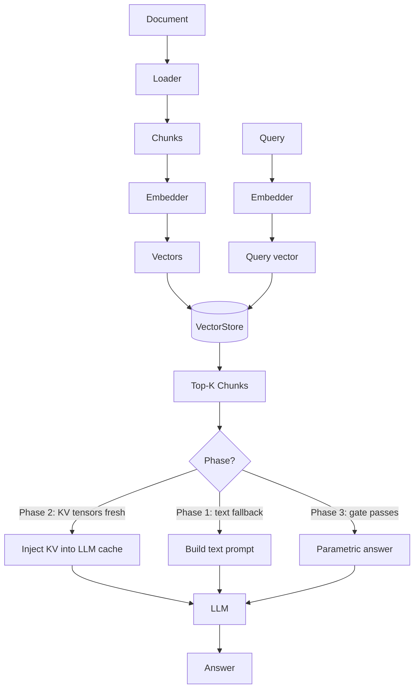

# KVForge Architecture

## Overview

KVForge is a three-phase RAG (Retrieval-Augmented Generation) system that progressively
reduces reliance on retrieval as the LLM learns the corpus through LoRA fine-tuning.

```
Phase 1 → Phase 2 → Phase 3
Retrieval   KV cache    Parametric
(always)   injection    answering
```

## The Three Phases

### Phase 1 — Retrieval + Text-in-Context

Every query:
1. Embeds the query with the configured embedder
2. Retrieves top-K chunks from the vector store
3. Builds a text prompt: `[context chunks] + [question]`
4. Calls the LLM with text prompt

This is standard RAG. No GPU needed for indexing; GPU needed for LLM inference.

### Phase 2 — KV Cache Injection

After KV tensors are computed for indexed chunks:
1. Query embeds and retrieves top-K chunks (same as Phase 1)
2. **For fresh chunks:** loads their pre-computed KV tensors, injects them directly into the LLM's
   attention cache, skipping the text-encoding step
3. **For stale chunks** (KV computed before last LoRA round): falls back to text-in-context;
   enqueues chunk for background KV recomputation

Phase 2 is faster and uses less prompt space than Phase 1.

### Phase 3 — Confidence-Gated Parametric Answering

After the LLM reaches `prs_threshold` PRS:
1. The **confidence gate** (`confidence_gate.py`) scores each query:
   - **Entropy** of the LLM's token distribution (low entropy = confident)
   - **Hedging signals** (phrases like "I think", "I'm not sure")
   - **Query similarity** to known-good queries from version history
2. If the gate passes: the LLM answers directly from its fine-tuned weights, with no retrieval
3. If the gate fails: falls back to Phase 2 KV injection

## Module Map

```
Core package (core/):
  core/config.py           DatasourceConfig Pydantic model
  core/kv_utils.py         KV tensor serialization / deserialization
  core/model_loader.py     Singleton LLM + tokenizer loader
  core/version.py          Atomic read/write of version.json state file
  core/confidence_gate.py  Phase 3 gate: entropy + hedging + similarity
  core/replay_buffer.py    SQLite-backed weighted training sampler
  core/access_tracker.py   Thread-safe tier classification (hot/warm/cold/frozen)

User-facing CLIs (root):
  kvforge.py      init / index / search subcommands
  ask.py              Single-shot question answering

Pipeline package (pipeline/):
  kv_indexer.py           Chunk + embed + KV tensor computation
  kv_inference.py         Phase 1/2/3 query-time inference
  kv_background.py        Daemon: background KV healing + access flush
  lora_trainer.py         LoRA fine-tuning with replay buffer
  prs_evaluator.py        Parametric Readiness Score evaluation
  sleep_faq_generator.py  Offline FAQ pre-computation via cloud LLM
  monitoring_dashboard.py FastAPI monitoring server
  index_and_train.py      Orchestrator: subprocess-based pipeline runner
  bedrock_rag.py          Legacy entry point (kept for symbol compatibility)

Studio package (studio/):
  pipeline_runner.py  Spawns pipeline step subprocesses; streams stdout/stderr
                      as SSE events; GPU pre-check before GPU-required steps;
                      per-UC CUDA_VISIBLE_DEVICES isolation via uc_config.json.
  kvforge_portal.py   Browser UI for the 6-step pipeline; SSE log streaming;
                      per-UC uc_config.json management; GPU health checks.
                      Served at port 8080 via FastAPI.

Pluggable packages:
  vectorstore/        VectorStore protocol + Qdrant / ChromaDB / FAISS backends
  embeddings/         Embedder protocol + FastEmbed / SentenceTransformers / OpenAI backends
  ingestion/          DocumentLoader protocol + PDF / Markdown / JSONL / HTML / Directory loaders

Tools:
  tools/generate_faqs.py  Auto-generate FAQ Q/A pairs from corpus
  tools/gen_viewer.py     Generate A/B evaluation HTML viewer
```

## Sleep-time FAQ Generation

Before LoRA training, the `pipeline/sleep_faq_generator.py` module pre-computes Q&A pairs from the
already-indexed chunks using a cloud LLM — offline, with no user traffic involved. This is called
"sleep-time" because it runs between indexing and training, not at query time.

**Why it matters for training quality:**

LoRA fine-tuning quality is directly proportional to the quality of the FAQ signal. Heuristic
generators produce surface-level question templates; a cloud LLM can generate diverse, semantically
rich questions that mirror real user intent. In practice this produces a measurable PRS lift
(UC4 example: PRS 0.727 → 0.861 after switching to sleep-time FAQ generation).

**What it saves:**

- `faqs.json` — Q&A pairs used as training signal by `lora_trainer.py`
- `version.json` (`known_good_queries`) — pre-seeds the Phase 3 confidence gate so high-quality
  queries are recognized from the very first PRS evaluation round

**Supported providers:** Gemini, Claude (Anthropic), OpenAI.

**Configuration (in `uc_config.json`):**

```json
{
  "llm": {
    "sleep_faq_provider": "gemini",
    "sleep_faq_model": "gemini-2.5-flash",
    "sleep_faq_count": 50
  }
}
```

**Standalone invocation:**

```bash
python -m pipeline.sleep_faq_generator \
  --config config.json \
  --output faqs.json \
  --count 50
```

## Monitoring Dashboard

Each use-case exposes a per-process FastAPI dashboard (`pipeline/monitoring_dashboard.py`) at
a dedicated port (8081–8084 on the reference EC2 deployment). Dashboards are fully independent
and read their own `config.json` and `version.json`.

**Key panels:**

| Panel | What it shows |
|-------|---------------|
| Phase / LoRA version | Current pipeline phase and adapter version number |
| Tier distribution | Hot / warm / cold / frozen chunk counts |
| Top-10 chunks | Most-accessed chunks sorted by `access_count`; click preview → full-text popup |
| PRS history | Per-round scores with inline progress bars; help modal explains the formula |
| FAQ Coverage Heatmap | FAQs × top-K matching chunks; cells coloured by cosine similarity (red≥0.85, orange≥0.75, yellow≥0.65, blue<0.65); threshold slider filters rows; click cell → full chunk popup |
| A/B query | Side-by-side KVForge (Model A) vs cloud LLM (Model B: Gemini / Claude / OpenAI) |

**Access tracking:** Every query — Model A or Model B, via vLLM or HF transformers — calls
`kv_background.record_access(chunk_id, rank)` for every retrieved chunk. The background daemon
periodically flushes these counters to Qdrant, keeping tier data accurate across all query paths.

## Tier System

The access tracker classifies each chunk by query frequency and recency:

| Tier | Condition | Replay weight |
|------|-----------|:---:|
| hot  | Top 15% by access count, last accessed < 7 days | 8 |
| warm | Next 50%, last accessed < 30 days | 4 |
| cold | Remaining accessed chunks | 2 |
| frozen | Never accessed (access_count = 0) | 1 |

Thresholds scale dynamically with corpus size so small corpora don't get stuck with all chunks in one tier.

## PRS Gate

The Parametric Readiness Score gates phase transitions:

```
PRS = 0.5 × accuracy + 0.3 × calibration + 0.2 × consistency
```

- **accuracy**: fraction of FAQ answers correctly reproduced
- **calibration**: 1 - mean(token entropy) for correct answers (confident answers score high)
- **consistency**: pairwise answer similarity for paraphrased versions of the same question

When `PRS >= prs_threshold` (default: 0.75), the system advances to Phase 3.

## Data Flow


