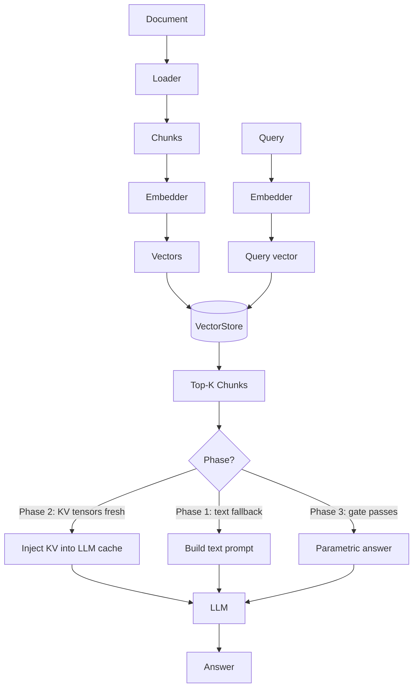

# SmartQdrant Architecture

## Overview

SmartQdrant is a three-phase RAG (Retrieval-Augmented Generation) system that progressively
reduces reliance on retrieval as the LLM learns the corpus through LoRA fine-tuning.

```
Phase 1 → Phase 2 → Phase 3
Retrieval   KV cache    Parametric
(always)   injection    answering
```

## The Three Phases

### Phase 1 — Retrieval + Text-in-Context

Every query:
1. Embeds the query with the configured embedder
2. Retrieves top-K chunks from the vector store
3. Builds a text prompt: `[context chunks] + [question]`
4. Calls the LLM with text prompt

This is standard RAG. No GPU needed for indexing; GPU needed for LLM inference.

### Phase 2 — KV Cache Injection

After KV tensors are computed for indexed chunks:
1. Query embeds and retrieves top-K chunks (same as Phase 1)
2. **For fresh chunks:** loads their pre-computed KV tensors, injects them directly into the LLM's
   attention cache, skipping the text-encoding step
3. **For stale chunks** (KV computed before last LoRA round): falls back to text-in-context;
   enqueues chunk for background KV recomputation

Phase 2 is faster and uses less prompt space than Phase 1.

### Phase 3 — Confidence-Gated Parametric Answering

After the LLM reaches `prs_threshold` PRS:
1. The **confidence gate** (`confidence_gate.py`) scores each query:
   - **Entropy** of the LLM's token distribution (low entropy = confident)
   - **Hedging signals** (phrases like "I think", "I'm not sure")
   - **Query similarity** to known-good queries from version history
2. If the gate passes: the LLM answers directly from its fine-tuned weights, with no retrieval
3. If the gate fails: falls back to Phase 2 KV injection

## Module Map

```
Root utilities (always available, no GPU needed):
  config.py           DatasourceConfig Pydantic model
  kv_utils.py         KV tensor serialization / deserialization
  model_loader.py     Singleton LLM + tokenizer loader
  version.py          Atomic read/write of version.json state file
  confidence_gate.py  Phase 3 gate: entropy + hedging + similarity
  replay_buffer.py    SQLite-backed weighted training sampler
  access_tracker.py   Thread-safe tier classification (hot/warm/cold/frozen)

User-facing CLIs (root):
  smartqdrant.py      init / index / search subcommands
  ask.py              Single-shot question answering

Pipeline package (pipeline/):
  kv_indexer.py       Chunk + embed + KV tensor computation
  kv_inference.py     Phase 1/2/3 query-time inference
  kv_background.py    Daemon: background KV healing + access flush
  lora_trainer.py     LoRA fine-tuning with replay buffer
  prs_evaluator.py    Parametric Readiness Score evaluation
  monitoring_dashboard.py  FastAPI monitoring server
  index_and_train.py  Orchestrator: subprocess-based pipeline runner
  bedrock_rag.py      Legacy entry point (kept for symbol compatibility)

Pluggable packages:
  vectorstore/        VectorStore protocol + Qdrant / ChromaDB / FAISS backends
  embeddings/         Embedder protocol + FastEmbed / SentenceTransformers / OpenAI backends
  ingestion/          DocumentLoader protocol + PDF / Markdown / JSONL / HTML / Directory loaders

Tools:
  tools/generate_faqs.py  Auto-generate FAQ Q/A pairs from corpus
  tools/gen_viewer.py     Generate A/B evaluation HTML viewer
```

## Tier System

The access tracker classifies each chunk by query frequency and recency:

| Tier | Access count | Effect |
|------|-------------|--------|
| hot  | ≥ 10/week | KV healing priority 8×; highest replay weight |
| warm | 3–9/week  | KV healing priority 4×; medium replay weight |
| cold | 1–2/week  | KV healing priority 2×; low replay weight |
| frozen | 0/week  | No KV healing; lowest replay weight |

## PRS Gate

The Parametric Readiness Score gates phase transitions:

```
PRS = 0.5 × accuracy + 0.3 × calibration + 0.2 × consistency
```

- **accuracy**: fraction of FAQ answers correctly reproduced
- **calibration**: 1 - mean(token entropy) for correct answers (confident answers score high)
- **consistency**: pairwise answer similarity for paraphrased versions of the same question

When `PRS >= prs_threshold` (default: 0.75), the system advances to Phase 3.

## Data Flow


