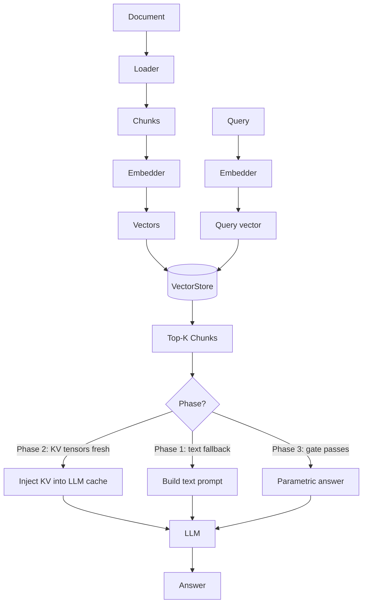

# KVForge Codebase Reorganisation Implementation Plan

> **For agentic workers:** REQUIRED: Use superpowers:subagent-driven-development (if subagents available) or superpowers:executing-plans to implement this plan. Steps use checkbox (`- [ ]`) syntax for tracking.

**Goal:** Reorganise the KVForge repo by moving 9 pipeline scripts into a `pipeline/` package, isolating Qdrant-internal tests, adding documented shell wrappers in `scripts/`, and writing complete project documentation.

**Architecture:** All 9 pipeline orchestration scripts move from root to `pipeline/`; their import paths are updated in every caller (production files, tests, example scripts). No logic changes anywhere. New `scripts/` directory holds shell wrappers for every runnable Python tool. New `docs/guides/` and `docs/api/` directories hold hand-written documentation.

**Tech Stack:** Python 3.10+, pytest, bash, pdoc (dev tool for auto-generated API docs)

---

## Chunk 1: Pipeline Package — Move Scripts and Fix All Imports

## Task 1: Establish baseline — confirm all tests pass before any change

**Files:**
- Read: `tests/test_*.py` (baseline)

- [ ] **Step 1: Run full test suite to establish baseline**

```bash
cd /path/to/repo
pytest tests/test_*.py -x -q
```

Expected: all tests pass. Note the count (e.g. "78 passed"). If any tests fail, stop and fix before proceeding.

- [ ] **Step 2: Commit note (no code change)**

```bash
git status  # should be clean
```

---

## Task 2: Create `pipeline/` package with empty `__init__.py`

**Files:**
- Create: `pipeline/__init__.py`

- [ ] **Step 1: Create the package init file**

```bash
mkdir -p pipeline
touch pipeline/__init__.py
```

`pipeline/__init__.py` contents: empty file (0 bytes).

- [ ] **Step 2: Verify package is importable**

```bash
python -c "import pipeline; print('pipeline package OK')"
```

Expected: `pipeline package OK`

- [ ] **Step 3: Run tests (should still pass — nothing moved yet)**

```bash
pytest tests/test_*.py -x -q
```

Expected: same count as baseline.

---

## Task 3: Move all 9 pipeline scripts from root to `pipeline/`

**Files:**
- Move (git mv): `bedrock_rag.py` → `pipeline/bedrock_rag.py`
- Move (git mv): `kv_indexer.py` → `pipeline/kv_indexer.py`
- Move (git mv): `kv_inference.py` → `pipeline/kv_inference.py`
- Move (git mv): `kv_background.py` → `pipeline/kv_background.py`
- Move (git mv): `lora_trainer.py` → `pipeline/lora_trainer.py`
- Move (git mv): `prs_evaluator.py` → `pipeline/prs_evaluator.py`
- Move (git mv): `monitoring_dashboard.py` → `pipeline/monitoring_dashboard.py`
- Move (git mv): `index_and_train.py` → `pipeline/index_and_train.py`
- Move (git mv): `gen_viewer.py` → `tools/gen_viewer.py`

- [ ] **Step 1: Move all 8 pipeline scripts to `pipeline/` (gen_viewer.py handled in Step 2)**

```bash
git mv bedrock_rag.py pipeline/bedrock_rag.py
git mv kv_indexer.py pipeline/kv_indexer.py
git mv kv_inference.py pipeline/kv_inference.py
git mv kv_background.py pipeline/kv_background.py
git mv lora_trainer.py pipeline/lora_trainer.py
git mv prs_evaluator.py pipeline/prs_evaluator.py
git mv monitoring_dashboard.py pipeline/monitoring_dashboard.py
git mv index_and_train.py pipeline/index_and_train.py
```

- [ ] **Step 2: Move gen_viewer.py to tools/**

```bash
git mv gen_viewer.py tools/gen_viewer.py
```

- [ ] **Step 3: Run tests — EXPECT FAILURES (imports are broken)**

```bash
pytest tests/test_*.py -x -q 2>&1 | head -30
```

Expected: import errors like `ModuleNotFoundError: No module named 'kv_indexer'`. This is correct — fixes follow in the next tasks.

---

## Task 4: Fix imports in root files (`ask.py`, `confidence_gate.py`)

**Files:**
- Modify: `ask.py` (lines 43, 46)
- Modify: `confidence_gate.py` (lines 31, 184, 210, 228)

- [ ] **Step 1: Update `ask.py` — change 2 import lines**

In `ask.py`, find and replace these two lines (they appear inside the `main()` function body):

Change line 43:
```python
    import kv_background
```
To:
```python
    import pipeline.kv_background as kv_background
```

Change line 46:
```python
    from bedrock_rag import _run_search, Config
```
To:
```python
    from pipeline.bedrock_rag import _run_search, Config
```

- [ ] **Step 2: Update `confidence_gate.py` — change 4 import lines**

In `confidence_gate.py`:

Change line 31 (top-level import):
```python
import kv_background
```
To:
```python
import pipeline.kv_background as kv_background
```

Change line 184 (inside function body):
```python
        from kv_inference import answer_with_retrieval
```
To:
```python
        from pipeline.kv_inference import answer_with_retrieval
```

Change line 210 (inside function body, duplicate):
```python
        from kv_inference import answer_with_retrieval
```
To:
```python
        from pipeline.kv_inference import answer_with_retrieval
```

Change line 228 (inside function body):
```python
        from bedrock_rag import Config, _run_search
```
To:
```python
        from pipeline.bedrock_rag import Config, _run_search
```

---

## Task 5: Fix imports inside `pipeline/` scripts (cross-pipeline imports)

**Files:**
- Modify: `pipeline/kv_indexer.py` (line 34)
- Modify: `pipeline/kv_inference.py` (lines 19, 22)
- Modify: `pipeline/kv_background.py` (line 144)
- Modify: `pipeline/monitoring_dashboard.py` (lines 60, 61, 282)
- Modify: `pipeline/prs_evaluator.py` (line 158)
- Modify: `pipeline/index_and_train.py` (lines 42, 46, 53, 68, 74)

- [ ] **Step 1: Update `pipeline/kv_indexer.py` — 1 line**

Change line 34:
```python
from bedrock_rag import chunk_pages, read_pdf, embed_chunks
```
To:
```python
from pipeline.bedrock_rag import chunk_pages, read_pdf, embed_chunks
```

- [ ] **Step 2: Update `pipeline/kv_inference.py` — 2 lines**

Change line 19:
```python
import kv_background
```
To:
```python
import pipeline.kv_background as kv_background
```

Change line 22:
```python
from bedrock_rag import _run_search, Config
```
To:
```python
from pipeline.bedrock_rag import _run_search, Config
```

- [ ] **Step 3: Update `pipeline/kv_background.py` — 1 line (lazy import inside function)**

Change line 144:
```python
            from kv_indexer import compute_kv_for_chunk
```
To:
```python
            from pipeline.kv_indexer import compute_kv_for_chunk
```

- [ ] **Step 4: Update `pipeline/monitoring_dashboard.py` — 3 lines**

Change line 60 (inside try block):
```python
        import kv_background as _kb
```
To:
```python
        import pipeline.kv_background as _kb
```

Change line 61 (inside try block):
```python
        import kv_inference as _ki
```
To:
```python
        import pipeline.kv_inference as _ki
```

Change line 282 (inside function body):
```python
        from bedrock_rag import _run_search, Config
```
To:
```python
        from pipeline.bedrock_rag import _run_search, Config
```

- [ ] **Step 5: Update `pipeline/prs_evaluator.py` — 1 line (lazy import)**

Change line 158:
```python
        from kv_inference import answer_with_retrieval
```
To:
```python
        from pipeline.kv_inference import answer_with_retrieval
```

- [ ] **Step 6: Update `pipeline/index_and_train.py` — 5 subprocess call-sites**

Change line 42:
```python
    run([py, "kv_indexer.py", "--config", args.config, "index", str(pdf)],
```
To:
```python
    run([py, "-m", "pipeline.kv_indexer", "--config", args.config, "index", str(pdf)],
```

Change line 46:
```python
    run([py, "lora_trainer.py",
```
To:
```python
    run([py, "-m", "pipeline.lora_trainer",
```

Change line 53:
```python
    run([py, "kv_indexer.py", "--config", args.config,
         "compute-kv", "--source-file", pdf.name],
```
To:
```python
    run([py, "-m", "pipeline.kv_indexer", "--config", args.config,
         "compute-kv", "--source-file", pdf.name],
```

Change line 68:
```python
        run([py, "kv_indexer.py", "--config", args.config,
             "compute-kv", "--stale-version", str(current_ver)],
```
To:
```python
        run([py, "-m", "pipeline.kv_indexer", "--config", args.config,
             "compute-kv", "--stale-version", str(current_ver)],
```

Change line 74:
```python
        run([py, "prs_evaluator.py",
```
To:
```python
        run([py, "-m", "pipeline.prs_evaluator",
```

---

## Task 6: Fix imports in all test files

**Files:**
- Modify: `tests/test_kv_indexer.py` (lines 34, 58)
- Modify: `tests/test_kv_inference.py` (lines 27, 34, 41)
- Modify: `tests/test_lora_trainer.py` (line 62)
- Modify: `tests/test_prs_evaluator.py` (lines 6, 14, 22, 29, 36, 47)
- Modify: `tests/test_dashboard.py` (line 11)
- Modify: `tests/test_embeddings.py` (lines 7, 19)
- Modify: `tests/test_integration_smoke.py` (line 19)
- Modify: `tests/test_ingestion.py` (lines 122, 138)

- [ ] **Step 1: Update `tests/test_kv_indexer.py`**

Change line 34 (inside test function):
```python
    from kv_indexer import compute_kv_for_chunk
```
To:
```python
    from pipeline.kv_indexer import compute_kv_for_chunk
```

Change line 58 (inside test function):
```python
    from kv_indexer import build_payload
```
To:
```python
    from pipeline.kv_indexer import build_payload
```

- [ ] **Step 2: Update `tests/test_kv_inference.py`**

Change line 27:
```python
    from kv_inference import decide_inference_mode
```
To:
```python
    from pipeline.kv_inference import decide_inference_mode
```

Change line 34:
```python
    from kv_inference import decide_inference_mode
```
To:
```python
    from pipeline.kv_inference import decide_inference_mode
```

Change line 41:
```python
    from kv_inference import decide_inference_mode, get_stale_chunk_ids
```
To:
```python
    from pipeline.kv_inference import decide_inference_mode, get_stale_chunk_ids
```

- [ ] **Step 3: Update `tests/test_lora_trainer.py`**

Change line 62:
```python
    from lora_trainer import fetch_chunks_for_source
```
To:
```python
    from pipeline.lora_trainer import fetch_chunks_for_source
```

- [ ] **Step 4: Update `tests/test_prs_evaluator.py`**

Change all 6 occurrences — each inside a separate test function:
```python
    from prs_evaluator import _extract_qa
```
To:
```python
    from pipeline.prs_evaluator import _extract_qa
```

And:
```python
    from prs_evaluator import _compute_prs
```
To:
```python
    from pipeline.prs_evaluator import _compute_prs
```

Use replace-all for `from prs_evaluator import` → `from pipeline.prs_evaluator import` across the whole file.

- [ ] **Step 5: Update `tests/test_dashboard.py`**

Change line 11 (inside try block):
```python
    import monitoring_dashboard as md
```
To:
```python
    import pipeline.monitoring_dashboard as md
```

- [ ] **Step 6: Update `tests/test_embeddings.py`**

Change both occurrences (lines 7 and 19 — inside test functions):
```python
    from bedrock_rag import validate_embed_dim
```
To:
```python
    from pipeline.bedrock_rag import validate_embed_dim
```

Use replace-all for `from bedrock_rag import validate_embed_dim` → `from pipeline.bedrock_rag import validate_embed_dim`.

- [ ] **Step 7: Update `tests/test_integration_smoke.py`**

Change line 19:
```python
from kv_inference import decide_inference_mode
```
To:
```python
from pipeline.kv_inference import decide_inference_mode
```

- [ ] **Step 8: Update `tests/test_ingestion.py`**

Change line 122 (the `patch()` string target):
```python
         patch("bedrock_rag.TextEmbedding") as mock_emb_cls, \
```
To:
```python
         patch("pipeline.bedrock_rag.TextEmbedding") as mock_emb_cls, \
```

> **Verification note:** After this change, confirm that `TextEmbedding` is looked up directly from `pipeline.bedrock_rag` at the call site under test (i.e., `bedrock_rag.py` does `from fastembed import TextEmbedding` at the top level, and `cmd_index` calls it as a module-level name). If it were re-exported or aliased via another module, the patch target would need to point to that other module instead. You can verify with: `grep -n "TextEmbedding" pipeline/bedrock_rag.py`

Change line 138 (inside test function):
```python
        from bedrock_rag import Config, cmd_index
```
To:
```python
        from pipeline.bedrock_rag import Config, cmd_index
```

---

## Task 7: Update example run_pipeline.sh and README.md files

**Files:**
- Modify: `examples/usecase1_customer_support/run_pipeline.sh`
- Modify: `examples/usecase2_pubmedqa/run_pipeline.sh`
- Modify: `examples/usecase3_squad/run_pipeline.sh`
- Modify: `examples/usecase1_customer_support/README.md`
- Modify: `examples/usecase2_pubmedqa/README.md`
- Modify: `examples/usecase3_squad/README.md`

- [ ] **Step 1: Update all three `run_pipeline.sh` files**

In each of the three `run_pipeline.sh` files, make these replacements (apply to all 3 files):

```
python kv_indexer.py       →  python -m pipeline.kv_indexer
python lora_trainer.py     →  python -m pipeline.lora_trainer
python prs_evaluator.py    →  python -m pipeline.prs_evaluator
python monitoring_dashboard.py  →  python -m pipeline.monitoring_dashboard
```

Note: `monitoring_dashboard.py` appears as a hint in an `echo` line (e.g. `echo "python monitoring_dashboard.py --config $CONFIG"`) — update it too so the printed hint is accurate.

For `usecase1_customer_support/run_pipeline.sh`, the lines to change are:
- Line with `python kv_indexer.py --config "$CONFIG" compute-kv` (appears twice)
- Line with `python lora_trainer.py \`
- Line with `python prs_evaluator.py \`

Apply the same pattern to `usecase2_pubmedqa/run_pipeline.sh` and `usecase3_squad/run_pipeline.sh`.

- [ ] **Step 2: Update all three `README.md` files in examples/**

In each README, replace all hardcoded Python commands in code blocks:
```
python kv_indexer.py    →  python -m pipeline.kv_indexer
python lora_trainer.py  →  python -m pipeline.lora_trainer
python prs_evaluator.py →  python -m pipeline.prs_evaluator
python monitoring_dashboard.py  →  python -m pipeline.monitoring_dashboard
```

---

## Task 8: Run full test suite — Chunk 1 gate

- [ ] **Step 1: Run full test suite**

```bash
pytest tests/test_*.py -x -q
```

Expected: same pass count as baseline (Task 1). Zero failures.

If any test fails, read the error carefully — it is almost certainly a missed import path. Fix it and rerun before proceeding.

- [ ] **Step 2: Verify pipeline module is importable**

```bash
python -c "import pipeline.kv_indexer; print('kv_indexer OK')"
python -c "import pipeline.kv_inference; print('kv_inference OK')"
python -c "import pipeline.kv_background; print('kv_background OK')"
```

Expected: each prints OK (may warn about missing GPU — that's fine).

- [ ] **Step 3: Commit Chunk 1**

```bash
git add pipeline/ tools/gen_viewer.py \
  ask.py confidence_gate.py \
  examples/usecase1_customer_support/run_pipeline.sh \
  examples/usecase2_pubmedqa/run_pipeline.sh \
  examples/usecase3_squad/run_pipeline.sh \
  examples/usecase1_customer_support/README.md \
  examples/usecase2_pubmedqa/README.md \
  examples/usecase3_squad/README.md \
  tests/test_kv_indexer.py tests/test_kv_inference.py \
  tests/test_lora_trainer.py tests/test_prs_evaluator.py \
  tests/test_dashboard.py tests/test_embeddings.py \
  tests/test_integration_smoke.py tests/test_ingestion.py

git commit -m "refactor: move pipeline scripts to pipeline/ package; update all imports"
```

---

## Chunk 2: Test Isolation — Move Qdrant Internal Tests

## Task 9: Move Qdrant-internal tests to `tests/qdrant_internal/`

**Files:**
- Create: `tests/qdrant_internal/README.md`
- Move: `tests/consensus_tests/` → `tests/qdrant_internal/consensus_tests/`
- Move: `tests/e2e_tests/` → `tests/qdrant_internal/e2e_tests/`
- Move: `tests/openapi/` → `tests/qdrant_internal/openapi/`

- [ ] **Step 1: Create the qdrant_internal directory and README**

Create `tests/qdrant_internal/README.md` with the content below. Use the Write tool to create the file directly — do NOT copy/paste via a code block in a shell script, as inner backtick fences would conflict:

    # Qdrant Internal Tests

    These test suites are carried over from the upstream [Qdrant](https://github.com/qdrant/qdrant)
    repository. They test Qdrant's internal cluster consensus, TLS configuration, snapshot
    compatibility, and REST API compliance — **not** KVForge's RAG pipeline.

    ## Contents

    | Directory | What it tests |
    |-----------|---------------|
    | `consensus_tests/` | Raft consensus protocol between Qdrant cluster nodes |
    | `e2e_tests/` | End-to-end: TLS, snapshots, data compatibility across versions |
    | `openapi/` | Qdrant REST API endpoint contract tests |

    ## Running these tests

    These tests require a running Qdrant cluster and are not part of the KVForge CI suite.
    Run KVForge-specific tests with:

        pytest tests/test_*.py -v

- [ ] **Step 2: Move the three test directories**

```bash
git mv tests/consensus_tests tests/qdrant_internal/consensus_tests
git mv tests/e2e_tests tests/qdrant_internal/e2e_tests
git mv tests/openapi tests/qdrant_internal/openapi
```

- [ ] **Step 3: Run tests — must still pass**

```bash
pytest tests/test_*.py -x -q
```

Expected: same pass count as after Task 8.

- [ ] **Step 4: Commit**

```bash
git add tests/qdrant_internal/
git commit -m "chore: isolate Qdrant-internal tests under tests/qdrant_internal/"
```

---

## Chunk 3: Shell Scripts

## Task 10: Create `scripts/` directory with all documented shell wrappers

**Files:**
- Create: `scripts/ask.sh`
- Create: `scripts/dashboard.sh`
- Create: `scripts/index.sh`
- Create: `scripts/compute_kv.sh`
- Create: `scripts/train_lora.sh`
- Create: `scripts/evaluate_prs.sh`
- Create: `scripts/generate_faqs.sh`
- Create: `scripts/generate_docs.sh`
- Create: `scripts/run_pipeline.sh`
- Create: `scripts/README.md`

- [ ] **Step 1: Create `scripts/ask.sh`**

```bash
#!/usr/bin/env bash
# ============================================================
# ask.sh — Query KVForge from the command line
#
# Usage:
#   scripts/ask.sh <config.json> "<query>"
#
# Required arguments:
#   CONFIG  Path to datasource JSON config file
#   QUERY   The question to ask (quoted string)
#
# Example:
#   ./scripts/ask.sh datasource_my-corpus.json "What is RAG?"
# ============================================================
set -euo pipefail

if ! command -v python &>/dev/null; then
  echo "Error: python not found in PATH" >&2; exit 1
fi

CONFIG="${1:-}"
QUERY="${2:-}"

if [[ -z "$CONFIG" || ! -f "$CONFIG" ]]; then
  echo "Usage: $0 <config.json> \"<query>\"" >&2; exit 1
fi
if [[ -z "$QUERY" ]]; then
  echo "Usage: $0 <config.json> \"<query>\"" >&2; exit 1
fi

python ask.py --config "$CONFIG" "$QUERY"
```

- [ ] **Step 2: Create `scripts/dashboard.sh`**

```bash
#!/usr/bin/env bash
# ============================================================
# dashboard.sh — Start the KVForge monitoring dashboard
#
# Usage:
#   scripts/dashboard.sh <config.json> [port]
#
# Required arguments:
#   CONFIG  Path to datasource JSON config file
#
# Optional arguments:
#   PORT    Port to listen on (default: 8080)
#
# Example:
#   ./scripts/dashboard.sh datasource_my-corpus.json
#   ./scripts/dashboard.sh datasource_my-corpus.json 9090
# ============================================================
set -euo pipefail

if ! command -v python &>/dev/null; then
  echo "Error: python not found in PATH" >&2; exit 1
fi

CONFIG="${1:-}"
PORT="${2:-8080}"

if [[ -z "$CONFIG" || ! -f "$CONFIG" ]]; then
  echo "Usage: $0 <config.json> [port]" >&2; exit 1
fi

python -m pipeline.monitoring_dashboard --config "$CONFIG" --port "$PORT"
```

- [ ] **Step 3: Create `scripts/index.sh`**

```bash
#!/usr/bin/env bash
# ============================================================
# index.sh — Load, embed, and index documents into the vector store
#
# Usage:
#   scripts/index.sh <config.json> <source_path>
#
# Required arguments:
#   CONFIG  Path to datasource JSON config file
#   SOURCE  Path to source documents (file or directory)
#
# Example:
#   ./scripts/index.sh datasource_my-corpus.json ./docs/
#   ./scripts/index.sh datasource_my-corpus.json my_document.pdf
# ============================================================
set -euo pipefail

if ! command -v python &>/dev/null; then
  echo "Error: python not found in PATH" >&2; exit 1
fi

CONFIG="${1:-}"
SOURCE="${2:-}"

if [[ -z "$CONFIG" || ! -f "$CONFIG" ]]; then
  echo "Usage: $0 <config.json> <source_path>" >&2; exit 1
fi
if [[ -z "$SOURCE" ]]; then
  echo "Usage: $0 <config.json> <source_path>" >&2; exit 1
fi

python kvforge.py index --config "$CONFIG" --source "$SOURCE"
```

- [ ] **Step 4: Create `scripts/compute_kv.sh`**

```bash
#!/usr/bin/env bash
# ============================================================
# compute_kv.sh — Compute and store KV tensors for indexed chunks
#
# Runs Phase 1→2 bridge: reads chunks from the vector store,
# runs them through the LLM to compute KV tensors, and stores
# the serialized tensors back as chunk payloads.
#
# Usage:
#   scripts/compute_kv.sh <config.json>
#
# Required arguments:
#   CONFIG  Path to datasource JSON config file
#
# Prerequisites:
#   - GPU recommended (will work on CPU but very slow)
#   - Documents must already be indexed (run index.sh first)
#
# Example:
#   ./scripts/compute_kv.sh datasource_my-corpus.json
# ============================================================
set -euo pipefail

if ! command -v python &>/dev/null; then
  echo "Error: python not found in PATH" >&2; exit 1
fi

CONFIG="${1:-}"

if [[ -z "$CONFIG" || ! -f "$CONFIG" ]]; then
  echo "Usage: $0 <config.json>" >&2; exit 1
fi

python -m pipeline.kv_indexer --config "$CONFIG" compute-kv
```

- [ ] **Step 5: Create `scripts/train_lora.sh`**

```bash
#!/usr/bin/env bash
# ============================================================
# train_lora.sh — Fine-tune the LLM with LoRA on FAQ pairs
#
# Uses PEFT LoRA to fine-tune the configured LLM on question/answer
# pairs from a FAQs JSON file. Saves adapter weights to
# the checkpoint_dir specified in the config.
#
# Usage:
#   scripts/train_lora.sh <config.json> <faqs.json>
#
# Required arguments:
#   CONFIG  Path to datasource JSON config file
#   FAQS    Path to FAQs JSON file (array of {question, answer} objects)
#
# Prerequisites:
#   - GPU required (LoRA fine-tuning is GPU-only)
#
# Example:
#   ./scripts/train_lora.sh datasource_my-corpus.json my-corpus_faqs.json
# ============================================================
set -euo pipefail

if ! command -v python &>/dev/null; then
  echo "Error: python not found in PATH" >&2; exit 1
fi

CONFIG="${1:-}"
FAQS="${2:-}"

if [[ -z "$CONFIG" || ! -f "$CONFIG" ]]; then
  echo "Usage: $0 <config.json> <faqs.json>" >&2; exit 1
fi
if [[ -z "$FAQS" || ! -f "$FAQS" ]]; then
  echo "Error: FAQS file not found: $FAQS" >&2
  echo "Usage: $0 <config.json> <faqs.json>" >&2; exit 1
fi

python -m pipeline.lora_trainer --config "$CONFIG" --faqs "$FAQS"
```

- [ ] **Step 6: Create `scripts/evaluate_prs.sh`**

```bash
#!/usr/bin/env bash
# ============================================================
# evaluate_prs.sh — Evaluate Parametric Readiness Score (PRS)
#
# Runs the PRS evaluation pipeline: asks the configured LLM each FAQ
# question and scores accuracy, calibration, and consistency.
# PRS = 0.5*accuracy + 0.3*calibration + 0.2*consistency.
# If PRS >= prs_threshold in config, the system advances to Phase 3.
#
# Usage:
#   scripts/evaluate_prs.sh <config.json> <faqs.json>
#
# Required arguments:
#   CONFIG  Path to datasource JSON config file
#   FAQS    Path to FAQs JSON file (array of {question, answer} objects)
#
# Example:
#   ./scripts/evaluate_prs.sh datasource_my-corpus.json my-corpus_faqs.json
# ============================================================
set -euo pipefail

if ! command -v python &>/dev/null; then
  echo "Error: python not found in PATH" >&2; exit 1
fi

CONFIG="${1:-}"
FAQS="${2:-}"

if [[ -z "$CONFIG" || ! -f "$CONFIG" ]]; then
  echo "Usage: $0 <config.json> <faqs.json>" >&2; exit 1
fi
if [[ -z "$FAQS" || ! -f "$FAQS" ]]; then
  echo "Error: FAQS file not found: $FAQS" >&2
  echo "Usage: $0 <config.json> <faqs.json>" >&2; exit 1
fi

python -m pipeline.prs_evaluator --config "$CONFIG" --faqs "$FAQS"
```

- [ ] **Step 7: Create `scripts/generate_faqs.sh`**

```bash
#!/usr/bin/env bash
# ============================================================
# generate_faqs.sh — Auto-generate FAQ pairs from indexed corpus
#
# Samples chunks from the vector store, calls the LLM to produce
# Q/A pairs in "Q: ... A: ..." format, and saves them to a JSON file
# suitable for train_lora.sh and evaluate_prs.sh.
#
# Usage:
#   scripts/generate_faqs.sh <config.json> <output.json> [count]
#
# Required arguments:
#   CONFIG  Path to datasource JSON config file
#   OUTPUT  Output JSON file path for generated FAQs
#
# Optional arguments:
#   COUNT   Number of FAQ pairs to generate (default: 50)
#
# Prerequisites:
#   - Documents must be indexed first (run index.sh)
#   - GPU recommended for LLM calls
#
# Example:
#   ./scripts/generate_faqs.sh datasource_my-corpus.json my-corpus_faqs.json
#   ./scripts/generate_faqs.sh datasource_my-corpus.json my-corpus_faqs.json 100
# ============================================================
set -euo pipefail

if ! command -v python &>/dev/null; then
  echo "Error: python not found in PATH" >&2; exit 1
fi

CONFIG="${1:-}"
OUTPUT="${2:-}"
COUNT="${3:-50}"

if [[ -z "$CONFIG" || ! -f "$CONFIG" ]]; then
  echo "Usage: $0 <config.json> <output.json> [count]" >&2; exit 1
fi
if [[ -z "$OUTPUT" ]]; then
  echo "Usage: $0 <config.json> <output.json> [count]" >&2; exit 1
fi

python tools/generate_faqs.py --config "$CONFIG" --output "$OUTPUT" --count "$COUNT"
```

- [ ] **Step 8: Create `scripts/generate_docs.sh`**

```bash
#!/usr/bin/env bash
# ============================================================
# generate_docs.sh — Auto-generate API reference from docstrings
#
# Uses pdoc (v14+) to generate HTML documentation from all Python
# module docstrings. Output is written to docs/api/generated/
# and is NOT committed to git (see .gitignore).
#
# Usage:
#   scripts/generate_docs.sh [output_dir]
#
# Optional arguments:
#   OUTPUT_DIR  Where to write generated HTML (default: docs/api/generated)
#
# Prerequisites:
#   pip install pdoc
#
# Example:
#   ./scripts/generate_docs.sh
#   ./scripts/generate_docs.sh /tmp/kvforge-docs
# ============================================================
set -euo pipefail

# NOTE: This script intentionally omits the CONFIG validation block used by
# other scripts — pdoc operates on source modules directly and requires no
# datasource config file.

if ! command -v python &>/dev/null; then
  echo "Error: python not found in PATH" >&2; exit 1
fi

if ! python -c "import pdoc" 2>/dev/null; then
  echo "Error: pdoc not installed. Run: pip install pdoc" >&2; exit 1
fi

OUTPUT_DIR="${1:-docs/api/generated}"
mkdir -p "$OUTPUT_DIR"

python -m pdoc -o "$OUTPUT_DIR" \
  config kv_utils model_loader version confidence_gate \
  replay_buffer access_tracker \
  pipeline embeddings ingestion vectorstore tools

echo "Documentation written to: $OUTPUT_DIR"
```

- [ ] **Step 9: Create `scripts/run_pipeline.sh`**

```bash
#!/usr/bin/env bash
# ============================================================
# run_pipeline.sh — Full KVForge Phase 1→2→3 pipeline
#
# Runs the complete pipeline for a new corpus:
#   1. Index documents (embed + upsert to vector store)
#   2. Generate FAQ pairs from the indexed corpus
#   3. Compute KV tensors (Phase 1→2 bridge)
#   4. Fine-tune with LoRA (Phase 2)
#   5. Recompute KV with updated weights
#   6. Evaluate PRS (gate for Phase 3)
#
# Usage:
#   scripts/run_pipeline.sh <config.json> <source_path> <faqs.json>
#
# Required arguments:
#   CONFIG  Path to datasource JSON config file
#   SOURCE  Path to source documents (file or directory)
#   FAQS    Path to FAQs JSON file (will be created by generate_faqs if absent)
#
# Prerequisites:
#   - GPU recommended (KV computation and LoRA training require GPU)
#   - Qdrant Docker running (if vector_store=qdrant in config)
#   - HuggingFace token set (if using a gated model like Llama 3)
#
# Example:
#   ./scripts/run_pipeline.sh datasource_my-corpus.json ./docs/ my-corpus_faqs.json
# ============================================================
set -euo pipefail

if ! command -v python &>/dev/null; then
  echo "Error: python not found in PATH" >&2; exit 1
fi

CONFIG="${1:-}"
SOURCE="${2:-}"
FAQS="${3:-}"

if [[ -z "$CONFIG" || ! -f "$CONFIG" ]]; then
  echo "Usage: $0 <config.json> <source_path> <faqs.json>" >&2; exit 1
fi
if [[ -z "$SOURCE" ]]; then
  echo "Usage: $0 <config.json> <source_path> <faqs.json>" >&2; exit 1
fi
if [[ -z "$FAQS" ]]; then
  echo "Usage: $0 <config.json> <source_path> <faqs.json>" >&2; exit 1
fi

SCRIPT_DIR="$(cd "$(dirname "${BASH_SOURCE[0]}")" && pwd)"

echo "============================================================"
echo "KVForge Full Pipeline"
echo "Config:  $CONFIG"
echo "Source:  $SOURCE"
echo "FAQs:    $FAQS"
echo "============================================================"

# Step 1: Index documents
printf "\n[1/6] Indexing documents...\n"
python kvforge.py index --config "$CONFIG" --source "$SOURCE"

# Step 2: Generate FAQs (if file doesn't exist yet)
if [[ ! -f "$FAQS" ]]; then
  printf "\n[2/6] Generating FAQ pairs...\n"
  python tools/generate_faqs.py --config "$CONFIG" --output "$FAQS" --count 50
else
  printf "\n[2/6] FAQs file already exists, skipping generation: %s\n" "$FAQS"
fi

# Step 3: Compute KV tensors
printf "\n[3/6] Computing KV tensors (Phase 1->2)...\n"
python -m pipeline.kv_indexer --config "$CONFIG" compute-kv

# Step 4: LoRA fine-tuning
printf "\n[4/6] LoRA fine-tuning...\n"
python -m pipeline.lora_trainer --config "$CONFIG" --faqs "$FAQS"

# Step 5: Recompute KV with updated weights
printf "\n[5/6] Recomputing KV tensors with updated weights...\n"
python -m pipeline.kv_indexer --config "$CONFIG" compute-kv

# Step 6: PRS evaluation
printf "\n[6/6] Evaluating Parametric Readiness Score...\n"
python -m pipeline.prs_evaluator --config "$CONFIG" --faqs "$FAQS"

printf "\n============================================================\n"
echo "Pipeline complete. Check PRS output above."
echo "If PRS >= prs_threshold, the system has advanced to Phase 3."
echo "============================================================"
```

- [ ] **Step 10: Make all scripts executable**

```bash
chmod +x scripts/*.sh
```

- [ ] **Step 11: Syntax-check all scripts**

```bash
bash -n scripts/ask.sh
bash -n scripts/dashboard.sh
bash -n scripts/index.sh
bash -n scripts/compute_kv.sh
bash -n scripts/train_lora.sh
bash -n scripts/evaluate_prs.sh
bash -n scripts/generate_faqs.sh
bash -n scripts/generate_docs.sh
bash -n scripts/run_pipeline.sh
```

Expected: all exit 0 with no output.

---

## Task 11: Create `scripts/README.md`

**Files:**
- Create: `scripts/README.md`

- [ ] **Step 1: Write the script catalog**

Create `scripts/README.md` with this content:

```markdown
# KVForge Scripts

Shell wrappers for every KVForge Python tool. All scripts:
- Validate that Python is available
- Validate required arguments before running
- Use `set -euo pipefail` (fail fast on errors)
- Print usage if called with missing arguments

## Quick Reference

| Script | Purpose | Required args |
|--------|---------|---------------|
| `ask.sh` | Query KVForge | `config.json` `"query"` |
| `index.sh` | Index documents into vector store | `config.json` `source_path` |
| `compute_kv.sh` | Compute KV tensors (Phase 1→2) | `config.json` |
| `train_lora.sh` | LoRA fine-tuning | `config.json` `faqs.json` |
| `evaluate_prs.sh` | Evaluate Parametric Readiness Score | `config.json` `faqs.json` |
| `generate_faqs.sh` | Auto-generate FAQ pairs from corpus | `config.json` `output.json` |
| `dashboard.sh` | Start monitoring dashboard | `config.json` |
| `generate_docs.sh` | Generate HTML API docs from docstrings | _(none)_ |
| `run_pipeline.sh` | Full Phase 1→2→3 pipeline | `config.json` `source` `faqs.json` |

## Common Workflows

### Index and query (no GPU needed)

```bash
python kvforge.py init --name my-corpus
./scripts/index.sh datasource_my-corpus.json ./my-docs/
./scripts/ask.sh datasource_my-corpus.json "What is my question?"
```

### Full pipeline (GPU required for KV + LoRA)

```bash
./scripts/run_pipeline.sh datasource_my-corpus.json ./my-docs/ my-corpus_faqs.json
```

### Individual steps

```bash
# Generate FAQs from indexed corpus
./scripts/generate_faqs.sh datasource_my-corpus.json my-corpus_faqs.json 50

# Fine-tune with existing FAQs
./scripts/train_lora.sh datasource_my-corpus.json my-corpus_faqs.json

# Evaluate readiness
./scripts/evaluate_prs.sh datasource_my-corpus.json my-corpus_faqs.json

# Start monitoring
./scripts/dashboard.sh datasource_my-corpus.json 8080
```

## Each script in detail

Each script contains a full header comment block with:
- Description
- Usage syntax
- Required and optional arguments
- Prerequisites (GPU, services)
- Example invocation

Run any script without arguments to see its usage.
```

- [ ] **Step 2: Run tests (scripts don't affect tests)**

```bash
pytest tests/test_*.py -x -q
```

Expected: same pass count.

- [ ] **Step 3: Commit Chunk 3**

```bash
git add scripts/
git commit -m "feat: add documented shell wrappers for all pipeline tools"
```

---

## Chunk 4: Documentation

## Task 12: Create `docs/guides/` — developer and operations guides

**Files:**
- Create: `docs/guides/quickstart.md`
- Create: `docs/guides/architecture.md`
- Create: `docs/guides/adding-backends.md`
- Create: `docs/guides/troubleshooting.md`

- [ ] **Step 1: Create `docs/guides/quickstart.md`**

```markdown
# KVForge — Quick Start

Get from zero to a working question-answering system in 5 minutes (retrieval-only, no GPU needed).

## Prerequisites

- Python 3.10+
- [Docker](https://docs.docker.com/get-docker/) (for Qdrant vector store)
- Install dependencies:

```bash
pip install qdrant-client fastembed pydantic
```

## 1. Start Qdrant

```bash
docker run -p 6333:6333 qdrant/qdrant
```

## 2. Initialise a datasource

```bash
python kvforge.py init --name my-corpus --loader markdown
```

This creates `datasource_my-corpus.json` with sensible defaults and a `lora_checkpoints/my-corpus/` directory.

## 3. Index your documents

```bash
./scripts/index.sh datasource_my-corpus.json ./my-docs/
# or equivalently:
python kvforge.py index --config datasource_my-corpus.json --source ./my-docs/
```

## 4. Ask a question

```bash
./scripts/ask.sh datasource_my-corpus.json "What is the return policy?"
# or equivalently:
python ask.py --config datasource_my-corpus.json "What is the return policy?"
```

## 5. Full pipeline (GPU required)

To advance beyond Phase 1 retrieval to Phase 2 (KV cache) and Phase 3 (parametric answering):

```bash
./scripts/run_pipeline.sh datasource_my-corpus.json ./my-docs/ my-corpus_faqs.json
```

See `scripts/README.md` for all individual pipeline steps.

## Supported vector stores

| Backend | Config value | When to use |
|---------|-------------|-------------|
| Qdrant (Docker) | `"qdrant"` | Production, multi-corpus |
| ChromaDB | `"chroma"` | Local dev, no Docker |
| FAISS | `"faiss"` | Fully offline, no services |

See `FAQ.md` → Vector Stores for full setup instructions for each backend.

## Next steps

- `docs/guides/architecture.md` — understand the 3-phase pipeline
- `docs/api/config.md` — all config fields and their effects
- `examples/` — three complete end-to-end examples with different datasets and vector stores
- `FAQ.md` — detailed how-to answers for common tasks
```

- [ ] **Step 2: Create `docs/guides/architecture.md`**

```markdown
# KVForge Architecture

## Overview

KVForge is a three-phase RAG (Retrieval-Augmented Generation) system that progressively
reduces reliance on retrieval as the LLM learns the corpus through LoRA fine-tuning.

```
Phase 1 → Phase 2 → Phase 3
Retrieval   KV cache    Parametric
(always)   injection    answering
```

## The Three Phases

### Phase 1 — Retrieval + Text-in-Context

Every query:
1. Embeds the query with the configured embedder
2. Retrieves top-K chunks from the vector store
3. Builds a text prompt: `[context chunks] + [question]`
4. Calls the LLM with text prompt

This is standard RAG. No GPU needed for indexing; GPU needed for LLM inference.

### Phase 2 — KV Cache Injection

After KV tensors are computed for indexed chunks:
1. Query embeds and retrieves top-K chunks (same as Phase 1)
2. **For fresh chunks:** loads their pre-computed KV tensors, injects them directly into the LLM's
   attention cache, skipping the text-encoding step
3. **For stale chunks** (KV computed before last LoRA round): falls back to text-in-context;
   enqueues chunk for background KV recomputation

Phase 2 is faster and uses less prompt space than Phase 1.

### Phase 3 — Confidence-Gated Parametric Answering

After the LLM reaches `prs_threshold` PRS:
1. The **confidence gate** (`confidence_gate.py`) scores each query:
   - **Entropy** of the LLM's token distribution (low entropy = confident)
   - **Hedging signals** (phrases like "I think", "I'm not sure")
   - **Query similarity** to known-good queries from version history
2. If the gate passes: the LLM answers directly from its fine-tuned weights, with no retrieval
3. If the gate fails: falls back to Phase 2 KV injection

## Module Map

```
Root utilities (always available, no GPU needed):
  config.py           DatasourceConfig Pydantic model
  kv_utils.py         KV tensor serialization / deserialization
  model_loader.py     Singleton LLM + tokenizer loader
  version.py          Atomic read/write of version.json state file
  confidence_gate.py  Phase 3 gate: entropy + hedging + similarity
  replay_buffer.py    SQLite-backed weighted training sampler
  access_tracker.py   Thread-safe tier classification (hot/warm/cold/frozen)

User-facing CLIs (root):
  kvforge.py      init / index / search subcommands
  ask.py              Single-shot question answering

Pipeline package (pipeline/):
  kv_indexer.py       Chunk + embed + KV tensor computation
  kv_inference.py     Phase 1/2/3 query-time inference
  kv_background.py    Daemon: background KV healing + access flush
  lora_trainer.py     LoRA fine-tuning with replay buffer
  prs_evaluator.py    Parametric Readiness Score evaluation
  monitoring_dashboard.py  FastAPI monitoring server
  index_and_train.py  Orchestrator: subprocess-based pipeline runner
  bedrock_rag.py      Legacy entry point (kept for symbol compatibility)

Pluggable packages:
  vectorstore/        VectorStore protocol + Qdrant / ChromaDB / FAISS backends
  embeddings/         Embedder protocol + FastEmbed / SentenceTransformers / OpenAI backends
  ingestion/          DocumentLoader protocol + PDF / Markdown / JSONL / HTML / Directory loaders

Tools:
  tools/generate_faqs.py  Auto-generate FAQ Q/A pairs from corpus
  tools/gen_viewer.py     Generate A/B evaluation HTML viewer
```

## Tier System

The access tracker classifies each chunk by query frequency and recency:

| Tier | Access count | Effect |
|------|-------------|--------|
| hot  | ≥ 10/week | KV healing priority 8×; highest replay weight |
| warm | 3–9/week  | KV healing priority 4×; medium replay weight |
| cold | 1–2/week  | KV healing priority 2×; low replay weight |
| frozen | 0/week  | No KV healing; lowest replay weight |

## PRS Gate

The Parametric Readiness Score gates phase transitions:

```
PRS = 0.5 × accuracy + 0.3 × calibration + 0.2 × consistency
```

- **accuracy**: fraction of FAQ answers correctly reproduced
- **calibration**: 1 - mean(token entropy) for correct answers (confident answers score high)
- **consistency**: pairwise answer similarity for paraphrased versions of the same question

When `PRS >= prs_threshold` (default: 0.75), the system advances to Phase 3.

## Data Flow


```

- [ ] **Step 3: Create `docs/guides/adding-backends.md`**

```markdown
# Adding New Backends

KVForge uses a protocol + registry pattern for all three pluggable subsystems.
Adding a new backend is always the same three steps:

1. Implement the protocol in a new file
2. Register it in the registry
3. Add any new config fields to `DatasourceConfig`

---

## Adding a VectorStore backend

### Step 1: Implement `VectorStore` protocol

Create `vectorstore/<name>_store.py`. Implement all 8 methods:

```python
# vectorstore/mystore_store.py
from vectorstore.base import VectorStore, Point, ScoredPoint

class MyStore:
    def __init__(self, **kwargs):
        # initialise connection
        pass

    def create_collection(self, name: str, dim: int) -> None: ...
    def collection_exists(self, name: str) -> bool: ...
    def delete_collection(self, name: str) -> None: ...
    def upsert(self, collection: str, points: list[Point]) -> None: ...
    def query(self, collection: str, vector: list[float], top_k: int = 5) -> list[ScoredPoint]: ...
    def scroll(self, collection: str, limit: int = 100, offset: int = 0) -> list[ScoredPoint]: ...
    def set_payload(self, collection: str, point_id: int, payload: dict) -> None: ...
    def count(self, collection: str) -> int: ...
```

### Step 2: Register in `vectorstore/registry.py`

Add an `elif` branch **before** the final `raise ValueError`:

```python
    if backend == "mystore":
        from vectorstore.mystore_store import MyStore
        return MyStore(
            host=cfg.get("mystore_host", "localhost"),
            port=cfg.get("mystore_port", 1234),
        )

    raise ValueError(
        f"Unknown vector_store '{backend}'. "
        f"Supported: qdrant, chroma, faiss, mystore"
    )
```

### Step 3: Add config fields to `config.py`

In `config.py`, update `DatasourceConfig`:

```python
vector_store: Literal["qdrant", "chroma", "faiss", "mystore"] = "qdrant"
mystore_host: str = "localhost"
mystore_port: int = 1234
```

---

## Adding an Embedder backend

### Step 1: Implement `Embedder` protocol

Create `embeddings/<name>_embedder.py`:

```python
# embeddings/myembedder_embedder.py
class MyEmbedder:
    def __init__(self, model_name: str, **kwargs):
        # load model
        self.dim = 768  # set actual dimension

    def encode(self, texts: list[str]) -> list[list[float]]:
        # return list of embedding vectors
        ...
```

### Step 2: Register in `embeddings/registry.py`

```python
    if backend == "myembedder":
        from embeddings.myembedder_embedder import MyEmbedder
        return MyEmbedder(model_name=cfg.get("embed_model", "my-default-model"))
```

---

## Adding a DocumentLoader backend

### Step 1: Implement `DocumentLoader` protocol

Create `ingestion/<name>_loader.py`:

```python
# ingestion/myformat_loader.py
class MyFormatLoader:
    def load(self, source: str) -> list[dict]:
        # Return list of {"text": str, "metadata": dict} dicts
        # metadata must include at least {"source": str}
        ...
```

### Step 2: Register in `ingestion/registry.py`

```python
    if loader_type == "myformat":
        from ingestion.myformat_loader import MyFormatLoader
        return MyFormatLoader(
            chunk_size=cfg.get("chunk_size", 600),
            chunk_overlap=cfg.get("chunk_overlap", 60),
        )
```

### Step 3: Add to `kvforge.py` init choices

```python
    p_init.add_argument("--loader", default="pdf",
                         choices=["pdf", "markdown", "jsonl", "html", "directory", "myformat"])
```
```

- [ ] **Step 4: Create `docs/guides/troubleshooting.md`**

```markdown
# Troubleshooting

## GPU / Memory

### `CUDA out of memory` during KV computation or LoRA training

Reduce batch sizes in the config:
```json
{
  "embed_batch": 16,
  "upsert_batch": 32
}
```

Or use 8-bit quantization (requires `bitsandbytes`):
```json
{
  "llm_model": "meta-llama/Llama-3.2-3B-Instruct",
  "load_in_8bit": true
}
```

### `No CUDA device found` / falls back to CPU

KV computation and LoRA training work on CPU but are very slow. For production, a GPU is required.
For development / testing, CPU is fine for indexing and retrieval (Phase 1 only).

---

## Vector Store

### Qdrant: `Connection refused` / `Failed to connect to localhost:6333`

Qdrant is not running. Start it:
```bash
docker run -p 6333:6333 qdrant/qdrant
```

Check your config has the correct host/port:
```json
{ "qdrant_host": "localhost", "qdrant_port": 6333 }
```

### ChromaDB: `ValueError: Could not connect to tenant` or `tenant does not exist`

The `chroma_persist_dir` in your config does not match where data was previously stored.
Set it consistently:
```json
{ "chroma_persist_dir": ".chroma/my-corpus" }
```

### FAISS: `FileNotFoundError: .faiss/my-corpus.index not found`

The FAISS index files were deleted or the `faiss_persist_dir` changed. Re-index:
```bash
./scripts/index.sh datasource_my-corpus.json ./my-docs/
```

---

## PRS / Training

### PRS is not improving across training rounds

1. **Check FAQ quality** — FAQs that are too easy (single-word answers) or too vague don't train well.
   Generate better FAQs:
   ```bash
   ./scripts/generate_faqs.sh datasource_my-corpus.json my-corpus_faqs.json 100
   ```

2. **Lower the threshold** — In your config: `"prs_threshold": 0.65`

3. **Increase training epochs** — `"lora_epochs": 5`

4. **Check model size** — Small models (1B) plateau quickly. Try `meta-llama/Llama-3.2-3B-Instruct`.

### `ValidationError: prs_threshold must be between 0 and 1`

The PRS threshold must be a float between 0 and 1. Default is 0.75.

---

## KV Cache

### KV shape mismatch: `Expected kv shape ... got ...`

The LLM model was changed after KV tensors were computed. Recompute:
```bash
./scripts/compute_kv.sh datasource_my-corpus.json
```

### `KeyError: 'kv_tensors'` in payload

KV tensors have not been computed for this chunk yet. Run:
```bash
./scripts/compute_kv.sh datasource_my-corpus.json
```

---

## Import / Module Errors

### `ModuleNotFoundError: No module named 'pipeline'`

The `pipeline/` package was not found. Run scripts from the repo root:
```bash
cd /path/to/kvforge
python -m pipeline.kv_indexer ...
```

### `ModuleNotFoundError: No module named 'fastembed'`

Install dependencies:
```bash
pip install -r requirements_gpu.txt
```

---

## HuggingFace / Model Loading

### `OSError: You are trying to access a gated repo` (Llama 3)

You need a HuggingFace token:
```bash
huggingface-cli login
# or set environment variable:
export HF_TOKEN=hf_...
```

### Slow model download on first run

Models are cached in `~/.cache/huggingface/`. Subsequent runs are fast.
For air-gapped environments, pre-download the model and set:
```bash
export TRANSFORMERS_OFFLINE=1
export HF_DATASETS_OFFLINE=1
```
```

---

## Task 13: Create `docs/api/` — API reference

**Files:**
- Create: `docs/api/index.md`
- Create: `docs/api/config.md`
- Create: `docs/api/pipeline.md`
- Create: `docs/api/vectorstore.md`
- Create: `docs/api/embeddings.md`
- Create: `docs/api/ingestion.md`

- [ ] **Step 1: Create `docs/api/index.md`**

```markdown
# KVForge API Reference

## Module Overview

| Module | Location | Purpose |
|--------|----------|---------|
| `config` | `config.py` | `DatasourceConfig` Pydantic model — all tunable parameters |
| `kv_utils` | `kv_utils.py` | KV tensor serialization, mean pooling, cache format conversion |
| `model_loader` | `model_loader.py` | Thread-safe singleton LLM + tokenizer loader |
| `version` | `version.py` | Atomic read/write of `version.json` phase state |
| `confidence_gate` | `confidence_gate.py` | Phase 3 gate: entropy + hedging + similarity scoring |
| `replay_buffer` | `replay_buffer.py` | SQLite-backed weighted training sampler |
| `access_tracker` | `access_tracker.py` | Thread-safe tier classification (hot/warm/cold/frozen) |
| `pipeline.kv_indexer` | `pipeline/kv_indexer.py` | Chunk + embed + KV tensor computation CLI |
| `pipeline.kv_inference` | `pipeline/kv_inference.py` | Phase 1/2/3 query-time inference |
| `pipeline.kv_background` | `pipeline/kv_background.py` | Background KV healing and access flush daemon |
| `pipeline.lora_trainer` | `pipeline/lora_trainer.py` | LoRA fine-tuning CLI |
| `pipeline.prs_evaluator` | `pipeline/prs_evaluator.py` | Parametric Readiness Score evaluation CLI |
| `pipeline.monitoring_dashboard` | `pipeline/monitoring_dashboard.py` | FastAPI monitoring server |
| `pipeline.index_and_train` | `pipeline/index_and_train.py` | Subprocess-based pipeline orchestrator |
| `vectorstore` | `vectorstore/` | VectorStore protocol + backends |
| `embeddings` | `embeddings/` | Embedder protocol + backends |
| `ingestion` | `ingestion/` | DocumentLoader protocol + backends |

## Detail Pages

- [config.md](config.md) — `DatasourceConfig` fields
- [pipeline.md](pipeline.md) — Pipeline module CLI and API
- [vectorstore.md](vectorstore.md) — VectorStore protocol and backends
- [embeddings.md](embeddings.md) — Embedder protocol and backends
- [ingestion.md](ingestion.md) — DocumentLoader protocol and backends

## Auto-generated API docs

Run `./scripts/generate_docs.sh` to generate full HTML API documentation from docstrings
into `docs/api/generated/` (not committed to git).
```

- [ ] **Step 2: Create `docs/api/config.md`**

```markdown
# DatasourceConfig Reference

All configuration is stored in a `datasource_<name>.json` file created by `python kvforge.py init`.
The file is validated by the `DatasourceConfig` Pydantic model on load.

## Core Fields

| Field | Type | Default | Description |
|-------|------|---------|-------------|
| `collection` | `str` | _(required)_ | Vector store collection name |
| `vector_store` | `"qdrant"\|"chroma"\|"faiss"` | `"qdrant"` | Vector store backend |
| `loader` | `"pdf"\|"markdown"\|"jsonl"\|"html"\|"directory"` | `"pdf"` | Document loader type |
| `embed_model` | `str` | `"BAAI/bge-small-en-v1.5"` | Embedding model identifier |
| `embedder_backend` | `"fastembed"\|"sentence_transformers"\|"openai"` | `"fastembed"` | Embedder backend |
| `vector_dim` | `int` | `384` | Embedding vector dimension (must match embed_model) |
| `llm_model` | `str` | `"meta-llama/Llama-3.2-3B-Instruct"` | HuggingFace LLM model ID |

## Vector Store Fields

| Field | Type | Default | Used when |
|-------|------|---------|-----------|
| `qdrant_host` | `str` | `"localhost"` | `vector_store="qdrant"` |
| `qdrant_port` | `int` | `6333` | `vector_store="qdrant"` |
| `chroma_persist_dir` | `str` | `".chroma"` | `vector_store="chroma"` |
| `faiss_persist_dir` | `str` | `".faiss"` | `vector_store="faiss"` |

## Chunking Fields

| Field | Type | Default | Description |
|-------|------|---------|-------------|
| `chunk_size` | `int` | `600` | Target chunk size in words |
| `chunk_overlap` | `int` | `60` | Overlap between consecutive chunks in words |
| `embed_batch` | `int` | `64` | Batch size for embedding computation |
| `upsert_batch` | `int` | `128` | Batch size for vector store upserts |
| `top_k` | `int` | `5` | Number of chunks to retrieve per query |

## LoRA Training Fields

| Field | Type | Default | Description |
|-------|------|---------|-------------|
| `lora_rank` | `int` | `16` | LoRA rank (higher = more parameters, more capacity) |
| `lora_alpha` | `int` | `32` | LoRA alpha (scaling factor, typically 2× rank) |
| `lora_target_modules` | `list[str]` | `["q_proj","k_proj","v_proj"]` | Attention layers to apply LoRA |
| `lora_dropout` | `float` | `0.05` | LoRA dropout rate |
| `lora_epochs` | `int` | `3` | Training epochs per LoRA round |
| `lora_lr` | `float` | `0.0002` | Learning rate |
| `checkpoint_dir` | `str` | `"lora_checkpoints/<name>/"` | Directory for LoRA adapter weights |

## PRS / Phase Transition Fields

| Field | Type | Default | Description |
|-------|------|---------|-------------|
| `prs_threshold` | `float` | `0.75` | PRS score required to advance to Phase 3 |
| `gate_threshold` | `float` | `0.75` | Confidence gate threshold within Phase 3 |
| `prs_weights` | `dict` | `{"accuracy":0.5,"calibration":0.3,"consistency":0.2}` | PRS component weights |

## FAQ / Evaluation Fields

| Field | Type | Default | Description |
|-------|------|---------|-------------|
| `faq_question_key` | `str` | `"question"` | JSON key for FAQ question field |
| `faq_answer_key` | `str` | `"answer"` | JSON key for FAQ answer field |

## Operational Fields

| Field | Type | Default | Description |
|-------|------|---------|-------------|
| `version_file` | `str` | `"<name>_version.json"` | Phase state file |
| `replay_db` | `str` | `"<name>_replay.db"` | SQLite replay buffer database |
| `access_flush_seconds` | `int` | `300` | Access counter flush interval (seconds) |
| `access_flush_queries` | `int` | `50` | Access counter flush interval (queries) |
| `dashboard_port` | `int` | `8080` | Monitoring dashboard port |
| `model_library` | `dict` | `{}` | Reserved for multi-model configurations |
```

- [ ] **Step 3: Create `docs/api/pipeline.md`**

```markdown
# Pipeline Module API Reference

All pipeline scripts live in the `pipeline/` package and can be run as:
```bash
python -m pipeline.<module> [args]
```

---

## `pipeline.kv_indexer`

**CLI:**
```
python -m pipeline.kv_indexer --config <cfg.json> index <source>
python -m pipeline.kv_indexer --config <cfg.json> compute-kv [--source-file <file>] [--stale-version N]
```

**Subcommands:**

| Subcommand | Description |
|------------|-------------|
| `index <source>` | Load, embed, and upsert documents from `<source>` into the vector store |
| `compute-kv` | Compute KV tensors for all chunks and store in payload |
| `compute-kv --source-file <f>` | Compute KV only for chunks from a specific source file |
| `compute-kv --stale-version N` | Recompute KV for all chunks with `kv_version < N` |

**Programmatic API:**
```python
from pipeline.kv_indexer import compute_kv_for_chunk, build_payload
```

---

## `pipeline.kv_inference`

**Programmatic API (not a standalone CLI):**
```python
from pipeline.kv_inference import decide_inference_mode, get_stale_chunk_ids, answer_with_retrieval
```

| Function | Description |
|----------|-------------|
| `decide_inference_mode(cfg, query)` | Returns `"kv"`, `"text"`, or `"parametric"` based on phase and chunk freshness |
| `get_stale_chunk_ids(cfg, chunk_ids)` | Returns subset of chunk IDs whose KV tensors are stale |
| `answer_with_retrieval(cfg, query, top_k)` | Phase 1/2 answer: retrieve chunks, inject KV or use text |

---

## `pipeline.kv_background`

**Programmatic API (daemon, typically not called directly):**
```python
import pipeline.kv_background as kv_background
kv_background.start(cfg)   # starts background KV healing + access flush threads
kv_background.enqueue(chunk_id)  # enqueue a chunk for KV recomputation
```

---

## `pipeline.lora_trainer`

**CLI:**
```
python -m pipeline.lora_trainer --config <cfg.json> --faqs <faqs.json>
python -m pipeline.lora_trainer --config <cfg.json> --source-file <file.pdf> --replay-ratio 0.2
```

| Flag | Default | Description |
|------|---------|-------------|
| `--config` | _(required)_ | Datasource config JSON |
| `--faqs` | — | FAQ JSON file (array of `{question, answer}`) |
| `--source-file` | — | Train on raw chunks from this source (alternative to --faqs) |
| `--replay-ratio` | `0.2` | Fraction of training examples from replay buffer |

---

## `pipeline.prs_evaluator`

**CLI:**
```
python -m pipeline.prs_evaluator --config <cfg.json> --faqs <faqs.json>
```

**Output:** Prints PRS breakdown (accuracy / calibration / consistency / total) and whether phase transition was triggered.

**Programmatic API:**
```python
from pipeline.prs_evaluator import _extract_qa, _compute_prs
```

---

## `pipeline.monitoring_dashboard`

**CLI:**
```
python -m pipeline.monitoring_dashboard --config <cfg.json> [--port 8080]
```

**REST API endpoints** (once running on `localhost:<port>`):

| Endpoint | Method | Description |
|----------|--------|-------------|
| `/health` | GET | Service health check |
| `/stats` | GET | Collection stats (count, phase, PRS) |
| `/version` | GET | Current phase and LoRA version |
| `/config` | GET | Active datasource config |
| `/query` | POST | `{"question": "..."}` — KVForge answer |
| `/ab_query` | POST | `{"question": "..."}` — KVForge vs Gemini A/B comparison |

---

## `pipeline.index_and_train`

**CLI:**
```
python -m pipeline.index_and_train <pdf_file> [--config cfg.json] [--faqs faqs.json] [--skip-prs]
```

Orchestrator that chains: `kv_indexer index` → `lora_trainer` → `kv_indexer compute-kv` → `kv_indexer compute-kv --stale-version N` → `prs_evaluator`.
```

- [ ] **Step 4: Create `docs/api/vectorstore.md`**

```markdown
# VectorStore API Reference

## Protocol

All vector store backends implement the `VectorStore` runtime-checkable Protocol from `vectorstore/base.py`.

### Methods

| Method | Signature | Description |
|--------|-----------|-------------|
| `create_collection` | `(name: str, dim: int) → None` | Create a new collection with given vector dimension |
| `collection_exists` | `(name: str) → bool` | Return True if collection exists |
| `delete_collection` | `(name: str) → None` | Delete collection and all its data |
| `upsert` | `(collection: str, points: list[Point]) → None` | Insert or update points |
| `query` | `(collection: str, vector: list[float], top_k: int) → list[ScoredPoint]` | Nearest-neighbour search |
| `scroll` | `(collection: str, limit: int, offset: int) → list[ScoredPoint]` | Page through all points |
| `set_payload` | `(collection: str, point_id: int, payload: dict) → None` | Merge payload fields for a point |
| `count` | `(collection: str) → int` | Return total point count |

### Data Classes

```python
@dataclass
class Point:
    id: int
    vector: list[float]
    payload: dict

@dataclass
class ScoredPoint:
    id: int
    score: float
    payload: dict
```

## Backends

### Qdrant (`vector_store: "qdrant"`)

- **Install:** `pip install qdrant-client`
- **Requires:** Qdrant server (Docker: `docker run -p 6333:6333 qdrant/qdrant`)
- **Config fields:** `qdrant_host` (default: `"localhost"`), `qdrant_port` (default: `6333`)
- **Best for:** Production, multi-corpus, advanced filtering, cloud deployment

### ChromaDB (`vector_store: "chroma"`)

- **Install:** `pip install chromadb`
- **Requires:** Nothing (in-process, persistent to disk)
- **Config fields:** `chroma_persist_dir` (default: `".chroma"`)
- **Best for:** Local development, single-machine, no Docker

### FAISS (`vector_store: "faiss"`)

- **Install:** `pip install faiss-cpu` (or `faiss-gpu` for GPU)
- **Requires:** Nothing (fully offline)
- **Config fields:** `faiss_persist_dir` (default: `".faiss"`)
- **Persistence:** Two files per collection: `<name>.index` (FAISS binary) + `<name>.meta.pkl` (payloads)
- **Best for:** Fully offline, air-gapped environments

## Comparison

| Feature | Qdrant | ChromaDB | FAISS |
|---------|--------|---------|-------|
| Docker needed | Yes | No | No |
| Persistent | Yes | Yes | Yes |
| Filtering | Rich | Basic | None |
| Multi-tenant | Yes | Yes | Manual |
| GPU support | No | No | Optional |
| Production-ready | Yes | Dev/test | Research |
```

- [ ] **Step 5: Create `docs/api/embeddings.md`**

```markdown
# Embeddings API Reference

## Protocol

All embedder backends implement the `Embedder` Protocol from `embeddings/base.py`.

### Methods

| Method | Signature | Description |
|--------|-----------|-------------|
| `encode` | `(texts: list[str]) → list[list[float]]` | Encode texts to embedding vectors |

### Property

| Property | Type | Description |
|----------|------|-------------|
| `dim` | `int` | Embedding vector dimension |

## Backends

### FastEmbed (`embedder_backend: "fastembed"`)

- **Install:** `pip install fastembed`
- **Config fields:** `embed_model` (default: `"BAAI/bge-small-en-v1.5"`)
- **Notes:** Fast, no GPU needed, models downloaded automatically

```json
{ "embedder_backend": "fastembed", "embed_model": "BAAI/bge-small-en-v1.5", "vector_dim": 384 }
```

### SentenceTransformers (`embedder_backend: "sentence_transformers"`)

- **Install:** `pip install sentence-transformers`
- **Config fields:** `embed_model` (default: `"BAAI/bge-small-en-v1.5"`)

```json
{ "embedder_backend": "sentence_transformers", "embed_model": "all-MiniLM-L6-v2", "vector_dim": 384 }
```

### OpenAI (`embedder_backend: "openai"`)

- **Install:** `pip install openai`
- **Config fields:** `embed_model` (default: `"text-embedding-3-small"`), `openai_api_key`
- **Requires:** `OPENAI_API_KEY` environment variable or `openai_api_key` in config

```json
{ "embedder_backend": "openai", "embed_model": "text-embedding-3-small", "vector_dim": 1536 }
```
```

- [ ] **Step 6: Create `docs/api/ingestion.md`**

```markdown
# Ingestion API Reference

## Protocol

All loader backends implement the `DocumentLoader` Protocol from `ingestion/base.py`.

### Methods

| Method | Signature | Description |
|--------|-----------|-------------|
| `load` | `(source: str) → list[dict]` | Load and chunk documents from source path |

### Output Schema

Each element in the returned list:
```python
{
    "text": str,       # chunk text content
    "metadata": {
        "source": str,   # file path or identifier
        # loader-specific fields below
    }
}
```

## Backends

### PDF Loader (`loader: "pdf"`)

- **Install:** `pip install pypdf`
- **Source:** Path to `.pdf` file
- **Metadata fields:** `source`, `page` (0-indexed page number), `section`, `chunk_id`
- **Config fields:** `chunk_size`, `chunk_overlap`

### Markdown Loader (`loader: "markdown"`)

- **Source:** Path to `.md` file
- **Splits on:** ATX headings (`#`, `##`, `###`)
- **Metadata fields:** `source`, `heading`, `section`, `chunk_id`

### JSONL Loader (`loader: "jsonl"`)

- **Source:** Path to `.jsonl` file (one JSON object per line)
- **Config fields:** `text_key` (which JSON field contains the text, scoped to config)
- **Metadata fields:** `source`, `line`, `chunk_id`

### HTML Loader (`loader: "html"`)

- **Install:** `pip install beautifulsoup4`
- **Source:** Path to `.html` file
- **Strips:** All HTML tags; extracts visible text only
- **Metadata fields:** `source`, `section`, `chunk_id`

### Directory Loader (`loader: "directory"`)

- **Source:** Path to a directory
- **Dispatches by extension:** `.pdf` → PDFLoader, `.md` → MarkdownLoader, `.jsonl` → JSONLLoader, `.html` → HTMLLoader
- **Skips:** Unknown file types
- **Metadata fields:** per-loader fields + `source` (full path)

## Output consistency

All loaders:
- Skip chunks with fewer than `min_chunk_words` words (default: 5)
- Include `"text"` and `"metadata"` keys in every element
- Include `"source"` in every `"metadata"` dict
```

---

## Task 14: Commit documentation

- [ ] **Step 1: Run tests (docs have no test impact)**

```bash
pytest tests/test_*.py -x -q
```

Expected: same pass count.

- [ ] **Step 2: Commit**

```bash
git add docs/guides/ docs/api/
git commit -m "docs: add guides/ and api/ reference documentation"
```

---

## Chunk 5: Config, .gitignore, README, and Final Verification

## Task 15: Add `pdoc.toml` and update `.gitignore`

**Files:**
- Create: `pdoc.toml`
- Modify: `.gitignore`

- [ ] **Step 1: Create `pdoc.toml`**

```toml
[pdoc]
output-directory = "docs/api/generated"
docformat = "google"
```

- [ ] **Step 2: Add generated docs dir to `.gitignore`**

Add these lines to `.gitignore`:

```
docs/api/generated/
```

- [ ] **Step 3: Run tests**

```bash
pytest tests/test_*.py -x -q
```

---

## Task 16: Update root `README.md`

**Files:**
- Modify: `README.md`

The README needs three new sections and updates to any module paths that changed.

- [ ] **Step 1: Add "Project Structure" section to README**

Find the existing "## Getting Started" section and insert a new "## Project Structure" section before it:

```markdown
## Project Structure

```
kvforge/
├── kvforge.py          # Main CLI: init / index / search
├── ask.py                  # Query CLI: ask a question
├── config.py               # DatasourceConfig Pydantic model
├── kv_utils.py             # KV tensor ops
├── model_loader.py         # Thread-safe LLM singleton
├── version.py              # Phase state (version.json)
├── confidence_gate.py      # Phase 3 entropy/hedging gate
├── replay_buffer.py        # SQLite weighted training sampler
├── access_tracker.py       # Tier classification (hot/warm/cold/frozen)
│
├── pipeline/               # Orchestration scripts
│   ├── kv_indexer.py       # Chunk + embed + KV computation
│   ├── kv_inference.py     # Phase 1/2/3 query inference
│   ├── kv_background.py    # Background KV healing daemon
│   ├── lora_trainer.py     # LoRA fine-tuning
│   ├── prs_evaluator.py    # PRS evaluation
│   ├── monitoring_dashboard.py  # FastAPI monitoring server
│   └── index_and_train.py  # Full pipeline orchestrator
│
├── embeddings/             # Pluggable embedder backends
├── ingestion/              # Pluggable document loaders
├── vectorstore/            # Pluggable vector store backends
├── tools/                  # Utility scripts
├── scripts/                # Shell wrappers for all pipeline tools
├── examples/               # End-to-end use-case examples
│   ├── usecase1_customer_support/   # Qdrant + Bitext dataset
│   ├── usecase2_pubmedqa/           # ChromaDB + PubMedQA dataset
│   └── usecase3_squad/              # FAISS + SQuAD v2 dataset
├── tests/                  # KVForge test suite
│   └── qdrant_internal/    # Upstream Qdrant tests (not KVForge)
└── docs/                   # Documentation
    ├── faq/                # FAQ topic pages
    ├── guides/             # Quickstart, architecture, troubleshooting
    └── api/                # API reference
```
```

- [ ] **Step 2: Add "Scripts" section to README**

Add after the "Project Structure" section:

```markdown
## Scripts

Shell wrappers for every pipeline tool are in `scripts/`. See [`scripts/README.md`](scripts/README.md) for the full catalog.

**Most common commands:**

```bash
# Index documents
./scripts/index.sh datasource_my-corpus.json ./my-docs/

# Ask a question
./scripts/ask.sh datasource_my-corpus.json "What is the return policy?"

# Full Phase 1→2→3 pipeline (GPU required)
./scripts/run_pipeline.sh datasource_my-corpus.json ./my-docs/ my-corpus_faqs.json
```
```

- [ ] **Step 3: Add "Documentation" section to README**

Add after the "Scripts" section:

```markdown
## Documentation

| Resource | Description |
|----------|-------------|
| [`docs/guides/quickstart.md`](docs/guides/quickstart.md) | Get started in 5 minutes |
| [`docs/guides/architecture.md`](docs/guides/architecture.md) | 3-phase pipeline deep-dive |
| [`docs/guides/adding-backends.md`](docs/guides/adding-backends.md) | Add a new vector store, embedder, or loader |
| [`docs/guides/troubleshooting.md`](docs/guides/troubleshooting.md) | Common errors and fixes |
| [`docs/api/index.md`](docs/api/index.md) | API reference index |
| [`docs/api/config.md`](docs/api/config.md) | All `DatasourceConfig` fields |
| [`FAQ.md`](FAQ.md) | How-to answers by topic |
```

- [ ] **Step 4: Update module paths in existing README sections**

Search the README for any references to `kv_indexer.py`, `lora_trainer.py`, `prs_evaluator.py`, `monitoring_dashboard.py`, `bedrock_rag.py` and update them to `pipeline/kv_indexer.py` etc. (only in the module table or file path references, not in code blocks showing CLI usage).

---

## Task 17: Final verification

- [ ] **Step 1: Run the full test suite**

```bash
pytest tests/test_*.py -v
```

Expected: all tests pass. Zero failures. Note the exact count and confirm it matches the baseline from Task 1.

- [ ] **Step 2: Syntax-check all shell scripts**

```bash
bash -n scripts/ask.sh scripts/dashboard.sh scripts/index.sh \
     scripts/compute_kv.sh scripts/train_lora.sh scripts/evaluate_prs.sh \
     scripts/generate_faqs.sh scripts/generate_docs.sh scripts/run_pipeline.sh
```

Expected: all exit 0.

- [ ] **Step 3: Verify pipeline package imports**

```bash
python -c "
import pipeline
import pipeline.kv_indexer
import pipeline.kv_inference
import pipeline.kv_background
import pipeline.lora_trainer
import pipeline.prs_evaluator
import pipeline.monitoring_dashboard
import pipeline.index_and_train
print('All pipeline imports OK')
"
```

Expected: `All pipeline imports OK` (may warn about missing GPU or optional deps — that's fine).

- [ ] **Step 4: Verify directory structure**

```bash
ls pipeline/
ls scripts/
ls docs/guides/
ls docs/api/
ls tests/qdrant_internal/
```

Expected:
- `pipeline/`: 8 `.py` files + `__init__.py` = 9 files total (`bedrock_rag.py`, `kv_indexer.py`, `kv_inference.py`, `kv_background.py`, `lora_trainer.py`, `prs_evaluator.py`, `monitoring_dashboard.py`, `index_and_train.py`, `__init__.py`)
- `scripts/`: 9 `.sh` files + `README.md` = 10 files total
- `docs/guides/`: 4 `.md` files (`quickstart.md`, `architecture.md`, `adding-backends.md`, `troubleshooting.md`)
- `docs/api/`: 6 `.md` files (`index.md`, `config.md`, `pipeline.md`, `vectorstore.md`, `embeddings.md`, `ingestion.md`)
- `tests/qdrant_internal/`: 3 dirs + `README.md`

- [ ] **Step 5: Final commit**

```bash
git add pdoc.toml .gitignore README.md
git commit -m "docs: add pdoc config, update .gitignore and README with new structure"
```

- [ ] **Step 6: Push to remote**

```bash
git push kvforge kvforge-main
```
